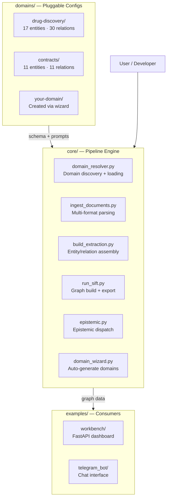

<objective>
Create four architecture diagrams (per D-09) as Mermaid source + SVG renders, and audit .gitignore for STA data safety (per D-16, D-17, D-18).

Purpose: Diagrams are dependencies for README (Plan 02) and Domain Guide (Plan 03) which embed/link to them. Gitignore audit ensures no private data leaks to public repo.
Output: 4 .mmd files, 4 .svg files, updated .gitignore
</objective>

<execution_context>
@$HOME/.claude/get-shit-done/workflows/execute-plan.md
@$HOME/.claude/get-shit-done/templates/summary.md
</execution_context>

<context>
@.planning/PROJECT.md
@.planning/ROADMAP.md
@.planning/STATE.md
@.planning/phases/10-documentation-refresh/10-CONTEXT.md
@docs/diagrams/architecture.mmd
@docs/diagrams/data-flow.mmd
</context>

<tasks>

<task type="auto">
  <name>Task 1: Create four Mermaid architecture diagrams and render to SVG</name>
  <files>docs/diagrams/architecture.mmd, docs/diagrams/data-flow.mmd, docs/diagrams/two-layer-kg.mmd, docs/diagrams/domain-package.mmd, docs/diagrams/architecture.svg, docs/diagrams/data-flow.svg, docs/diagrams/two-layer-kg.svg, docs/diagrams/domain-package.svg</files>
  <read_first>
    - docs/diagrams/architecture.mmd (current diagram to replace)
    - docs/diagrams/data-flow.mmd (current diagram to update)
    - docs/diagrams/molecular-biology-chain.mmd (existing style reference)
    - domains/contracts/domain.yaml (for domain package anatomy accuracy)
    - domains/drug-discovery/domain.yaml (for domain package anatomy accuracy)
  </read_first>
  <action>
Create/replace four Mermaid diagrams per D-09:

**1. architecture.mmd — Three-layer framework diagram (REPLACE existing)**


**2. two-layer-kg.mmd — Two-layer KG diagram (NEW)**
Create a flowchart showing:
- Layer 1 (Brute Facts): Entities extracted from documents with types and relations. Show example nodes (Party, Obligation, Compound, Gene) connected by typed edges.
- Layer 2 (Epistemic Super-Domain): Overlaid analysis showing conflict detection, gap analysis, confidence scoring, epistemic status (asserted/hypothesized/prophetic).
- Arrow from Layer 1 to Layer 2 labeled "epistemic analysis".
- Make clear this is domain-agnostic: any domain's brute facts get epistemic analysis.

**3. data-flow.mmd — Domain-agnostic pipeline (UPDATE existing)**
Replace biomedical-specific references. Show the pipeline:
Documents → domain_resolver (select domain) → ingest_documents (parse) → build_extraction (extract entities/relations via LLM) → run_sift (build graph, entity resolution, community detection) → epistemic analysis → Output (graph JSON, visualization, export formats).
Label each step with the core/ script that performs it. Show domain.yaml feeding into the extraction step.

**4. domain-package.mmd — Domain package anatomy (NEW)**
Create a diagram showing the contents of a domain package directory:
```
domains/your-domain/
  ├── domain.yaml        (entity types, relation types, aliases)
  ├── SKILL.md           (extraction prompt for LLM agents)
  ├── epistemic.py       (domain-specific analysis rules)
  ├── references/        (ontology refs, nomenclature guides)
  └── workbench/
      └── template.yaml  (dashboard customization)
```
Use a classDiagram or flowchart to show the package structure with brief annotations on each file's purpose.

After creating all four .mmd files, render each to SVG:
```bash
bunx beautiful-mermaid docs/diagrams/architecture.mmd
bunx beautiful-mermaid docs/diagrams/two-layer-kg.mmd
bunx beautiful-mermaid docs/diagrams/data-flow.mmd
bunx beautiful-mermaid docs/diagrams/domain-package.mmd
```

If beautiful-mermaid outputs to a different location than expected, move SVGs to docs/diagrams/. Verify each SVG is non-empty (file size > 0 bytes).

Keep existing molecular-biology-chain.mmd and its SVG untouched.
  </action>
  <verify>
    <automated>for d in architecture data-flow two-layer-kg domain-package; do test -s "docs/diagrams/$d.mmd" && test -s "docs/diagrams/$d.svg" && echo "$d: OK" || echo "$d: MISSING"; done</automated>
  </verify>
  <acceptance_criteria>
    - docs/diagrams/architecture.mmd contains "core/" and "domains/" and "examples/"
    - docs/diagrams/two-layer-kg.mmd contains "epistemic" and "Brute"
    - docs/diagrams/data-flow.mmd contains "domain_resolver" and does NOT contain "Drug Discovery" or "biomedical" (case-insensitive check)
    - docs/diagrams/domain-package.mmd contains "domain.yaml" and "SKILL.md" and "epistemic.py"
    - All four .svg files exist and are non-empty (size > 100 bytes)
    - docs/diagrams/molecular-biology-chain.mmd is unchanged
  </acceptance_criteria>
  <done>Four Mermaid diagrams created and rendered to SVG. Three-layer framework, two-layer KG, domain-agnostic data flow, and domain package anatomy all present.</done>
</task>

<task type="auto">
  <name>Task 2: Audit and update .gitignore for STA data safety</name>
  <files>.gitignore</files>
  <read_first>
    - .gitignore (current rules)
    - tests/fixtures/ (verify synthetic test fixtures are safe)
  </read_first>
  <action>
Per D-16, D-17, D-18: Verify and add explicit .gitignore rules preventing STA data leakage.

Read current .gitignore. Add these rules if not already present (add under a clear comment block):

```gitignore
# STA contract data — private, never commit
sample-contracts/
sample-output/
**/akka-*.json
**/akka-*.pdf

# Real extraction output — always local
epistract-output/

# Demo recordings — removed until framework video exists (per D-04)
*.mp4
*.mov
demo/
recordings/
```

Verify these synthetic test fixtures are NOT excluded (per D-18 — they are safe to keep):
- tests/fixtures/sample_contract_a.pdf
- tests/fixtures/sample_contract_b.pdf
- tests/fixtures/marriott_contract.txt

After updating .gitignore, run verification:
```bash
# Verify no STA vendor names in tracked files
grep -ri "aramark\|freeman" README.md docs/ 2>/dev/null | grep -v ".planning" && echo "LEAK" || echo "Clean"
```

Do NOT add paper/ to .gitignore if it is already there. The paper gitignore handling is for Plan 04.
  </action>
  <verify>
    <automated>grep -q "sample-contracts" .gitignore && grep -q "epistract-output" .gitignore && echo "gitignore OK" || echo "gitignore MISSING rules"</automated>
  </verify>
  <acceptance_criteria>
    - .gitignore contains "sample-contracts/" rule
    - .gitignore contains "epistract-output/" rule
    - .gitignore contains comment "STA contract data"
    - tests/fixtures/sample_contract_a.pdf is NOT matched by any .gitignore rule (verify with `git check-ignore tests/fixtures/sample_contract_a.pdf` returning empty)
  </acceptance_criteria>
  <done>Gitignore updated with explicit STA data exclusion rules. Synthetic test fixtures confirmed safe. No STA data leakage in tracked documentation files.</done>
</task>

</tasks>

<verification>
```bash
# All 4 diagram pairs exist and are non-empty
for d in architecture data-flow two-layer-kg domain-package; do
  test -s "docs/diagrams/$d.mmd" && test -s "docs/diagrams/$d.svg" && echo "$d: OK" || echo "$d: MISSING"
done

# No biomedical-specific language in updated architecture diagram
grep -i "drug\|biomedical\|scientist" docs/diagrams/architecture.mmd && echo "STALE LANGUAGE" || echo "Clean"

# Gitignore has STA rules
grep "akka" .gitignore

# No STA leakage
grep -ri "aramark\|freeman" README.md docs/*.md 2>/dev/null && echo "LEAK" || echo "Clean"
```
</verification>

<success_criteria>
- 4 Mermaid .mmd source files in docs/diagrams/ with domain-agnostic content
- 4 corresponding .svg renders, all non-empty
- .gitignore has explicit STA data exclusion rules
- Synthetic test fixtures are not excluded
- No biomedical-specific language in framework-level diagrams
</success_criteria>

<output>
After completion, create `.planning/phases/10-documentation-refresh/10-01-SUMMARY.md`
</output>
