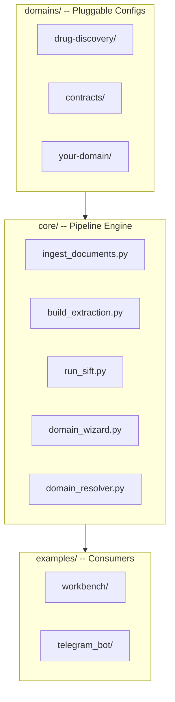

# Phase 10: Documentation Refresh - Research

**Researched:** 2026-04-04
**Domain:** Documentation rewrite, Mermaid diagrams, LaTeX paper, gitignore audit
**Confidence:** HIGH

## Summary

Phase 10 is a documentation-only phase that rewrites README.md (514 lines), docs/ADDING-DOMAINS.md (323 lines), CLAUDE.md (268 lines), four Mermaid architecture diagrams, and the LaTeX paper (on remote main). No code changes are required. The project's three-layer structure (core/, domains/, examples/) already exists from Phases 6-9, so the documentation needs to catch up to the actual codebase state.

The paper lives on origin/main in paper/ (gitignored locally). It uses section-based includes (00-abstract through 08-conclusion) compiled with tectonic. The title, abstract, architecture, and conclusion sections need reframing from biomedical-specific to framework-generic language, plus a new Case Study 2 subsection for event contracts.

**Primary recommendation:** Structure the work in four waves: (1) diagrams first (other docs reference them), (2) README + domain guide, (3) CLAUDE.md + gitignore audit, (4) paper reframing. Diagrams are the dependency -- README and guide embed/link to them.

<user_constraints>

## User Constraints (from CONTEXT.md)

### Locked Decisions
- **D-01:** Framework-first lead -- open with "Turn any document corpus into a structured knowledge graph." No biomedical-specific framing in the pitch.
- **D-02:** Dual-path quick-start -- Path A: "Use a Pre-Built Domain" (3 commands to first graph), Path B: "Create Your Own Domain" (wizard workflow, 5 steps). Both paths end at graph exploration.
- **D-03:** Scenarios collapse into a "Showcase" section -- drug discovery gets 2-3 paragraphs, STA contracts gets 2-3 paragraphs (aggregate stats only, no vendor/amount details). Detailed write-ups move to docs/showcases/.
- **D-04:** Demo video removed from README entirely -- current video is biomedical-only and doesn't represent the framework.
- **D-05:** "How It Works" section -- brief explanation of two-layer KG (brute facts + epistemic), extraction pipeline, domain pluggability.
- **D-06:** "Pre-built Domains" table -- available domains with entity/relation counts, document format support, links to domain docs.
- **D-07:** "Commands Reference" -- all /epistract:* commands with one-line descriptions, updated for new commands.
- **D-08:** "Contributing / Development" section -- setup instructions, test commands, project structure overview.
- **D-09:** Four diagrams: (1) three-layer framework, (2) two-layer KG, (3) updated data flow, (4) domain package anatomy.
- **D-10:** Rendering: Mermaid .mmd source files rendered to SVG via beautiful-mermaid.
- **D-11:** Wizard-first, manual-second structure for docs/ADDING-DOMAINS.md.
- **D-12:** Manual section includes schema reference with annotated examples from both existing domains.
- **D-13:** Paper lives on remote main at paper/ (gitignored locally, needs pull from remote).
- **D-14:** New title: "Epistract: A Domain-Agnostic Framework for Agentic Knowledge Graph Construction from Document Corpora"
- **D-15:** Case Study 2: Event Contract Management -- aggregate stats only (62 contracts, 341 nodes, 663 edges, 53 conflicts, 11 entity types, 11 relation types).
- **D-16:** All real STA contract data stays local-only. Public repo shows capability not content.
- **D-17:** Verify + add explicit .gitignore rules for STA-related paths.
- **D-18:** Test fixtures (sample_contract_a.pdf, sample_contract_b.pdf, marriott_contract.txt) are synthetic -- safe to keep.
- **D-19:** Update CLAUDE.md Project section, Architecture section, and conventions for framework identity.

### Claude's Discretion
- README section ordering beyond the decisions above
- Exact wording of framework pitch and showcase summaries
- Mermaid diagram styling and layout choices
- Level of detail in Commands Reference (terse vs annotated)
- Paper section restructuring details beyond title/abstract/architecture

### Deferred Ideas (OUT OF SCOPE)
- Framework demo video -- separate phase/backlog item
- Interactive README with GitHub-rendered Mermaid diagrams

</user_constraints>

<phase_requirements>

## Phase Requirements

| ID | Description | Research Support |
|----|-------------|------------------|
| DOCS-01 | README reframed as framework with dual-path quick-start | D-01 through D-08 define full README structure. Current README is 514 lines, biomedical-focused. Full rewrite needed. |
| DOCS-02 | Architecture diagrams show three-layer separation | D-09, D-10. Four .mmd files + SVG renders. beautiful-mermaid available via bunx. Existing diagrams in docs/diagrams/ to replace/update. |
| DOCS-03 | Domain developer guide covers full adoption workflow | D-11, D-12. Current docs/ADDING-DOMAINS.md is 323 lines with stale skills/ paths. Rewrite with wizard-first structure, reference both domains/ packages. |
| DOCS-04 | Paper updated to framework framing | D-13 through D-15. Paper on origin/main, 9 section files. Need to update abstract, architecture, add Case Study 2, update conclusion. tectonic available for compilation. |

</phase_requirements>

## Standard Stack

### Core
| Tool | Version | Purpose | Why Standard |
|------|---------|---------|--------------|
| beautiful-mermaid | latest (via bunx) | Render .mmd to SVG | Already in project toolchain (CLAUDE.md), consistent with existing diagrams |
| tectonic | installed | Compile LaTeX paper | Already used for paper builds per project memory |
| Mermaid | syntax v10+ | Diagram source language | Existing .mmd files use flowchart TB/LR syntax |

### Supporting
| Tool | Purpose | When to Use |
|------|---------|-------------|
| git show origin/main:paper/* | Access paper files from remote | Paper is gitignored locally; read from remote branch |
| ruff format | Format any Python touched | If epistemic.py or other Python files are edited |

### Alternatives Considered
| Instead of | Could Use | Tradeoff |
|------------|-----------|----------|
| beautiful-mermaid | mermaid-cli (mmdc) | beautiful-mermaid already in toolchain; mmdc would need separate install |
| tectonic | pdflatex | tectonic auto-downloads packages; pdflatex requires manual TeX distribution |

## Architecture Patterns

### Diagram File Organization
```
docs/diagrams/
  architecture.mmd       # REPLACE: three-layer framework diagram
  architecture.svg       # REGENERATE
  data-flow.mmd          # UPDATE: domain-agnostic pipeline
  data-flow.svg          # REGENERATE
  two-layer-kg.mmd       # NEW: brute facts + epistemic
  two-layer-kg.svg       # NEW
  domain-package.mmd     # NEW: domain package anatomy
  domain-package.svg     # NEW
  molecular-biology-chain.mmd  # KEEP: biomedical-specific, not referenced in new README
  molecular-biology-chain.svg  # KEEP
```

### README Structure (recommended order)
```
1. Title + framework tagline (D-01)
2. Quick Start - dual path (D-02)
3. How It Works (D-05) - inline architecture diagram
4. Pre-built Domains table (D-06)
5. Showcase section (D-03) - drug discovery + contracts summaries
6. Commands Reference (D-07)
7. The Name (keep existing etymology section)
8. Contributing / Development (D-08)
9. License
```

### Domain Guide Structure (recommended)
```
1. Quick Start: Domain Wizard (5-step happy path)
2. What Gets Generated (domain package anatomy diagram)
3. Manual Domain Creation
   3a. domain.yaml reference (annotated, both domains as examples)
   3b. SKILL.md guide
   3c. epistemic.py reference
4. Testing Your Domain
5. Publishing / Sharing
```

### Paper Section Map
```
Sections to modify:
  00-abstract.tex     -- REWRITE: framework framing
  01-motivation.tex   -- UPDATE: add cross-domain motivation paragraph
  02-architecture.tex -- UPDATE: add domain pluggability subsection
  04-evaluation.tex   -- ADD: Case Study 2 subsection (contracts)
  08-conclusion.tex   -- UPDATE: framework + future work
  
main.tex              -- UPDATE: title, possibly add new figure
  
Sections to keep unchanged:
  03-schema.tex       -- Biomedical schema stays as Case Study 1
  05-comparison.tex   -- Evolution comparison still valid
  06-collaboration.tex
  07-availability.tex
```

### Anti-Patterns to Avoid
- **Biomedical-first language in generic sections:** The README pitch, How It Works, and quick start must be domain-agnostic. Drug discovery is a showcase example, not the identity.
- **Exposing STA contract details:** No vendor names, dollar amounts, or specific contract terms. Aggregate stats only (62 contracts, 341 nodes, etc.).
- **Dead links to demo video:** D-04 says remove entirely, not replace with placeholder.
- **Stale paths in domain guide:** Current guide references `skills/{name}-extraction/` paths. New structure uses `domains/{name}/`. Every path reference must be updated.

## Don't Hand-Roll

| Problem | Don't Build | Use Instead | Why |
|---------|-------------|-------------|-----|
| SVG rendering from Mermaid | Manual SVG creation | `bunx beautiful-mermaid file.mmd` | Consistent styling, automatic layout |
| Paper PDF compilation | Manual PDF assembly | `tectonic paper/main.tex` | Auto-downloads LaTeX packages |
| Diagram consistency | Freeform diagram design | Mermaid flowchart/classDiagram syntax | Machine-parseable, versionable |

## Common Pitfalls

### Pitfall 1: Paper Access from Feature Branch
**What goes wrong:** Paper is gitignored locally. `cat paper/main.tex` fails on feature branch.
**Why it happens:** paper/ was removed in Phase 6 cleanup (V1 artifact), lives only on origin/main.
**How to avoid:** Use `git show origin/main:paper/sections/XX-name.tex` to read. To edit, either: (a) checkout paper files temporarily, or (b) create paper updates as a patch to apply to main.
**Warning signs:** "No such file or directory" when accessing paper/.

### Pitfall 2: Stale Scenario Counts
**What goes wrong:** README says "6 scenarios" but paper has different counts after adding Case Study 2.
**Why it happens:** Multiple docs reference the same stats independently.
**How to avoid:** Per project memory (feedback_paper_consistency.md): always grep for stale scenario counts across all paper sections before committing.
**Warning signs:** Inconsistent numbers between README showcase, paper abstract, and paper evaluation.

### Pitfall 3: Domain Guide References Old Structure
**What goes wrong:** Guide says `skills/{name}-extraction/` when actual structure is `domains/{name}/`.
**Why it happens:** Copying from existing ADDING-DOMAINS.md without updating paths.
**How to avoid:** Reference actual directory listing: `domains/contracts/` and `domains/drug-discovery/` each contain domain.yaml, SKILL.md, epistemic.py, references/, workbench/.
**Warning signs:** Paths with `skills/` appearing in new documentation.

### Pitfall 4: STA Data Leakage
**What goes wrong:** Real vendor names, contract amounts, or specific terms appear in public docs.
**Why it happens:** Copy-pasting from actual extraction output into showcase section.
**How to avoid:** D-16 requires aggregate stats only: 62 contracts, 341 nodes, 663 edges, 53 conflicts, 11 entity types, 11 relation types. No entity names from real data.
**Warning signs:** Proper nouns that look like company/venue names in showcase text.

### Pitfall 5: beautiful-mermaid Silent Failure
**What goes wrong:** SVG files not generated or empty.
**Why it happens:** Mermaid syntax errors produce no output with some renderers.
**How to avoid:** Validate .mmd syntax before rendering. Check SVG file size after generation.
**Warning signs:** 0-byte SVG files, missing SVG after render command.

## Code Examples

### Mermaid Three-Layer Framework Diagram (D-09 diagram 1)


### SVG Rendering Command
```bash
bunx beautiful-mermaid docs/diagrams/architecture.mmd --theme Nord
# Outputs: docs/diagrams/architecture.svg
```

### Reading Paper from Remote
```bash
git show origin/main:paper/sections/00-abstract.tex
git show origin/main:paper/main.tex
```

### Writing Paper Updates
```bash
# Option A: checkout paper to local, edit, commit, push to main
git checkout origin/main -- paper/
# Edit files...
git add paper/
git commit -m "docs(paper): reframe as cross-domain framework"

# Option B: create patch file for later application to main
```

## State of the Art

| Old State | New State | Impact |
|-----------|-----------|--------|
| README: "Turn scientific literature into structured biomedical knowledge" | "Turn any document corpus into a structured knowledge graph" | Framework identity |
| Architecture: single-domain diagram | Three-layer (core/domains/examples) + two-layer KG diagram | Shows pluggability |
| Domain guide: skills/{name}-extraction/ paths | domains/{name}/ paths + wizard-first workflow | Matches actual codebase |
| Paper title: "Beyond RAG: Domain-Specific Agentic Architecture for Biomedical KG Construction" | "Epistract: A Domain-Agnostic Framework for Agentic Knowledge Graph Construction from Document Corpora" | Academic reframing |
| CLAUDE.md: biomedical-centric project description | Framework-first with cross-domain capabilities | AI assistant context |

## Open Questions

1. **Paper editing workflow on feature branch**
   - What we know: paper/ is gitignored locally, accessible via `git show origin/main:paper/*`
   - What's unclear: Whether to checkout paper files to feature branch, create a separate branch, or patch main directly
   - Recommendation: Checkout paper/ files to feature branch temporarily (remove gitignore entry for editing), commit paper changes, then re-add gitignore. This keeps all Phase 10 changes on one branch.

2. **beautiful-mermaid output format**
   - What we know: Tool is available via bunx, used for existing diagrams
   - What's unclear: Exact CLI flags for theme, output path, format selection
   - Recommendation: Test with `bunx beautiful-mermaid docs/diagrams/architecture.mmd` and verify output. LOW confidence on exact flags -- validate at execution time.

3. **docs/showcases/ directory creation**
   - What we know: D-03 says detailed write-ups move to docs/showcases/. Directory does not exist yet.
   - What's unclear: Whether to create full showcase docs in this phase or just the directory + stub files
   - Recommendation: Create directory with two files (drug-discovery.md, contracts.md) containing the detailed content removed from README. Keeps scope contained.

## Environment Availability

| Dependency | Required By | Available | Version | Fallback |
|------------|------------|-----------|---------|----------|
| bunx | Mermaid SVG rendering | Yes | via bun | -- |
| beautiful-mermaid | Diagram generation | Yes (via bunx) | latest | mmdc (mermaid-cli) |
| tectonic | Paper PDF compilation | Yes | installed at /opt/homebrew/bin | pdflatex |
| git (remote access) | Paper file access | Yes | via origin/main | -- |
| ruff | Format any Python changes | Yes | installed | -- |
| pytest | Run validation tests | Yes | 8.2.1 | -- |

**Missing dependencies with no fallback:** None.

## Validation Architecture

### Test Framework
| Property | Value |
|----------|-------|
| Framework | pytest 8.2.1 |
| Config file | tests/conftest.py |
| Quick run command | `python -m pytest tests/test_unit.py -x -q` |
| Full suite command | `python -m pytest tests/ -v` |

### Phase Requirements to Test Map
| Req ID | Behavior | Test Type | Automated Command | File Exists? |
|--------|----------|-----------|-------------------|-------------|
| DOCS-01 | README has framework pitch, dual-path quick-start, no biomedical-first language | manual-only | Visual review of README.md | N/A |
| DOCS-02 | 4 architecture diagrams exist as .mmd + .svg pairs | smoke | `ls docs/diagrams/{architecture,data-flow,two-layer-kg,domain-package}.{mmd,svg}` | N/A |
| DOCS-03 | Domain guide references domains/ paths, wizard-first structure | manual-only | `grep -c "skills/" docs/ADDING-DOMAINS.md` should return 0 | N/A |
| DOCS-04 | Paper title updated, abstract reframed, Case Study 2 added | manual-only | Visual review of paper sections | N/A |

**Justification for manual-only:** Documentation phases produce prose and diagrams. Content quality cannot be automatically validated -- only structural checks (file existence, stale path references) can be automated. Recommend shell-based smoke checks:

```bash
# Verify no stale skills/ paths in new docs
grep -r "skills/" README.md docs/ADDING-DOMAINS.md | grep -v "node_modules"

# Verify all 4 diagram pairs exist
for d in architecture data-flow two-layer-kg domain-package; do
  test -f "docs/diagrams/$d.mmd" && test -f "docs/diagrams/$d.svg" && echo "$d: OK" || echo "$d: MISSING"
done

# Verify no STA vendor names leaked (spot check)
grep -i "marriott\|aramark\|freeman\|convention center" README.md docs/showcases/*.md 2>/dev/null && echo "LEAK DETECTED" || echo "Clean"

# Verify demo video removed
grep -i "youtube\|demo.*video\|7mHbdb0nn3Y" README.md && echo "VIDEO STILL PRESENT" || echo "Video removed"
```

### Sampling Rate
- **Per task commit:** Smoke checks above
- **Per wave merge:** Full smoke suite + visual review
- **Phase gate:** All smoke checks pass + visual review of README, guide, diagrams

### Wave 0 Gaps
None -- documentation phase requires no test infrastructure. Smoke checks are inline shell commands.

## Project Constraints (from CLAUDE.md)

- **Package manager:** uv for Python, bun/bunx for JS tooling
- **Formatting:** ruff format / ruff check
- **Testing:** pytest
- **Python:** 3.11+
- **Diagrams:** beautiful-mermaid via bunx for Mermaid rendering
- **Makefile:** Standard targets (help, install, clean, test, lint, format, run, venv)
- **pathlib.Path:** Always use Path, never os.path
- **Paper builds:** tectonic (not pdflatex)
- **Stale counts:** Always grep for stale scenario counts across all paper sections before committing

## Sources

### Primary (HIGH confidence)
- Project files: README.md, docs/ADDING-DOMAINS.md, CLAUDE.md, docs/diagrams/*.mmd -- read directly
- Paper source: origin/main:paper/ -- accessed via git show
- Domain packages: domains/contracts/, domains/drug-discovery/ -- listed directly
- .gitignore: read directly, verified STA patterns and video exclusions

### Secondary (MEDIUM confidence)
- beautiful-mermaid CLI flags -- tool is available but exact flags not verified in this session
- Paper compilation workflow -- tectonic confirmed installed, exact build command from project memory

## Metadata

**Confidence breakdown:**
- Standard stack: HIGH - all tools verified installed and previously used in project
- Architecture: HIGH - all file paths verified, directory structure confirmed
- Pitfalls: HIGH - based on direct observation of current docs and project history
- Paper workflow: MEDIUM - paper accessible from remote but editing workflow has open question

**Research date:** 2026-04-04
**Valid until:** 2026-05-04 (documentation, stable)
