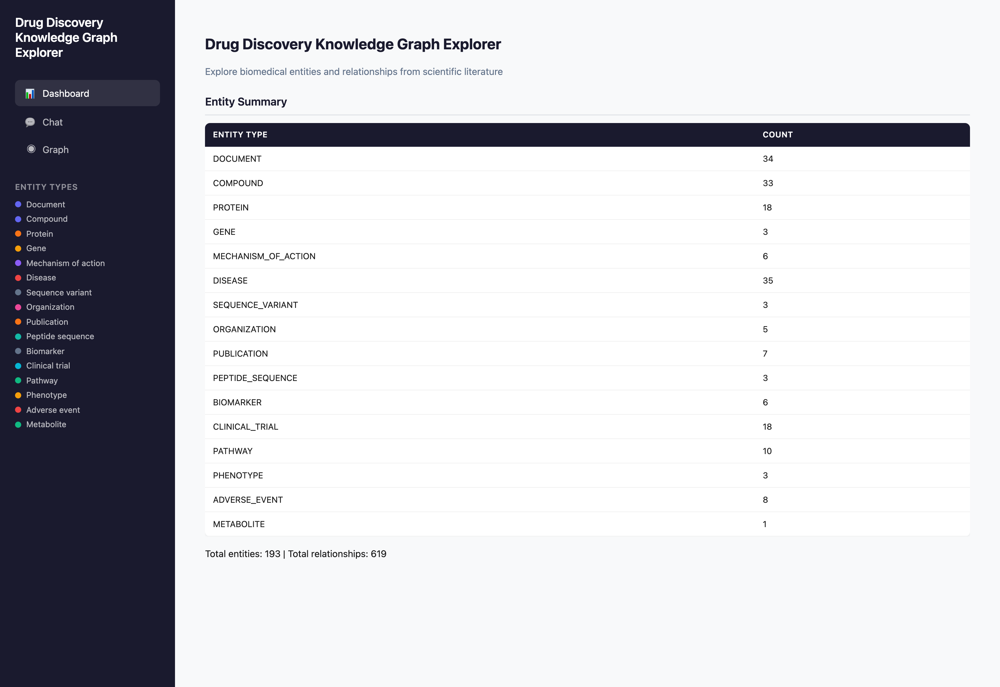
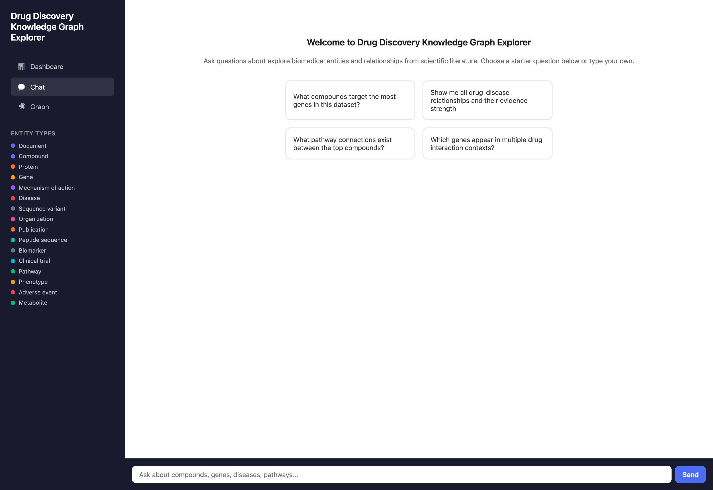
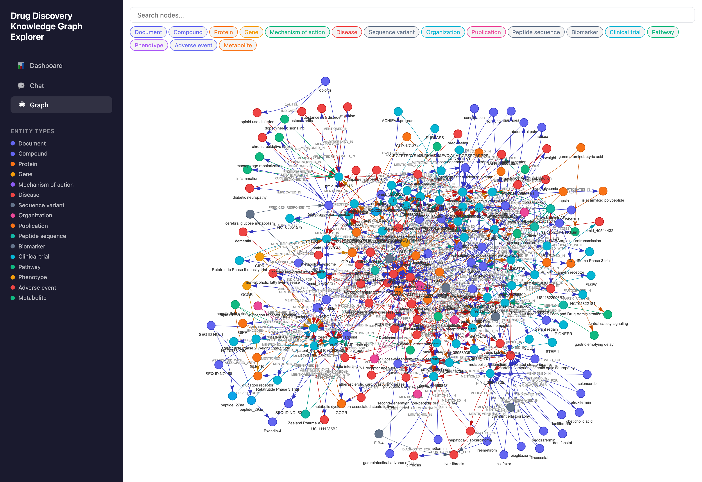
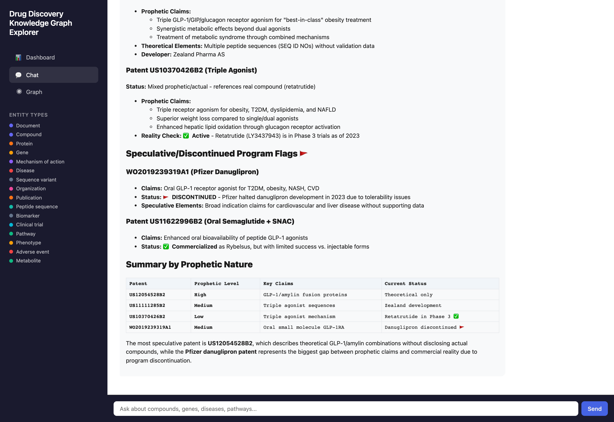
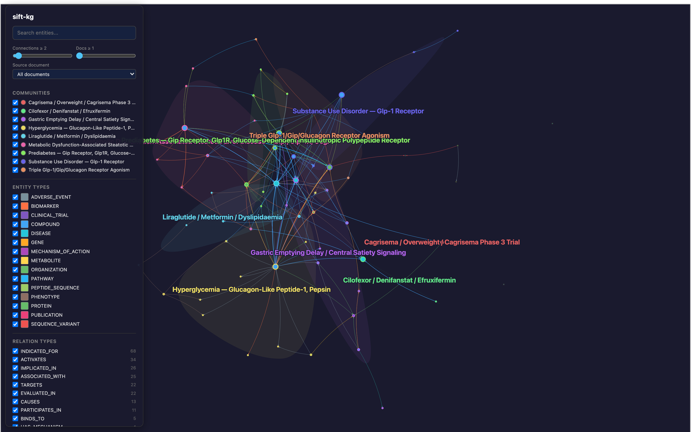
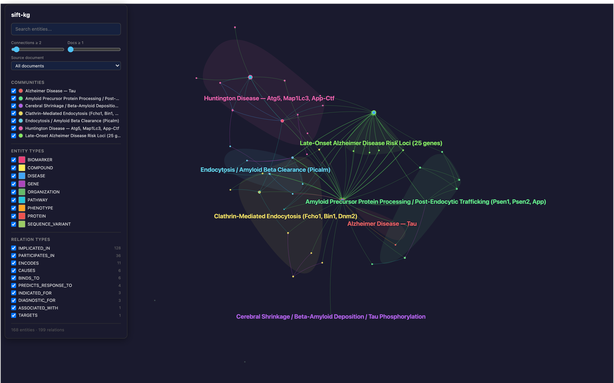
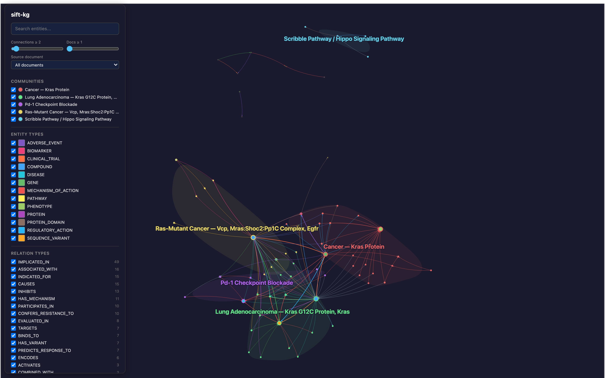
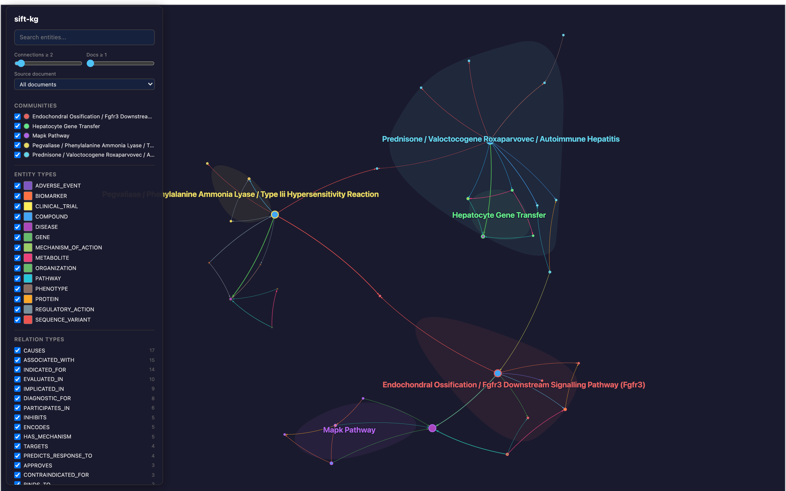
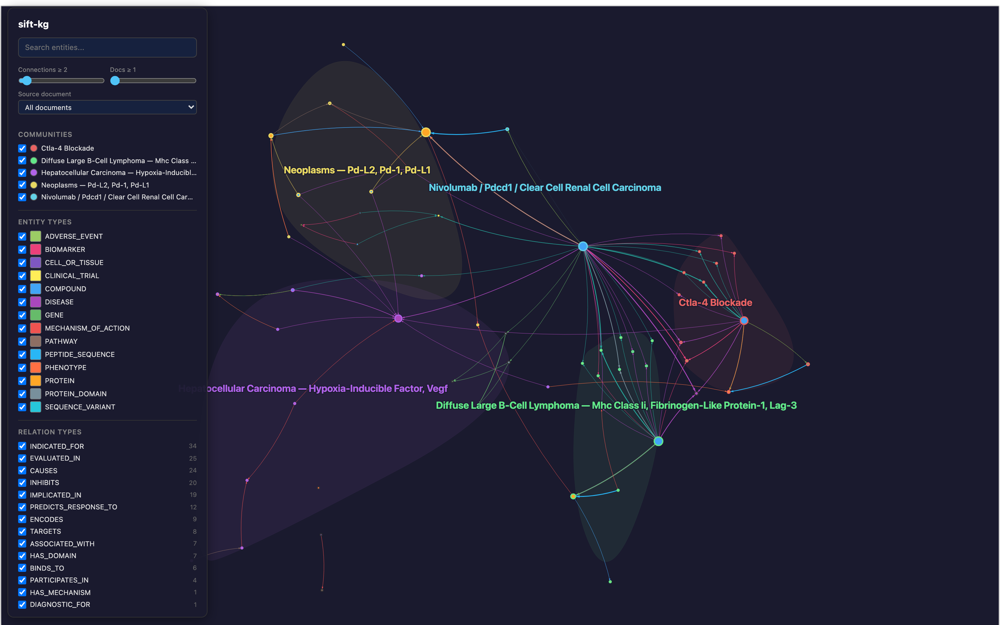
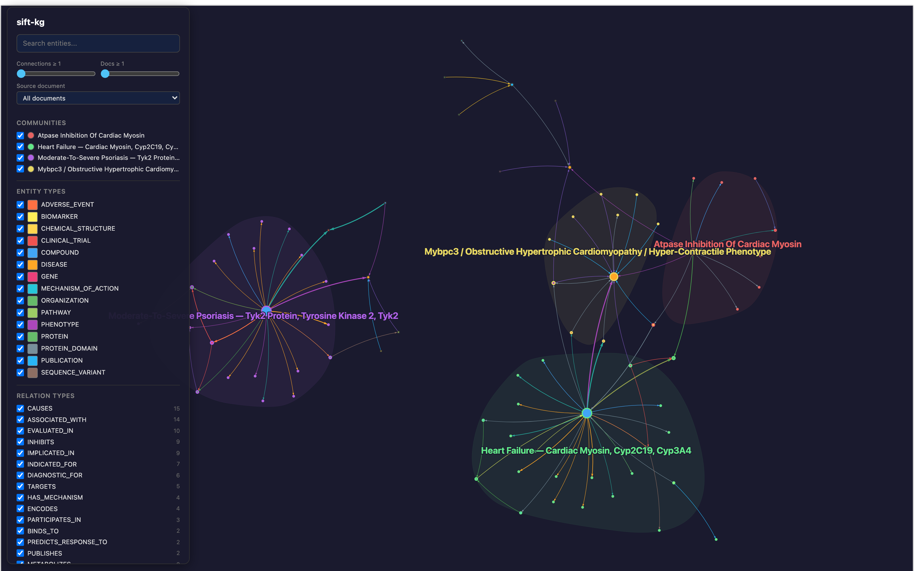

# Epistract

**Turn any document corpus into a structured knowledge graph.**

Epistract is a domain-agnostic knowledge graph framework that runs as a [Claude Code](https://claude.ai/claude-code) plugin. Point it at a folder of documents, specify a domain schema, and it builds a two-layer knowledge graph: brute-force entity/relation extraction grounded to domain ontologies, then domain-specific epistemic analysis that surfaces conflicts, gaps, risks, and confidence levels across your corpus.

Ship with a pre-built domain, create your own with the domain wizard, or acquire a fresh corpus from PubMed in one command.

> **v2.0 status (2026-04-13):** All 6 drug-discovery scenarios have been re-validated end-to-end through the V2 plugin pipeline. Regression suite passes against V1 baselines. The contracts domain ships as a schema scaffold without bundled corpus — bring your own contracts to reproduce the cross-domain story. See [V2 Showcase](docs/showcases/drug-discovery-v2.md).

## The Name

From Greek **episteme** (ἐπιστήμη) — structured scientific knowledge, the highest form of knowledge in Aristotle's epistemological hierarchy — combined with **extract**. Episteme is not opinion or belief; it is knowledge grounded in evidence, demonstration, and systematic understanding. That is what this tool produces: not a bag of keywords, but a structured representation of how concepts relate to each other, traceable back to the source text.

## Installation

Epistract runs as a [Claude Code](https://claude.ai/claude-code) plugin. Getting it into your Claude Code is a two-step process: install the plugin, then install its Python dependencies.

### Prerequisites

- **[Claude Code](https://claude.ai/claude-code)** — the CLI/IDE host for the plugin
- **Python 3.11, 3.12, or 3.13** — `scripts/setup.sh` enforces `>= 3.11` and warns on 3.14+. Tested primarily on 3.13. Python 3.14 may or may not have prebuilt `sift-kg` wheels yet.
- **[uv](https://docs.astral.sh/uv/)** — required. Handles the project `.venv`, dependency resolution, and lockfile in one tool. Install with `curl -LsSf https://astral.sh/uv/install.sh | sh`.

Optional (enabled automatically when detected):
- **RDKit** — molecular validation for drug-discovery SMILES / InChIKeys
- **Biopython** — sequence validation for DNA/RNA/protein sequences
- **Azure AI Foundry, Anthropic, or OpenRouter API key** — only needed for the interactive workbench chat panel (graph + extraction work without any LLM credentials)

### Step 1 — Install the plugin in Claude Code

Choose one path:

**Option A: Clone and install as local marketplace** (recommended while the plugin is not yet in a public marketplace)

```bash
git clone https://github.com/usathyan/epistract.git
cd epistract
```

Then from inside Claude Code, register the local clone as a marketplace and install the plugin:

```
/plugin marketplace add ./
/plugin install epistract@epistract
```

> Claude Code requires the `./` prefix for local path marketplaces — a bare `.` fails with a "source not found" error. If you're registering from a different directory, use the absolute path to the epistract clone instead.

The `/plugin marketplace add ./` registers the repo's `.claude-plugin/marketplace.json` as a local source. The `/plugin install epistract@epistract` pulls the `epistract` plugin from the `epistract` marketplace you just registered.

**Option B: Install directly from GitHub** (when Claude Code's GitHub marketplace support matures)

```
/plugin marketplace add https://github.com/usathyan/epistract
/plugin install epistract@epistract
```

After either option, verify the plugin is loaded:

```
/plugin list
```

You should see `epistract` (version 2.0.0) in the installed list, and the `/epistract:*` commands should autocomplete in your Claude Code prompt (`setup`, `ingest`, `build`, `view`, `validate`, `epistemic`, `query`, `export`, `domain`, `dashboard`, `ask`, `acquire`).

### Step 2 — Create the project `.venv` and install Python dependencies

Epistract uses a **project-local `.venv`** (via `uv venv`) rather than your system Python. This isolates `sift-kg`, `rdkit`, and `biopython` from your other Python tooling and matches how the plugin runs at runtime (Claude Code subprocesses inherit the `.venv` from the project root).

With the plugin loaded, run:

```
/epistract:setup
```

This shells out to `scripts/setup.sh`, which:

1. Verifies `uv` is installed (errors out with install instructions if not)
2. Creates `.venv/` via `uv venv` if it doesn't already exist
3. Checks Python 3.11–3.13 in that venv
4. Installs `sift-kg` via `uv pip install` (targets the project `.venv` automatically)
5. Optionally installs `rdkit-pypi` + `biopython` with `--all`

The script is idempotent — safe to re-run after upgrades. It does **not** fall back to plain `pip` on failure: if `uv pip install` can't reach PyPI (corporate SSL proxies are the usual culprit), it prints a clear error with remediation steps instead of silently installing into the wrong environment.

Verify the install:

```
/epistract:setup --check
```

Expected output: uv version, Python version, sift-kg version, RDKit status, Biopython status, and "Setup check complete." If anything is missing it'll say `MISSING: <package>` with the install command.

**When running commands manually** (outside Claude Code's `/epistract:*` dispatch), activate the venv first:

```bash
source .venv/bin/activate
```

or prefix commands with the venv Python: `.venv/bin/python3 -m epistract`.

### Troubleshooting

- **`uv pip install sift-kg` fails with SSL errors** — you're behind a corporate SSL-inspection proxy. Export `SSL_CERT_FILE` or `REQUESTS_CA_BUNDLE` pointing at your corporate CA bundle, then re-run `/epistract:setup`.
- **`/plugin marketplace add .` says "source not found"** — use `/plugin marketplace add ./` (note the trailing `/`). Claude Code needs the `./` prefix to distinguish a local path from a marketplace name.
- **`sift-kg` says "already installed" but the viewer errors out** — you probably have `sift-kg` in your system Python instead of the project `.venv`. Delete `.venv`, re-run `/epistract:setup`, and the script will recreate it cleanly.
- **Python 3.14 complaints** — epistract supports 3.11–3.13. If you're on 3.14, either use `uv venv --python 3.13` to pin the venv to 3.13, or accept the "may not have prebuilt wheels" warning and see if your platform still has a compatible `sift-kg` wheel.

### Upgrading

To upgrade to a newer version:

```bash
cd /path/to/epistract && git pull
```

Then in Claude Code:

```
/plugin marketplace update epistract
/plugin install epistract@epistract
/epistract:setup
```

## Quick Start

With the plugin installed and `/epistract:setup` completed, you have three quick-start paths depending on what you want to do.

### Path A: Use a Pre-Built Domain

Two commands to your first graph:

```
/epistract:ingest ./my-papers/ --output ./graph-output --domain drug-discovery
```

Parse documents and extract entities/relations using the drug discovery schema. This single command runs the full pipeline — read → chunk → extract → validate → build graph → generate viewer. You do **not** need to separately invoke `/epistract:build`, `/epistract:validate`, or `/epistract:view` after a fresh ingest.

```
/epistract:epistemic ./graph-output
```

Run domain-specific epistemic analysis — produces `claims_layer.json` with contradictions, hypotheses, prophetic claims (from patents), and contested findings.

Then open the interactive viewer:

```
/epistract:view ./graph-output
```

### Path B: Acquire a Corpus from PubMed First

New in v2 — fetch articles directly from PubMed and ingest in two commands:

```
/epistract:acquire "PICALM Alzheimer disease" --output ./my-papers/ --max 20
/epistract:ingest ./my-papers/ --output ./graph-output --domain drug-discovery
```

`/epistract:acquire` uses NCBI E-utilities to search PubMed, download abstracts, and write them as plain-text files that `/epistract:ingest` can consume without modification. An NCBI API key improves rate limits. See [`commands/acquire.md`](commands/acquire.md) for full options.

### Path C: Create Your Own Domain

Four steps from zero to a custom knowledge graph (assumes plugin + `/epistract:setup` are already done):

1. **Create domain** — `/epistract:domain --input ./sample-docs/` — the wizard analyzes your documents, proposes entity types, relation types, and epistemic rules, and generates a full domain package (`domain.yaml` + `SKILL.md` + `epistemic.py`)
2. **Review** — confirm the generated domain configuration; edit type definitions or naming standards if needed
3. **Ingest** — `/epistract:ingest ./corpus/ --output ./graph-output --domain your-domain`
4. **Explore** — `/epistract:view ./graph-output`

See [Adding New Domains](docs/ADDING-DOMAINS.md) for the wizard-first guide and [the domain developer guide](docs/DEVELOPER.md) if it exists for a deeper walkthrough.

## How It Works

Epistract builds knowledge graphs in two layers. The first layer extracts brute facts — entities and relations pulled from documents by LLM agents, constrained by a domain schema grounded in established ontologies. The second layer applies epistemic analysis — domain-specific rules that detect what is asserted versus hypothesized, what contradicts across documents, what is missing, and where risks lie.


### Two-Layer Knowledge Graph

- **Layer 1 — Brute Facts:** Entities and relations extracted from documents via LLM agents, constrained by domain schema. Each entity is typed and grounded to domain standards. Each relation carries a confidence score and evidence passage.
- **Layer 2 — Epistemic Analysis:** Domain-specific rules detect conflicts, gaps, confidence levels, and risks across the graph. The epistemic machinery is the same regardless of domain — only the rules change. Drug discovery rules classify relations as *asserted* / *hypothesized* / *prophetic* (patent-sourced forward claims) and flag cross-document contradictions. Contract rules detect cross-contract conflicts, obligation gaps, and risk indicators.

### Domain Pluggability

New domains are added by creating a configuration package:

- `domain.yaml` — entity types, relation types, naming standards, canonical names
- `SKILL.md` — extraction prompt with domain expertise
- `epistemic.py` — rules for conflict detection, gap analysis, risk scoring

No pipeline code changes required. Use the wizard (`/epistract:domain`) to auto-generate all three from a sample corpus, or create them manually. The domain resolver (`core/domain_resolver.py`) loads packages by name or alias from `domains/`.

### Plugin Command Anatomy

Slash commands split into two groups — **full-pipeline commands** that do everything needed for a scenario, and **single-stage re-run commands** that operate on existing output. For a fresh scenario you only need two commands: `/epistract:ingest` and `/epistract:epistemic`.

| Slash command | Runs | When to use |
|---|---|---|
| `/epistract:ingest <docs> --output <dir> --domain <name>` | read → chunk → extract → validate → build → viewer | **Fresh scenario run** — start here |
| `/epistract:epistemic <dir>` | Epistemic classification → `claims_layer.json` | After every fresh `ingest` — separate because it reads the built graph |
| `/epistract:build <dir>` | Graph build only | Re-running the builder on existing extractions |
| `/epistract:view <dir>` | `graph.html` generation only | Re-generating the viewer |
| `/epistract:validate <dir>` | Molecular validation only | Re-running SMILES/sequence validation |
| `/epistract:query <dir> <query>` | Entity search | Post-run exploration |
| `/epistract:export <dir> <format>` | GraphML / GEXF / CSV / SQLite export | Post-run data handoff |
| `/epistract:acquire <query> --output <dir>` | PubMed search + download | Fetching a fresh corpus (see Path B) |
| `/epistract:domain --input <samples>` | Domain wizard | Creating a new domain package (Path C) |
| `/epistract:dashboard` | Web workbench | Interactive chat + graph exploration |
| `/epistract:ask <question>` | Natural-language Q&A | Ask the graph questions directly |
| `/epistract:setup` | Dependency installer | First-time setup, re-run after upgrades |

## Interactive Workbench

In addition to the static `graph.html` viewer, epistract ships an interactive FastAPI-backed workbench with two live panels: a force-directed graph canvas and a chat assistant powered by Claude (via direct Anthropic API or OpenRouter). Launch it with:

```
/epistract:dashboard <output_dir> --domain <name>
```

For example, to explore the Scenario 6 GLP-1 knowledge graph from the showcase (193 nodes, 619 edges, 9 communities, 15 prophetic patent claims):

```
/epistract:dashboard tests/corpora/06_glp1_landscape/output-v2 --domain drug-discovery
```

The workbench opens at `http://127.0.0.1:8000` with three panels — Dashboard, Chat, and Graph — wired to the same loaded knowledge graph.

### Dashboard Panel — Auto-Generated Summary



*Auto-generated entity summary for the S6 GLP-1 graph: 16 entity types with deduplicated counts, totals at the bottom (193 nodes / 619 edges). The dashboard renders even without a domain-specific HTML template — `/api/dashboard` builds the summary from `graph_data.json` whenever no `dashboard.html` exists for the current domain. Domains can ship a custom dashboard.html for richer layouts (the contracts domain originally did, before being scrubbed for the public release).*

### Chat Panel — Domain-Aware Welcome



*The chat panel landing screen reads its title, body text, placeholder, and starter questions from `domains/drug-discovery/workbench/template.yaml`. Drug-discovery starters surface immediately ("What compounds target the most genes in this dataset?", "Show me all drug-disease relationships and their evidence strength", etc.) without any user configuration. Switch domains and the entire chat persona changes.*

### Graph Panel — Visual Exploration



*The full S6 GLP-1 knowledge graph rendered in the workbench: 193 nodes color-coded by entity type, 9 community clusters, entity-type filter pills at the top, search bar for direct entity lookup. Pan, zoom, click any node to see neighborhood context; toggle entity types on and off to isolate sub-graphs.*

### Chat Panel — Epistemic Layer in Action



*Asking "Which patents make prophetic claims about new indications?" — the chat panel surfaces the **15 prophetic claims** the epistemic layer identified across 10 GLP-1 patents. With the drug-discovery persona active, Claude produces a structured analysis: per-patent prophetic claims, status flags (✅ Active / 🔴 DISCONTINUED / ✅ Commercialized), a "Summary by Prophetic Nature" table grouping patents by speculation level (High/Medium/Low), and a meta-analysis identifying the most speculative patent (US12054528B2) and the biggest gap between prophetic claims and commercial reality (Pfizer's discontinued danuglipron program). This is the cross-document synthesis the workbench is designed for.*

### What You Can Do

- **Ask natural-language questions** — e.g., *"What are the resistance mechanisms for sotorasib?"* or *"Compare semaglutide vs tirzepatide adverse events"* — answers stream back via SSE with citations to source documents.
- **Explore the graph visually** — pan, zoom, filter by entity type, search by name, click any node for neighborhood context.
- **Drill to source** — every answer links to the documents, entities, and relations that support it (sources panel).
- **Review the epistemic layer** — contradictions, hypotheses, and prophetic claims surface in the chat answers when `/epistract:epistemic` has been run.

### Configuration

Workbench appearance and persona are domain-configurable via `domains/<name>/workbench/template.yaml` — title, entity colors, persona prompt, starter questions. The same workbench code works for any domain.

### LLM Provider

The chat panel auto-detects credentials in this order (`examples/workbench/api_chat.py:_resolve_api_config()`):

1. **`AZURE_FOUNDRY_API_KEY`** + **`AZURE_FOUNDRY_RESOURCE`** (required together) + optional **`AZURE_FOUNDRY_DEPLOYMENT`** → calls Azure AI Foundry's Anthropic-native endpoint at `https://<resource>.services.ai.azure.com/anthropic/v1/messages` with `claude-sonnet-4-6` (or whatever deployment name you set). **Fails loud** if the API key is set but the resource name is missing — no silent fall-through.
2. **`ANTHROPIC_API_KEY`** → calls Anthropic directly with `claude-sonnet-4-20250514`
3. **`OPENROUTER_API_KEY`** → calls OpenRouter with `anthropic/claude-sonnet-4`

Set one of these in your shell before launching. The graph and sources panels work without any LLM credentials — only the chat panel needs them.

**Azure AI Foundry example:**

```bash
export AZURE_FOUNDRY_API_KEY="your-foundry-api-key"
export AZURE_FOUNDRY_RESOURCE="my-company-ai"                # your Azure resource name
export AZURE_FOUNDRY_DEPLOYMENT="claude-sonnet-4-6"          # optional; this is the default
/epistract:dashboard ./my-graph-output --domain drug-discovery
```

Azure Foundry uses the Anthropic-compatible API format, so no new streaming code path is needed — the workbench reuses `_stream_anthropic()` for both Anthropic-direct and Azure-Foundry providers. If you're already using Anthropic in the workbench, switching to Foundry is a single env-var swap with no code changes.

Why Azure Foundry? Enterprise customers with Azure commitments can route chat traffic through their existing Azure billing and compliance controls (private networking, VNet integration, content filters, audit logs) while still using Claude Sonnet. For everyone else, `ANTHROPIC_API_KEY` or `OPENROUTER_API_KEY` is simpler.

## Pre-built Domains

| Domain | Entity Types | Relation Types | Document Formats | Description |
|--------|-------------|----------------|------------------|-------------|
| drug-discovery | 17 | 30 | PDF, DOCX, HTML, TXT, 75+ more | Biomedical literature analysis with molecular validation, patent epistemic classification, and integration with RDKit / Biopython |
| contracts | 11 | 11 | PDF, XLS, EML, 75+ more | Event/vendor contract analysis with cross-contract conflict detection, obligation gap scoring, and risk indicators |

Both domains live in `domains/` as self-contained packages. Inspect `domains/drug-discovery/domain.yaml` and `domains/contracts/domain.yaml` to see how schemas are declared.

## Showcase

### Drug Discovery Literature Analysis

Epistract was evaluated across six drug discovery research scenarios spanning genetic target validation (PICALM/Alzheimer's), competitive intelligence (KRAS G12C), due diligence (rare disease), combinations (immuno-oncology), cardiology, and patent-heavy CI (GLP-1). The v2.0 framework re-ran all six scenarios end-to-end through `/epistract:*` slash commands in April 2026 and passed regression against pinned V1 baselines (≥80% of V1 node/edge counts on all six).



*Scenario 6 — GLP-1 Competitive Intelligence. 193 nodes, 619 links, 9 communities built from 34 documents (24 PubMed abstracts + 10 patents). The largest V2 scenario and the only one to produce prophetic epistemic claims from patent forward-looking language.*

**Aggregate V2 results (2026-04-13):** 111 documents → 867 nodes, 2,592 links, 39 communities — **+10.7% nodes, +16.2% edges, +18.2% communities over V1 aggregate totals.**

| # | Scenario | Focus | Docs | V2 Nodes | V2 Edges | V2 Communities | Status |
|---|---|---|---:|---:|---:|---:|:---:|
| 1 | PICALM / Alzheimer's | Target validation | 15 | 183 | 478 | 7 | ✅ PASS |
| 2 | KRAS G12C Landscape | Competitive intelligence | 16 | 140 | 432 | 5 | ✅ PASS |
| 3 | Rare Disease Therapeutics | Due diligence | 15 | 110 | 278 | 5 | ✅ PASS |
| 4 | Immuno-Oncology Combinations | Checkpoint + validator enrichment | 16 | 151 | 440 | 5 | ✅ PASS |
| 5 | Cardiovascular & Inflammation | Cardiology + autoimmune | 15 | 90 | 245 | 4 | ✅ PASS |
| 6 | GLP-1 Competitive Intelligence | Patents + papers multi-source | 34 | 193 | 619 | 9 | ✅ PASS |

#### Scenario Gallery

<table>
<tr>
<td width="33%"><a href="tests/scenarios/scenario-01-picalm-alzheimers-v2.md"></a><br/><sub><b>S1:</b> PICALM / Alzheimer's — 183/478/7</sub></td>
<td width="33%"><a href="tests/scenarios/scenario-02-kras-g12c-landscape-v2.md"></a><br/><sub><b>S2:</b> KRAS G12C Landscape — 140/432/5</sub></td>
<td width="33%"><a href="tests/scenarios/scenario-03-rare-disease-v2.md"></a><br/><sub><b>S3:</b> Rare Disease Therapeutics — 110/278/5</sub></td>
</tr>
<tr>
<td width="33%"><a href="tests/scenarios/scenario-04-immunooncology-v2.md"></a><br/><sub><b>S4:</b> Immuno-Oncology Combinations — 151/440/5</sub></td>
<td width="33%"><a href="tests/scenarios/scenario-05-cardiovascular-v2.md"></a><br/><sub><b>S5:</b> Cardiovascular & Inflammation — 90/245/4</sub></td>
<td width="33%"><a href="tests/scenarios/scenario-06-glp1-landscape-v2.md"></a><br/><sub><b>S6:</b> GLP-1 Competitive Intelligence — 193/619/9</sub></td>
</tr>
</table>

Each thumbnail links to its per-scenario V2 report with community breakdown, entity/relation type distribution, V1→V2 delta, and domain-specific insights.

**V2 uncovered new findings that V1 missed:**

- **S1** — V2 found a **7th community** (Clathrin-Mediated Endocytosis: FCHO1, BIN1, DNM2) that V1 merged into the autophagy cluster. V2 also flagged **1 epistemic contradiction** on SORL1 between Karch 2015 and Chouraki 2014 — a real framing difference that deserves human review.
- **S2** — V2 split V1's coarse "adagrasib/ICI" community into a dedicated **PD-1 Checkpoint Blockade** cluster and a **Scribble/Hippo Pathway** cluster capturing adaptive YAP/TAZ-mediated resistance biology. +41% edges driven by richer `CONFERS_RESISTANCE_TO` and `HAS_MECHANISM` relations.
- **S3** — New standalone **Hepatocyte Gene Transfer** community cleanly factors out AAV-delivered gene therapy (valoctocogene roxaparvovec) from the PKU enzyme replacement cluster. **2 hypotheses** flagged — highest of any V2 scenario.
- **S4** — **First scenario with validator enrichment**: RDKit/Biopython auto-added 11 entities and 11 relations from nivolumab sequence data. Surfaced a new `PEPTIDE_SEQUENCE` entity type. **32 clinical trials** extracted — the most of any V2 scenario.
- **S5** — V2 merged V1's two cardiac myosin clusters into a unified **Heart Failure — Cardiac Myosin, CYP2C19, CYP3A4** community, surfacing the CYP metabolism dimension that V1 buried. Tightest V2/V1 delta but still passing.
- **S6** — **First V2 scenario with prophetic epistemic claims** — the domain's epistemic layer correctly classified **15 forward-looking patent claims** ("the compounds of the invention are useful for treating obesity") across 10 GLP-1 patents from Novo Nordisk, Eli Lilly, Pfizer, and Zealand Pharma. New **Substance Use Disorder** community captures GLP-1's emerging use in alcohol and opioid addiction — a 2024-2025 finding not present in V1.

**Broader observations from the V2 run:**

1. **Per-document parallelism scales cleanly.** V2 dispatches one `epistract:extractor` subagent per document instead of V1's shared-context batches. This produced higher raw entity yield per document (17-23 avg vs V1's 15-20) and let the drug-discovery domain SKILL.md flow through each agent in isolation. 34 parallel subagents completed successfully for S6 with zero failures.
2. **Canonical naming does the heavy lifting on dedup.** 354 raw entities → 183 graph nodes on S1 (48% collapse) is almost entirely driven by `domain_canonical_entities` during `build_graph` postprocess. Without the canonical map, V2 would produce 2-3× too many nodes.
3. **Competitive-intelligence corpora exercise the schema more comprehensively.** S2 used 20 distinct relation types (vs S1's 11) because every KRAS paper mentions drugs, trials, resistance, and approvals. Genetics corpora (S1) and rare disease corpora (S3) use fewer relation types but more entities per type.
4. **The epistemic layer discriminates document types.** S6 classified 595 relations as *asserted* (paper-sourced), 15 as *prophetic* (patent-sourced forward claims), and 5 as *hypothesized* (hedged language in either source). Same layer, different rules per doctype.
5. **V2 community factorization is finer.** All 6 scenarios produced either more communities than V1 (S1 +1, S2 +1, S3 +1) or the same count with different boundaries (S4, S5, S6). None produced fewer *and* coarser. The extra density from per-document agents tightens intra-community cohesion, letting Louvain draw cleaner partitions.
6. **Validator enrichment is latent until real molecular data appears.** S1/S2/S3 had `entities_added: 0` because their corpora were genetics/CI with no real SMILES or sequences. S4 (nivolumab) and S6 (GLP-1 patents) triggered RDKit/Biopython enrichment for the first time, auto-adding 4-11 entities per scenario with computed molecular properties.
7. **Regression thresholds (≥80% of V1) caught no regressions.** V2 exceeded V1 on 4 of 6 scenarios and matched it on the other 2. The tight margins on S5 (96% nodes, 99.6% edges) and S6 (94% nodes, 98% edges) reflect cleaner partitioning, not degraded extraction.

[Read the full V2 evaluation →](docs/showcases/drug-discovery-v2.md) · [Original V1 evaluation →](docs/showcases/drug-discovery.md)

### Event Contract Management

The `contracts` domain ships as a schema scaffold demonstrating that epistract is truly cross-domain: the same pipeline runs against a different schema with different epistemic rules. The drug-discovery and contracts domains share zero extraction or build code — only the YAML configuration, SKILL.md prompt, and `epistemic.py` rules differ.

The contracts domain defines 11 entity types (PARTY, OBLIGATION, DEADLINE, COST, CLAUSE, SERVICE, VENUE, COMMITTEE, PERSON, EVENT, STAGE, ROOM) and 11 relation types capturing contractual relationships. Its epistemic layer detects cross-contract conflicts (contradictory terms, overlapping obligations, scheduling collisions), obligation gaps, and risk indicators (tight deadlines, penalty clauses, exclusivity constraints).

This public branch ships the contracts domain package (`domains/contracts/` — domain.yaml, SKILL.md, references/, epistemic.py) but **does not include any contract documents**. Bring your own corpus to reproduce the cross-domain story:

```
/epistract:ingest ./my-contracts/ --output ./contracts-output --domain contracts
/epistract:epistemic ./contracts-output
/epistract:dashboard ./contracts-output --domain contracts
```

[Browse the contracts domain package →](domains/contracts/) · [Read the cross-domain showcase →](docs/showcases/contracts.md)

## Commands Reference

| Command | Description |
|---------|-------------|
| `/epistract:setup` | Install framework and dependencies (idempotent) |
| `/epistract:acquire <query>` | Search PubMed and download articles into a local corpus (NCBI E-utilities) |
| `/epistract:ingest <docs>` | Full pipeline: parse documents, extract entities/relations, validate, build graph, generate viewer |
| `/epistract:epistemic <dir>` | Run epistemic analysis (conflicts, hypotheses, prophetic claims, risks) on an existing graph |
| `/epistract:build <dir>` | Rebuild graph from existing extractions (skip extraction step) |
| `/epistract:view <dir>` | Re-generate interactive graph visualization |
| `/epistract:validate <dir>` | Re-run molecular validation (RDKit, Biopython) on extractions |
| `/epistract:query <dir> <query>` | Search and filter entities in the knowledge graph |
| `/epistract:export <dir> <format>` | Export graph to GraphML, GEXF, CSV, SQLite, or JSON |
| `/epistract:domain --input <samples>` | Create a new domain via the interactive wizard |
| `/epistract:dashboard` | Launch the interactive web dashboard (chat + graph panels) |
| `/epistract:ask` | Chat with your knowledge graph via natural language |

## Contributing / Development

### Setup

```bash
git clone https://github.com/usathyan/epistract.git
cd epistract
uv pip install -e ".[dev]"
```

### Testing

```bash
make test            # unit tests
make test-integ      # integration tests
make regression      # scenario regression (V2 baselines in tests/baselines/v2/)
```

The regression runner (`tests/regression/run_regression.py`) compares each scenario's `output-v2/` against pinned baselines and reports PASS/FAIL per scenario. Fresh V2 baselines can be written with `--update-baselines`.

### Project Structure

```
core/                  # Domain-agnostic pipeline engine
  domain_resolver.py   # Loads domain packages by name
  run_sift.py          # Wraps sift-kg build/view/export/search/info
  build_extraction.py  # Writes extraction JSON (LLM → sift-kg interchange format)
  label_epistemic.py   # Dispatches epistemic analysis per domain
  label_communities.py # Louvain detection + auto-labeling
domains/               # Pluggable domain configurations
  drug-discovery/      # 17 entity types, 30 relation types, molecular validation
  contracts/           # 11 entity types, 11 relation types, conflict detection
examples/              # Consumer applications
  workbench/           # FastAPI dashboard with chat + graph panels
  telegram_bot/        # Telegram chat interface
commands/              # Claude Code slash commands
agents/                # Agent prompts (extractor, acquirer, validator)
tests/                 # Test suite + baselines + regression runner
  corpora/             # Drug-discovery test scenarios (6 scenarios)
  baselines/v1/        # V1 pinned baselines (regression targets)
  baselines/v2/        # V2 baselines (written by --update-baselines)
  scenarios/           # Per-scenario V1 and V2 reports
  regression/          # Regression runner + baseline comparator
docs/                  # Documentation and diagrams
  showcases/           # V1 and V2 showcase pages (drug-discovery, contracts)
  diagrams/            # Architecture SVGs
```

See [CLAUDE.md](CLAUDE.md) for AI-assisted development conventions.

## Technical Documentation

- **[Adding Domains](docs/ADDING-DOMAINS.md)** — Wizard-first guide to creating new domain packages
- **[Drug Discovery Showcase (V2)](docs/showcases/drug-discovery-v2.md)** — Full V2 evaluation across 6 scenarios with per-scenario reports, delta analysis, and epistemic findings
- **[Drug Discovery Showcase (V1)](docs/showcases/drug-discovery.md)** — Original V1 evaluation (preserved as regression baseline)
- **[Contracts Showcase](docs/showcases/contracts.md)** — Cross-domain validation on event planning contracts
- **[Architecture Diagrams](docs/diagrams/)** — Framework architecture, data flow, and domain package anatomy
- **[Test Scenarios](tests/MANUAL_TEST_SCENARIOS.md)** — 6 drug discovery scenarios with curated corpora
- **[Per-scenario V2 reports](tests/scenarios/)** — Detailed per-scenario findings, community breakdowns, and insights

## License

MIT
