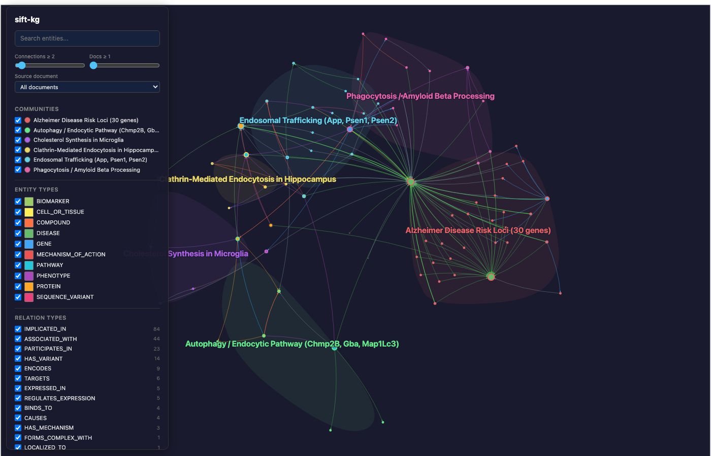
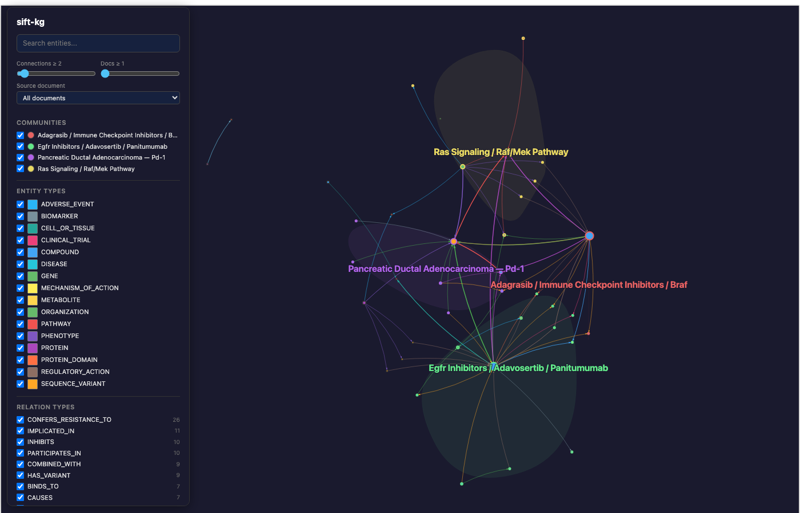
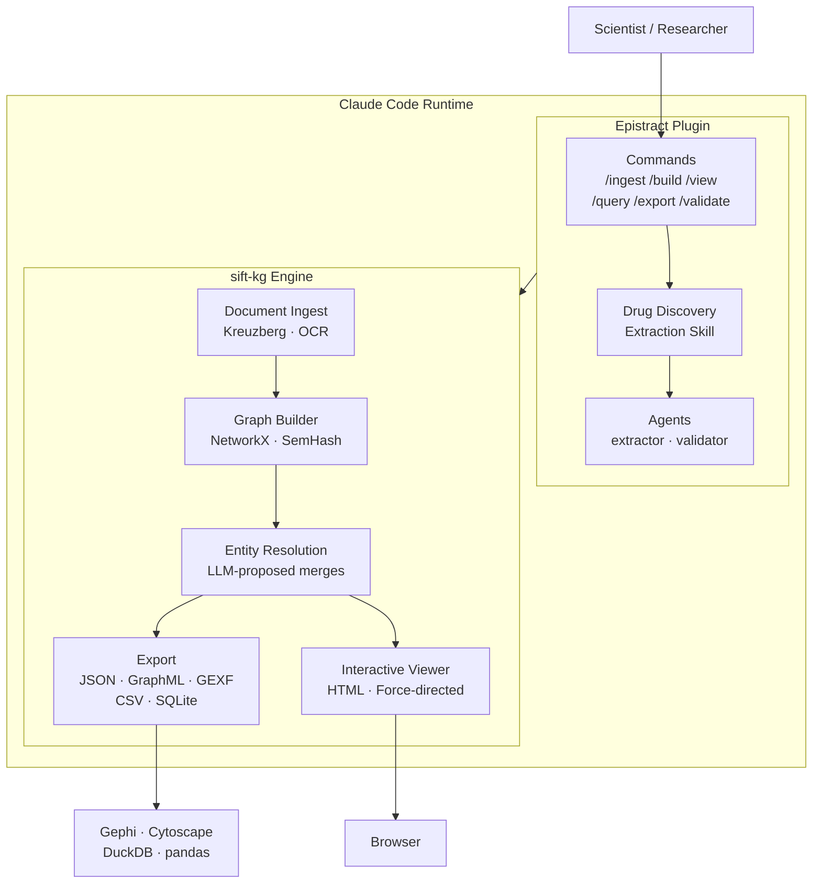
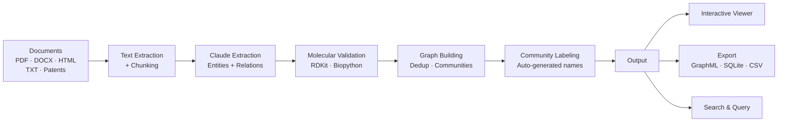
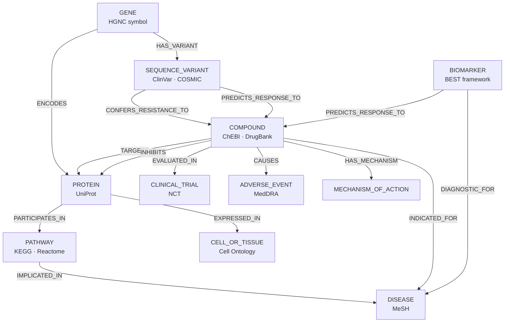

# Epistract

**Turn scientific literature into structured biomedical knowledge.**

Epistract reads drug discovery documents — PubMed papers, bioRxiv preprints, patent filings, clinical trial reports, FDA labels — and builds a knowledge graph that captures the entities and relationships a scientist cares about: compounds, targets, mechanisms, trials, biomarkers, pathways, and how they connect.

It runs as a [Claude Code](https://claude.ai/claude-code) plugin. You point it at a folder of documents. It reads them with a scientist's understanding, extracts structured knowledge using a schema grounded in 40+ established biomedical ontologies, validates molecular identifiers with [RDKit](https://www.rdkit.org/) and [Biopython](https://biopython.org/), and produces an interactive graph you can explore in your browser.

## The Name

From Greek **episteme** (ἐπιστήμη) — structured scientific knowledge, the highest form of knowledge in Aristotle's epistemological hierarchy — combined with **extract**. Episteme is not opinion or belief; it is knowledge grounded in evidence, demonstration, and systematic understanding. That is what this tool produces: not a bag of keywords, but a structured representation of how scientific concepts relate to each other, traceable back to the source text.

---

## Quick Start

### 1. Install

Requires [Claude Code](https://claude.ai/claude-code) and Python 3.11+.

**Install from GitHub** — run these inside any Claude Code session:

```
/plugin marketplace add usathyan/epistract
/plugin install epistract@epistract
```

Then restart Claude Code. The plugin is now available in all sessions.

**For developers** — clone locally and install as a dev marketplace:

```bash
git clone https://github.com/usathyan/epistract.git
```

```
/plugin marketplace add /path/to/epistract
/plugin install epistract@epistract
```

Restart Claude Code after installing.

**Verify installation:**

```
/epistract-setup
```

This installs [sift-kg](https://github.com/juanceresa/sift-kg) (the knowledge graph engine) and checks for optional molecular validation libraries ([RDKit](https://www.rdkit.org/), [Biopython](https://biopython.org/)).

### 2. Ingest Documents

```
/epistract-ingest ./my-papers/
```

Epistract will:
1. Read and chunk all documents (PDFs, DOCX, HTML, TXT, 75+ formats, OCR for scans)
2. Extract entities and relations using the drug discovery schema
3. Validate SMILES, sequences, CAS numbers, NCT IDs found in the text
4. Create structural graph nodes from validated molecular identifiers
5. Build a deduplicated knowledge graph with community detection and auto-labeling
6. Open an interactive visualization in your browser

### 3. Explore

The interactive viewer shows your knowledge graph with labeled community regions, focus mode, trail breadcrumbs, search, and filtering.

### 4. Export

```
/epistract-export graphml    # For Gephi, yEd, Cytoscape
/epistract-export sqlite     # For SQL queries, DuckDB, Datasette
/epistract-export csv        # For spreadsheets, pandas
```

### 5. Query

```
/epistract-query "sotorasib"              # Find entities by name
/epistract-query "KRAS" --type PROTEIN    # Filter by type
```

---

## Commands

| Command | Description |
|---|---|
| `/epistract-setup` | Install dependencies (sift-kg, optional RDKit/Biopython) |
| `/epistract-ingest <path>` | Full pipeline: ingest → extract → validate → build → view |
| `/epistract-build` | Build graph from existing extractions |
| `/epistract-validate` | Validate molecular identifiers in extractions |
| `/epistract-view` | Open interactive graph viewer |
| `/epistract-query <term>` | Search entities in the knowledge graph |
| `/epistract-export <format>` | Export to graphml, gexf, csv, sqlite, json |

---

## Use Cases

- **Literature review** — Map how compounds, targets, and mechanisms connect across a body of research
- **Target validation** — Trace genetic evidence (GWAS, MR) through to protein targets and existing compounds
- **Competitive intelligence** — Ingest patent filings and clinical trial publications to map a therapeutic landscape
- **Safety signal detection** — Extract and connect adverse events across clinical trial reports
- **Biomarker discovery** — Identify which biomarkers predict response to which therapies
- **Due diligence** — Build a structured knowledge base from a target company's publication and patent portfolio

---

## Test Scenarios

Epistract ships with five real-world drug discovery research scenarios, each backed by a curated corpus of PubMed abstracts. Each scenario page includes the use case, corpus details, how to run, expected graph structure, and — for completed runs — actual results with graph screenshots and community analysis.

| # | Scenario | Focus | Documents | Status |
|---|---|---|---|---|
| 1 | [PICALM / Alzheimer's](tests/scenarios/scenario-01-picalm-alzheimers.md) | Genetic target validation | 15 papers | **Completed** |
| 2 | [KRAS G12C Landscape](tests/scenarios/scenario-02-kras-g12c-landscape.md) | Competitive intelligence | 16 papers | **Completed** |
| 3 | [Rare Disease Therapeutics](tests/scenarios/scenario-03-rare-disease.md) | Due diligence | 15 papers | **Completed** |
| 4 | [Immuno-Oncology Combinations](tests/scenarios/scenario-04-immunooncology.md) | Checkpoint combinations | 15 papers | Pending |
| 5 | [Cardiovascular & Inflammation](tests/scenarios/scenario-05-cardiovascular.md) | Cardiology + inflammation | 14 papers | Pending |

See [tests/MANUAL_TEST_SCENARIOS.md](tests/MANUAL_TEST_SCENARIOS.md) for the full index, acceptance criteria, and corpus provenance.

### Scenario 1 Result: PICALM / Alzheimer's Disease



*149 nodes, 457 links, 6 auto-labeled communities. Full results: [scenario-01-picalm-alzheimers.md](tests/scenarios/scenario-01-picalm-alzheimers.md)*

| Community | Members | Theme |
|---|---|---|
| **Alzheimer Disease Risk Loci (30 genes)** | 49 | GWAS genes converging on LOAD |
| **Endosomal Trafficking (APP, PSEN1, PSEN2)** | 18 | Core amyloid/tau pathology cascade |
| **Phagocytosis / Amyloid Beta Processing** | 15 | PICALM variants, TREM2, CD33 |
| **Autophagy / Endocytic Pathway** | 17 | Cross-disease autophagy links (AD, PD) |
| **Clathrin-Mediated Endocytosis in Hippocampus** | 10 | Tissue-specific CME biology |
| **Cholesterol Synthesis in Microglia** | 8 | 2025 Nature: rs10792832 causal mechanism |

### Scenario 2 Result: KRAS G12C Inhibitor Landscape



*108 nodes, 307 links, 4 auto-labeled communities. Full results: [scenario-02-kras-g12c-landscape.md](tests/scenarios/scenario-02-kras-g12c-landscape.md)*

| Community | Members | Theme |
|---|---|---|
| **EGFR Inhibitors / Adavosertib / Panitumumab** | 25 | Combination strategies and CRC responses |
| **Adagrasib / Immune Checkpoint Inhibitors / BRAF** | 20 | Adagrasib clinical profile and bypass resistance |
| **RAS Signaling / RAF/MEK Pathway** | 17 | Mechanistic biology and emerging targets |
| **Pancreatic Ductal Adenocarcinoma / PD-1** | 10 | Disease indications and next-gen RAS-ON inhibitors |

### Automating Test Runs

To run fully automated without permission prompts:

```bash
# Option 1: Skip all permissions (trusted local use only)
claude --dangerously-skip-permissions

# Option 2: Pre-approve specific patterns
claude --allowedTools "Bash(python3 *)" --allowedTools "Read(*)" --allowedTools "Write(*)"
```

Or add to `.claude/settings.json`:
```json
{
  "permissions": {
    "allow": [
      "Bash(python3 *)",
      "Bash(echo *)",
      "Bash(ls *)",
      "Bash(mkdir *)",
      "Read(*)",
      "Write(*/output/*)",
      "Edit(*)"
    ]
  }
}
```

### Testing Rigor & Findings

Each test run exercises the full pipeline and feeds engineering findings back into the codebase. Three critical bugs were discovered and fixed during testing — including an LLM-output schema mismatch (F-001), a semantic community labeling gap (F-002), and a plugin version propagation failure (F-003). All findings include root cause analysis, two-layer fixes, and cross-scenario verification.

See [tests/FINDINGS.md](tests/FINDINGS.md) for the complete engineering findings log.

---

## Architecture



## Pipeline



---

## What It Extracts

Epistract uses a domain schema designed for drug discovery, grounded in the [Biolink Model](https://biolink.github.io/biolink-model/), [Gene Ontology](http://geneontology.org/), [ChEBI](https://www.ebi.ac.uk/chebi/), [MeSH](https://meshb.nlm.nih.gov/), and 40+ other biomedical ontologies.

### Domain Schema — 17 Entity Types, 30 Relation Types

**Implemented in `domain.yaml`, enforced during extraction:**

| Category | Entity Types | Count |
|---|---|---|
| **Drug & Chemistry** | COMPOUND, METABOLITE | 2 |
| **Molecular Biology** | GENE, PROTEIN, PROTEIN_DOMAIN, SEQUENCE_VARIANT, CELL_OR_TISSUE | 5 |
| **Disease & Phenotype** | DISEASE, PHENOTYPE, ADVERSE_EVENT | 3 |
| **Clinical** | CLINICAL_TRIAL, BIOMARKER, REGULATORY_ACTION | 3 |
| **Pathways & Mechanisms** | PATHWAY, MECHANISM_OF_ACTION | 2 |
| **Context** | ORGANIZATION, PUBLICATION | 2 |

**30 relation types** covering:
- **Drug-Target** — TARGETS, INHIBITS, ACTIVATES, BINDS_TO, HAS_MECHANISM
- **Drug-Disease** — INDICATED_FOR, CONTRAINDICATED_FOR
- **Drug-Clinical** — EVALUATED_IN, CAUSES
- **Drug-Drug** — DERIVED_FROM, COMBINED_WITH, INTERACTS_WITH
- **Molecular Biology** — ENCODES, PARTICIPATES_IN, IMPLICATED_IN, CONFERS_RESISTANCE_TO, EXPRESSED_IN, LOCALIZED_TO, HAS_VARIANT, HAS_DOMAIN, METABOLIZED_BY, PHOSPHORYLATES, FORMS_COMPLEX_WITH, REGULATES_EXPRESSION
- **Biomarker** — PREDICTS_RESPONSE_TO, DIAGNOSTIC_FOR
- **Organizational** — DEVELOPED_BY, PUBLISHED_IN, GRANTS_APPROVAL_FOR
- **Fallback** — ASSOCIATED_WITH

Every extraction links back to the source document and passage. Every relation carries a confidence score calibrated for scientific literature.

### Molecular Biology Linkage



The schema captures the full chain from gene → protein → pathway → disease, with drug intervention points, resistance mechanisms, and biomarker links at every level.

---

## Structural Enrichment

Epistract doesn't just extract text — it **validates and enriches molecular structures and sequences**, creating first-class graph nodes from validated identifiers.

### Three Levels of Structural Knowledge

**Level 1 — Structure as Identity:**
Validated SMILES strings become `CHEMICAL_STRUCTURE` nodes with canonical SMILES, InChI, InChIKey, molecular weight, LogP, TPSA, and Lipinski Ro5 analysis. Validated sequences become `NUCLEOTIDE_SEQUENCE` or `PEPTIDE_SEQUENCE` nodes with computed properties. All linked to parent entities via `HAS_STRUCTURE` / `HAS_SEQUENCE` relations.

**Level 2 — InChIKey Deduplication:**
Same molecule, different names across documents? Epistract detects this via InChIKey matching. If two papers call the same compound different names but contain the same SMILES → same InChIKey → merge candidate reported. This is structural deduplication — far more reliable than name matching.

**Level 3 — Computed Properties as Knowledge:**
RDKit computes drug-likeness properties (Lipinski Ro5 violations, TPSA, LogP) that become queryable attributes. Biopython computes sequence properties (GC content, isoelectric point, molecular weight) that enable filtering.

### Why This Matters

LLMs cannot reliably reproduce character-exact molecular notation (SMILES, sequences). A single transposition produces a different molecule. Epistract uses a **hybrid approach**:
1. **Claude** identifies molecular identifiers in text and understands what they represent
2. **Regex patterns** extract the exact strings from the source text
3. **RDKit/Biopython** validates and enriches with computed properties

This means your knowledge graph contains **verified** molecular structures, not LLM approximations.

---

## Molecular Validation

When [RDKit](https://www.rdkit.org/) and/or [Biopython](https://biopython.org/) are installed, Epistract automatically validates molecular identifiers:

**Chemistry (RDKit):**
- SMILES → canonical form, InChI, InChIKey, molecular formula, MW, LogP, HBD/HBA, TPSA, Lipinski Ro5
- Invalid SMILES → flagged and excluded from graph

**Sequences (Biopython):**
- DNA/RNA → GC content, complement, reverse complement, translation
- Amino acid → molecular weight, isoelectric point, instability index, GRAVY
- Antibody CDR sequences → identified by region (H1/H2/H3, L1/L2/L3)

**Pattern Detection (no dependencies):**
- NCT numbers → ClinicalTrials.gov identifiers
- CAS numbers → chemical registry identifiers
- Patent numbers (US, PCT) → intellectual property references
- InChIKey → 27-character molecular fingerprints

---

## How It Works

Epistract combines two systems:

1. **Claude** reads scientific text with deep domain understanding. It identifies entities, classifies them into the schema, extracts relationships with confidence scores, and captures evidence passages. Claude understands that "BRAF V600E" is a sequence variant in the BRAF gene, that "pembrolizumab" is a PD-1-targeting monoclonal antibody, and that "KEYNOTE-024" is a Phase III trial.

2. **[sift-kg](https://github.com/juanceresa/sift-kg)** handles everything downstream: text ingestion from 75+ formats, graph construction with automatic deduplication (SemHash, Unicode normalization), entity resolution with human-in-the-loop review, Louvain community detection, interactive visualization, and export to GraphML/GEXF/CSV/SQLite.

3. **Community labeling** (`label_communities.py`) automatically generates descriptive names for each community based on member entity composition — gene-dominant clusters become "Disease Risk Loci (N genes)", pathway-driven clusters name the pathway, mechanism+cell clusters produce labels like "Cholesterol Synthesis in Microglia".

---

## Ontology Grounding

Every entity type maps to established biomedical ontologies:

| Entity Type | Primary Ontology | Cross-References |
|---|---|---|
| COMPOUND | [ChEBI](https://www.ebi.ac.uk/chebi/) | DrugBank, ChEMBL, PubChem |
| GENE | [HGNC](https://www.genenames.org/) | NCBI Gene, Ensembl |
| PROTEIN | [UniProtKB](https://www.uniprot.org/) | PDB, InterPro |
| DISEASE | [MeSH](https://meshb.nlm.nih.gov/) | Disease Ontology, ICD-11, OMIM |
| PATHWAY | [KEGG](https://www.genome.jp/kegg/) | Reactome, GO Biological Process |
| ADVERSE_EVENT | [MedDRA](https://www.meddra.org/) | CTCAE |
| SEQUENCE_VARIANT | [ClinVar](https://www.ncbi.nlm.nih.gov/clinvar/) | dbSNP, COSMIC |
| BIOMARKER | [BEST Framework](https://www.ncbi.nlm.nih.gov/books/NBK326791/) | Per-analyte ontology |
| CELL_OR_TISSUE | [Cell Ontology](http://obofoundry.org/ontology/cl.html) | Uberon |
| PROTEIN_DOMAIN | [InterPro](https://www.ebi.ac.uk/interpro/) | Pfam, SMART |
| METABOLITE | [ChEBI](https://www.ebi.ac.uk/chebi/) | HMDB, KEGG Compound |

---

## Naming Conventions

Epistract enforces standard biomedical nomenclature:

| Entity | Standard | Example |
|---|---|---|
| Drugs | INN (International Nonproprietary Name) | pembrolizumab, not Keytruda |
| Genes | HGNC symbols | EGFR, TP53, BRCA1 |
| Variants | HGVS protein notation | BRAF V600E, KRAS G12C |
| Diseases | MeSH preferred terms | non-small cell lung cancer |
| Adverse events | MedDRA preferred terms | immune-mediated colitis |
| Proteins | UniProt standard names | PD-1, HER2, VEGFR-2 |

---

## Roadmap

- **Neo4j graph database export** — MERGE nodes/edges with constraints and indexes
- **Vector embeddings** — entity description embeddings and Morgan fingerprints in Neo4j vector index
- **Combined RAG query** — `/epistract-ask` for vector + graph + structure similarity in one query
- **External enrichment** — PubChem/ChEMBL/UniProt API lookups adding nodes from external knowledge bases

---

## Technical Documentation

- **[DEVELOPER.md](DEVELOPER.md)** — Technical reference with 40+ ontology links, sift-kg integration details, data formats, and the full dependency tree
- **[Domain Specification](docs/drug-discovery-domain-spec.md)** — Complete 2000-line schema specification with ontology alignment, extraction guidance, and validation criteria
- **[Plugin Design](docs/epistract-plugin-design.md)** — Architecture and component design
- **[Test Scenarios](tests/MANUAL_TEST_SCENARIOS.md)** — 5 real-world drug discovery scenarios with curated PubMed corpora
- **[Test Requirements](tests/TEST_REQUIREMENTS.md)** — 16 unit tests, 8 functional tests, 18 user acceptance tests with traceability matrix
- **[Engineering Findings](tests/FINDINGS.md)** — Bugs discovered, root cause analysis, systemic lessons from production-quality testing

---

## Requirements

- [Claude Code](https://claude.ai/claude-code) (the runtime environment)
- Python 3.11+
- sift-kg (installed by `/epistract-setup`)
- Optional: [RDKit](https://www.rdkit.org/) (~50MB) for SMILES validation and structural enrichment
- Optional: [Biopython](https://biopython.org/) (~20MB) for sequence validation

## License

MIT
