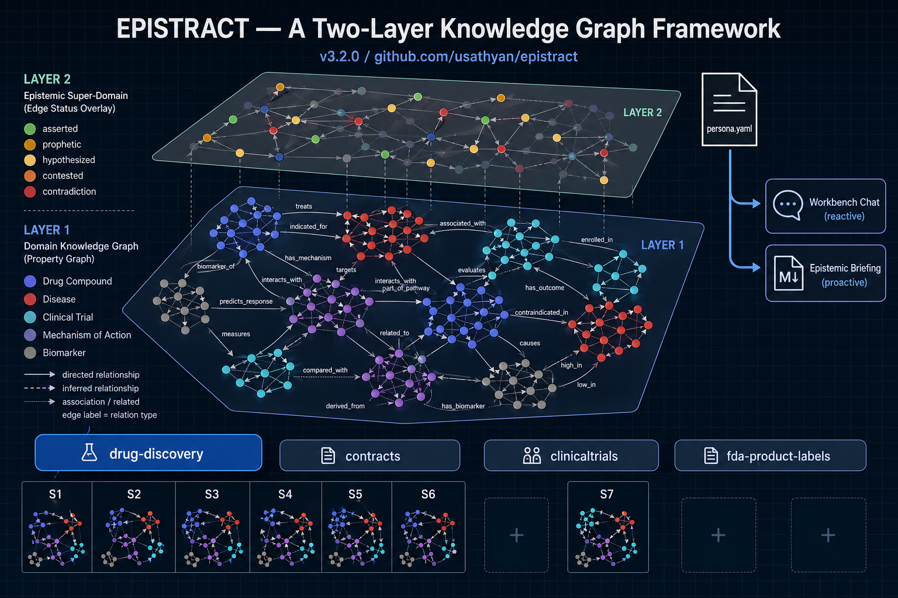

# Epistract

**Turn any corpus of documents into a knowledge graph that actually understands what the documents say, what they contradict, and what they are missing.**

> 📄 **Paper:** *Epistract: A Two-Layer Knowledge Graph Framework with an Epistemic Super-Domain Layer* — [paper/v2/main.pdf](paper/v2/main.pdf) (April 2026, framework v3.2.1).



The diagram above is the whole framework on one page. The dense graph at the bottom is **Layer 1, the brute facts** — entities (compounds, diseases, mechanisms, biomarkers, clinical trials) extracted from the corpus and connected by typed relations, color-coded by entity type. The translucent overlay above it is **Layer 2, the epistemic super-domain** — every relation in the graph carries a categorical status (`asserted`, `prophetic`, `hypothesized`, `contested`, `contradiction`, `negative`) so the graph knows the difference between a peer-reviewed clinical result and patent forward-looking language. **The framework ships with a predefined classification taxonomy and starter rules** — hedging patterns, document-type inference, cross-source aggregation — that work out of the box for the four pre-built domains; you can enhance or customize them for your corpus by editing the domain's `epistemic.py` (one-line additions to `HEDGING_PATTERNS`, custom contradiction rules, or new domain-specific status types like the four-level FDA epistemology classifier we ship for product labels). The single `persona.yaml` icon on the right with two arrows is the second pattern that matters: one analyst persona, defined once per domain, drives both a **reactive workbench chat** and a **proactive auto-generated briefing**. The four pills along the bottom are today's pre-built domains; the row of thumbnails (S1–S7) is the track record — actual scenario corpora that have pressure-tested each domain.

**Think of it as the consolidation layer for your deep research.** [Claude Code](https://claude.ai/claude-code) already gives you rich deep-research capabilities — built-in web search and document fetch, plus a growing ecosystem of plugins and MCP servers for academic literature search, patent and trial-registry retrieval, regulatory database access, and browser automation. You can already use Claude Code to assemble a body of documents that answers a research direction. **Epistract is what you reach for next.** Once you have that body of documents in hand — collected through deep research, manual curation, an institutional document store, or any combination — Epistract consolidates it into a structured knowledge graph project: typed entities and relations, categorical epistemic statuses on every relation, an analyst briefing, and a reactive chat surface. The graph project becomes the substrate for answering many specific questions about the consolidated body. It is **primarily an analysis tool**: it does not transact, does not write back to your corpus, does not generate new documents. It produces artifacts the scientist consumes. Built for biomedical researchers, clinical and regulatory analysts, competitive intelligence teams, contract analysts, and anyone whose work involves rigorous synthesis of literature sets they have already assembled — or are continuing to assemble — through deep research.

**Iterative, not one-and-done.** As your understanding of the consolidated body grows, the framework supports iteration. Some loops stay inside Epistract — `/epistract:epistemic` to re-grade evidence after refining hedging rules, follow-up questions in the workbench chat, persona edits when the analytical voice needs sharpening. Other loops send you back upstream: a gap in the briefing reveals a missing study, you go back to deep research (Claude Code's web tools, MCP-mediated source connectors) to acquire it, then `/epistract:ingest` to fold the new documents in. Deep research lives upstream of the consolidation; the consolidation feeds new questions; new questions drive more deep research. Epistract is the consolidation layer in that loop. The framework itself does not auto-learn across runs — refinements are human-mediated for now, and [Issue #15](https://github.com/usathyan/epistract/issues/15) tracks the aspirational compounding mechanism. What does persist across runs is the scientist's broader context: Claude Code's own memory system and its plugin and MCP ecosystem keep what you've tried, what you've found, and what you want to try next available across sessions.

**Where it fits, where to use export.** The design point is interactive consolidation sessions — small-to-medium corpora that comfortably fit a Claude Code environment. The eight validated scenarios range from 7 to 34 documents per corpus; the framework has not been tested on corpora of hundreds or thousands of documents, and the upper bound at which the chat or briefing degrades is undetermined. For larger or persistent KGs, `/epistract:export` dumps the graph to GraphML, CSV, SQLite, or JSON for ingestion into Neo4j-class persistent stores.

**It ships with four domains out of the box** (drug-discovery, contracts, clinicaltrials, fda-product-labels) and you can create a new one with `/epistract:domain` in under 15 minutes — a domain is 11–17 entity types and 10–22 relation types defined in YAML plus a persona string, no pipeline code changes. **Drug-discovery has been validated across six varied scenarios** (PICALM/Alzheimer's, KRAS G12C, Rare Disease, Immuno-Oncology, Cardiovascular, GLP-1 Competitive Intelligence — 111 documents collectively); clinicaltrials launched with its first (GLP-1 Phase 3 Trials, 10 CT.gov protocols, S7); fda-product-labels launched with its first in v3.2.1 (7-document openFDA SPL corpus, S8 — Ozempic, Wegovy, Mounjaro, Humira, Gleevec, Lipitor, Jantoven). The Pre-built Domains table below tracks each domain's current scenario coverage — schema is static, but a domain that's been run against six varied corpora has had its persona, epistemic rules, and entity coverage pressure-tested in ways one with zero scenarios hasn't.

---

## What it looks like

Here's epistract running on a 34-document GLP-1 corpus (10 drug patents + 24 PubMed papers, built in ~22 minutes):


*278 entities, 855 relationships, 10 communities. Each node is colored by entity type; each edge is a typed relation (TARGETS, INHIBITS, INDICATED_FOR, CAUSES, etc.) with source citations. Pan, zoom, filter by entity type, click any node for neighborhood context. This is the interactive workbench at* `/epistract:dashboard`.


*And this is what the epistemic layer gives you on top of the graph. The chat panel is grounded in the same graph data — ask about prophetic claims, contested indications, or coverage gaps, and it answers with citations to the originating documents.*

More screenshots: [docs/WORKBENCH.md](docs/WORKBENCH.md).

---

## Showcase — what the graph can tell you

On the GLP-1 corpus above, epistract automatically produces an analyst briefing every time you run `/epistract:epistemic`. No manual writing. Here's an excerpt:

> **Executive Summary**
> - **GLP-1/GIP dual and triple agonism is the dominant mechanistic theme** across the corpus. `semaglutide`, `tirzepatide`, `orforglipron`, and `retatrutide` are all represented, with asserted clinical evidence strongest for `semaglutide` and `tirzepatide` in Type 2 Diabetes Mellitus and Obesity, progressively weaker (prophetic → hypothesized) for emerging indications.
> - **61 prophetic claims inflate the apparent indication breadth** of these compounds. Cardiovascular risk reduction, neurodegeneration, and metabolic sub-disorders are largely patent-forward-looking, not empirically established.
> - **Two confirmed contradictions** exist on `semaglutide` and `tirzepatide` obesity indications, where confidence scores span 0.55–0.97 and 0.65–0.97 — a gap large enough to affect regulatory and commercial forecasting.
> - **Safety surveillance is materially incomplete**: Nonarteritic Anterior Ischemic Optic Neuropathy as a `semaglutide` adverse event is hypothesized and contested; long-term cardiovascular outcome data for newer agents are absent.
>
> **Recommended Follow-Ups**
> 1. Temporally stratify the two confirmed contradictions against STEP-1 and SURMOUNT-1 approval dates.
> 2. Integrate SURPASS-2 trial data (Frías et al., NEJM 2021) to close the tirzepatide-vs-semaglutide head-to-head gap.
> 3. Ingest Jastreboff et al. NEJM 2023 — contains asserted efficacy data for `retatrutide` that would upgrade multiple prophetic nodes.

That's the narrator reading 34 abstracts and patents and synthesizing what an analyst would. The full briefing, the graph, the extractions, and the validation report are all in `tests/corpora/06_glp1_landscape/output-v3/`. See [docs/SHOWCASE-GLP1.md](docs/SHOWCASE-GLP1.md) for the full V2→V3 comparison and the complete narrative.

---

## Install

Epistract is a [Claude Code](https://claude.ai/claude-code) plugin. Two commands:

```bash
# 1. In Claude Code, add the marketplace and install
/plugin marketplace add usathyan/epistract
/plugin install epistract

# 2. Install Python dependencies
/epistract:setup
```

**Prerequisites:** Python 3.11+, [uv](https://docs.astral.sh/uv/), Claude Code. Optional: RDKit (molecular validation), Biopython (sequence validation), an API key for the chat/narrator (Azure Foundry, Anthropic, or OpenRouter — graph and extraction work without one).

Full install steps, troubleshooting, and Azure Foundry / enterprise gateway config: [docs/WORKBENCH.md](docs/WORKBENCH.md#install).

---

## First run — five minutes

```bash
# (1) Point at your documents + pick a domain
/epistract:ingest ./my-papers/ --output ./graph-output --domain drug-discovery

# (2) Run the epistemic layer (produces claims_layer.json + epistemic_narrative.md)
/epistract:epistemic ./graph-output

# (3) Explore
/epistract:dashboard ./graph-output --domain drug-discovery
```

Open http://127.0.0.1:8000 — interactive graph, dashboard summary, chat panel powered by the same epistemic-aware analyst persona that wrote the briefing.

Don't have your own corpus? Try the bundled GLP-1 one:

```bash
/epistract:dashboard tests/corpora/06_glp1_landscape/output-v3 --domain drug-discovery
```

Other entry points: `/epistract:acquire` (fetch from PubMed), `/epistract:domain` (create a new domain schema from sample docs). See [docs/COMMANDS.md](docs/COMMANDS.md) for the full command reference.

---

## Build your own domain

Epistract's pipeline is domain-agnostic — the domain lives in a small set of config files. To create one from sample documents:

```bash
/epistract:domain --input ./sample-docs/ --name my-domain
```

The wizard reads your samples, proposes entity/relation types, asks about your analyst persona, and writes a complete domain package:

```
domains/my-domain/
  domain.yaml              # schema (entity types, relation types, validators)
  SKILL.md                 # extractor instructions (how to read your documents)
  epistemic.py             # domain-specific epistemic rules
  workbench/template.yaml  # chat persona + narrator persona + entity colors
```

That's it — the same pipeline works on your domain. Full walk-through: [docs/ADDING-DOMAINS.md](docs/ADDING-DOMAINS.md).

---

## What's inside a graph

Every epistract graph has two layers:

- **Layer 1 — Brute facts.** Entities (compounds, parties, assets, whatever your schema declares) and typed relations between them, each with a confidence score and a verbatim source quote. Extraction is Pydantic-validated at write time — no silent drops.

- **Layer 2 — Epistemic super domain.** Every relation is classified: `asserted` (stated with quantitative evidence), `prophetic` (patent forward-looking language), `hypothesized` (hedged wording), `contested` (multiple sources with conflicting confidence), `contradictions` (opposing evidence), `negative` (explicit absence), `speculative`. A rule engine + an LLM narrator turn the classified graph into a structured briefing.

More: [docs/ARCHITECTURE.md](docs/ARCHITECTURE.md).

---

## Pre-built domains

| Domain | Schema | Scenarios validated | Specialty pipeline | Use cases |
|---|---|---|---|---|
| **drug-discovery** | 13 entity / 22 relation types | **6 scenarios** — [S1 PICALM / Alzheimer's](tests/scenarios/scenario-01-picalm-alzheimers-v2.md) (target validation, 183 nodes / 478 edges) · [S2 KRAS G12C](tests/scenarios/scenario-02-kras-g12c-landscape-v2.md) (CI, 140 / 432) · [S3 Rare Disease](tests/scenarios/scenario-03-rare-disease-v2.md) (due diligence, 110 / 278) · [S4 Immuno-oncology](tests/scenarios/scenario-04-immunooncology-v2.md) (combinations, 151 / 440) · [S5 Cardiovascular](tests/scenarios/scenario-05-cardiovascular-v2.md) (cardiology, 90 / 245) · **[S6 GLP-1 CI](tests/scenarios/scenario-06-glp1-landscape-v2.md)** (V3 rebuild, 278 / 855, full narrator briefing — see [SHOWCASE-GLP1](docs/SHOWCASE-GLP1.md)) | RDKit + Biopython molecular validation; prophetic-claim detection from patents; structural-biology doctype short-circuit | Biomedical literature, patents, clinical trial reports — competitive intelligence, target validation, regulatory / adverse-event capture |
| **clinicaltrials** | 12 / 10 | **1 scenario** — **[S7 GLP-1 Phase 3 Trials](tests/scenarios/scenario-07-clinicaltrials-glp1-phase3.md)** (10 CT.gov protocols, 142 / 395, post-`--enrich` 177 high_evidence relations — see [SHOWCASE-CLINICALTRIALS](docs/SHOWCASE-CLINICALTRIALS.md)) | Phase-based evidence grading (Phase 3 + N≥300 → high; Phase 2 → medium; Phase 1 / observational → low); optional `--enrich` from CT.gov v2 + PubChem PUG REST | ClinicalTrials.gov protocols + IRB submissions + clinical study reports — NCT capture, blinding/enrollment signals, head-to-head comparison framing |
| **contracts** | 11 / 11 | **0 scenarios** — schema scaffold; [showcase walkthrough](docs/showcases/contracts.md) describes the persona; bring your own contract corpus | Cross-contract conflict detection, obligation gap scoring, risk indicators, SLA / force-majeure reasoning | Event / vendor contract analysis, procurement portfolio review, legal due diligence |
| **fda-product-labels** | 17 / 16 | **1 scenario** — **[S8 FDA Product Labels](tests/scenarios/scenario-08-fda-product-labels.md)** (7 SPL labels, 81 nodes / 149 edges, 1,579-word narrator briefing — see [SHOWCASE-FDA](docs/SHOWCASE-FDA.md)) | Four-level FDA epistemology classifier (established / observed / reported / theoretical), in addition to the v3 epistemic vocabulary | FDA Structured Product Labeling (SPL) — drug products, indications, contraindications, boxed warnings, drug interactions, pharmacovigilance, lab-test monitoring |

**Reading the table:** *Schema* is the static shape — entity types and relation types declared once. *Scenarios validated* is the track record — how much real-world corpus the domain has actually been run against, and how many narrator briefings have surfaced refinements that contributors folded back into the domain config. A domain with six scenarios has had its persona, epistemic rules, and entity-type coverage exercised against varied source material; one with zero is a schema waiting for its first run. The framework itself doesn't auto-learn across scenarios today — refinements are human-mediated. ([Issue #15](https://github.com/usathyan/epistract/issues/15) tracks an aspirational cross-scenario knowledge persistence layer.)

All four live in `domains/` as self-contained packages — schemas are human-readable YAML; inspect any of `domains/drug-discovery/domain.yaml`, `domains/contracts/domain.yaml`, `domains/clinicaltrials/domain.yaml`, or `domains/fda-product-labels/domain.yaml`. To start a new scenario on an existing domain, just run `/epistract:ingest <your-corpus> --domain <name>` — no schema work needed.

### Showcases & visual artifacts

**drug-discovery** — S6 GLP-1 Competitive Intelligence (34 docs: 10 patents + 24 PubMed abstracts → 278 nodes, 855 edges, 61 prophetic claims, 1,166-word narrator briefing)

- Showcase: [`docs/SHOWCASE-GLP1.md`](docs/SHOWCASE-GLP1.md)
- Auto-generated analyst briefing: [`tests/corpora/06_glp1_landscape/output-v3/epistemic_narrative.md`](tests/corpora/06_glp1_landscape/output-v3/epistemic_narrative.md)
- Workbench screenshots — [dashboard panel](docs/screenshots/workbench-01-dashboard.png) · [chat welcome](docs/screenshots/workbench-02-chat-welcome.png) · [graph panel](docs/screenshots/workbench-03-graph-glp1.png) · [chat on prophetic claims](docs/screenshots/workbench-04-chat-epistemic.png)
- Interactive graph (open locally in browser): [`tests/corpora/06_glp1_landscape/output-v3/graph.html`](tests/corpora/06_glp1_landscape/output-v3/graph.html)
- Scenario history (V1 → V2 → V3): [`tests/scenarios/scenario-06-glp1-landscape-v2.md`](tests/scenarios/scenario-06-glp1-landscape-v2.md)
- V2 scenario gallery (S1–S5 screenshots from the V2 regression validation): [S1 PICALM](tests/scenarios/screenshots/scenario-01-graph-v2.png) · [S2 KRAS G12C](tests/scenarios/screenshots/scenario-02-graph-v2.png) · [S3 Rare Disease](tests/scenarios/screenshots/scenario-03-graph-v2.png) · [S4 Immuno-oncology](tests/scenarios/screenshots/scenario-04-graph-v2.png) · [S5 Cardiovascular](tests/scenarios/screenshots/scenario-05-graph-v2.png) · [S6 GLP-1](tests/scenarios/screenshots/scenario-06-graph-v2.png)

**clinicaltrials** — S7 GLP-1 Phase 3 Landscape (10 CT.gov protocols: SURPASS, SURMOUNT, STEP, PIONEER, SUSTAIN, ACHIEVE → 142 nodes, 395 edges, 1,197-word narrator briefing)

- Showcase: [`docs/SHOWCASE-CLINICALTRIALS.md`](docs/SHOWCASE-CLINICALTRIALS.md)
- Auto-generated analyst briefing: [`tests/corpora/07_glp1_phase3_trials/output/epistemic_narrative.md`](tests/corpora/07_glp1_phase3_trials/output/epistemic_narrative.md)
- Workbench screenshots — [dashboard panel](docs/screenshots/clinicaltrials-01-dashboard.png) · [chat welcome](docs/screenshots/clinicaltrials-02-chat-welcome.png) · [graph panel](docs/screenshots/clinicaltrials-03-graph.png) · [chat on trial interventions](docs/screenshots/clinicaltrials-04-chat-epistemic.png)
- Interactive graph (open locally in browser): [`tests/corpora/07_glp1_phase3_trials/output/graph.html`](tests/corpora/07_glp1_phase3_trials/output/graph.html)
- Scenario doc: [`tests/scenarios/scenario-07-clinicaltrials-glp1-phase3.md`](tests/scenarios/scenario-07-clinicaltrials-glp1-phase3.md)
- Raw corpus: [`tests/corpora/07_glp1_phase3_trials/docs/`](tests/corpora/07_glp1_phase3_trials/docs/) (10 NCT protocol files)

**contracts** — schema scaffold; bring your own corpus

- Showcase walkthrough: [`docs/showcases/contracts.md`](docs/showcases/contracts.md)
- Domain package: [`domains/contracts/`](domains/contracts/) (schema, SKILL.md, epistemic.py, workbench template with a worked 57-document persona)
- No bundled corpus graph in the public repo — the contracts domain is designed for private legal/procurement work. Run `/epistract:ingest <your-contract-corpus> --domain contracts` to produce your own graph + workbench view.

**fda-product-labels** — S8 FDA Product Labels showcase (7 SPL labels: Ozempic, Wegovy, Mounjaro, Humira, Gleevec, Lipitor, Jantoven → 81 nodes, 149 edges, 1,579-word narrator briefing). Four-level FDA epistemology classifier (new in v3.2).

- Showcase: [`docs/SHOWCASE-FDA.md`](docs/SHOWCASE-FDA.md)
- Auto-generated analyst briefing: [`tests/corpora/08_fda_labels/output/epistemic_narrative.md`](tests/corpora/08_fda_labels/output/epistemic_narrative.md)
- Workbench screenshots — [dashboard panel](docs/screenshots/fda-labels-01-dashboard.png) · [chat welcome](docs/screenshots/fda-labels-02-chat-welcome.png) · [graph panel](docs/screenshots/fda-labels-03-graph.png) · [chat on epistemic](docs/screenshots/fda-labels-04-chat-epistemic.png)
- Interactive graph (open locally in browser): [`tests/corpora/08_fda_labels/output/graph.html`](tests/corpora/08_fda_labels/output/graph.html)
- Scenario doc: [`tests/scenarios/scenario-08-fda-product-labels.md`](tests/scenarios/scenario-08-fda-product-labels.md)
- Raw corpus: [`tests/corpora/08_fda_labels/docs/`](tests/corpora/08_fda_labels/docs/) (7 SPL label files)
- Domain package: [`domains/fda-product-labels/`](domains/fda-product-labels/) (17 entity types, 16 relation types, hand-tailored senior FDA regulatory intelligence analyst persona)
- Four-level FDA epistemology classifier in [`domains/fda-product-labels/epistemic.py`](domains/fda-product-labels/epistemic.py) — `established` (boxed warnings, contraindications, RCT evidence) / `reported` (adverse reactions, post-marketing surveillance) / `theoretical` (mechanism, pharmacology, in vitro) / `asserted` (default) — populated alongside the v3-standard `epistemic_status` field

*GitHub renders `.html` files as source, not interactive pages — clone the repo and open the `graph.html` links locally in a browser to interact with the force-directed graphs.*

---

## Documentation

- [docs/ARCHITECTURE.md](docs/ARCHITECTURE.md) — how the pipeline works, the two-layer design, data formats
- [docs/WORKBENCH.md](docs/WORKBENCH.md) — interactive dashboard, chat panel, LLM provider config (Azure / Anthropic / OpenRouter), install troubleshooting
- [docs/COMMANDS.md](docs/COMMANDS.md) — full `/epistract:*` command reference
- [docs/ADDING-DOMAINS.md](docs/ADDING-DOMAINS.md) — domain wizard walk-through + manual creation
- [docs/PIPELINE-CAPACITY.md](docs/PIPELINE-CAPACITY.md) — formats, limits, what the pipeline will and won't do
- [docs/SHOWCASE-GLP1.md](docs/SHOWCASE-GLP1.md) — GLP-1 competitive-intelligence story (drug-discovery domain), V2 → V3 comparison, full narrator output
- [docs/SHOWCASE-CLINICALTRIALS.md](docs/SHOWCASE-CLINICALTRIALS.md) — Clinical Trials GLP-1 Phase 3 landscape (clinicaltrials domain, v3.1), paired with the S6 literature showcase above
- [docs/showcases/contracts.md](docs/showcases/contracts.md) — contracts-domain showcase
- [docs/known-limitations.md](docs/known-limitations.md) — current propagation contracts and known gaps
- [DEVELOPER.md](DEVELOPER.md) — contributing, internals, extending the pipeline
- [CHANGELOG.md](CHANGELOG.md) — release notes

---

## Name

From Greek **episteme** (ἐπιστήμη) — structured scientific knowledge, the highest form of knowledge in Aristotle's epistemological hierarchy — combined with **extract**. Episteme is not opinion or belief; it is knowledge grounded in evidence, demonstration, and systematic understanding. That is what this tool produces: not a bag of keywords, but a structured representation of how concepts relate to each other, traceable to the source text, honest about what it does and does not know.

---

## License

MIT. See [LICENSE](LICENSE).
