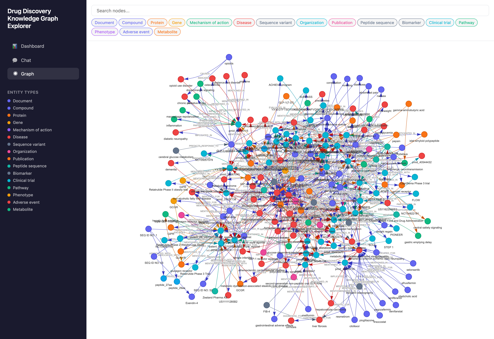
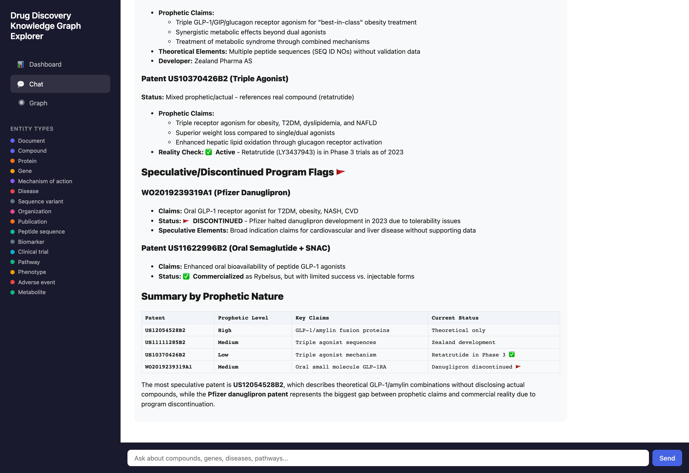

# Epistract

**Turn a pile of documents into a map of what they say — and how sure they are about it.**

> 📄 **Paper:** *Epistract: A Two-Layer Knowledge Graph Framework with an Epistemic Super-Domain Layer* — [paper/v2/main.pdf](paper/v2/main.pdf) (April 2026, framework v3.2.x).
>
> 🎥 **Demo (5 min):** [Epistract at Knowledge Graph Conference 2026](https://youtu.be/SRBXZGL42fQ) (May 2026, framework v3.2.2).

---

## The short version

Imagine you have 30 research papers on your desk and one question to answer. Reading them all takes days. Keeping track of who said what — and which claims are solid versus guesses — is even harder.

Epistract reads the documents for you and builds a **knowledge graph**: a map where each dot is a *thing* (a drug, a disease, a gene, a company) and each line between dots is a *fact* connecting them ("Drug A treats Disease B"). Every line keeps the exact sentence it came from, so you can always check the source.

Then it adds a second layer that most tools skip: **how sure is each fact?** Was it proven in a clinical trial? Is it a hopeful prediction in a patent? Is the author hedging with words like "may" or "might"? Do two papers disagree? That second layer is what the name is about — *epistemic* means "having to do with knowledge and how we know things."

You can then explore the map, ask it questions in plain English, and get answers that point back to the original documents.

**A few words you'll see below:**

| Word | Plain meaning |
|---|---|
| **Corpus** | The set of documents you give Epistract (a folder of PDFs, web pages, etc.) |
| **Entity** | A "thing" found in the documents — a drug, a gene, a company, a contract clause |
| **Relation** | A fact linking two entities — "Drug A *inhibits* Protein B" |
| **Knowledge graph** | All the entities (dots) and relations (lines) together, as a map |
| **Extraction** | The step where AI reads the documents and pulls out entities and relations |
| **Domain** | A subject area (drug research, contracts, FDA labels…) with its own list of entity and relation types |
| **Epistemic layer** | Labels on each fact saying how certain it is and where that certainty comes from |
| **Claude Code** | Anthropic's AI coding assistant. Epistract runs inside it as a plugin (an add-on) |

---

## Why this exists

I have spent the last decade building enterprise knowledge graphs — Anzo from the Cambridge Semantics era, AWS Neptune / RDF stacks, Neo4j deployments at multiple companies. They worked. They answer the big-picture questions executives ask: what does the whole organization know, where do different teams' work overlap, how well do we cover a topic. For *breadth*, they are the right tool.

Epistract is built for a different person. Think of:

- a biomedical researcher reading 30 papers to decide whether a drug target is worth pursuing,
- a regulatory specialist comparing seven FDA drug labels,
- a competitive-intelligence (CI) analyst working through a competitor's patents,
- a contracts reviewer sorting through a stack of vendor agreements.

Each of them has a specific question and a hand-picked set of documents for it. The graph they need exists for *that one question* — built fast, questioned hard, and put away once the decision is made. A permanent company-wide graph is the wrong tool for that job: too slow to build, too broad to be precise, and too costly to shut down.

Epistract is built for that job. Point it at your documents and you get a structured graph that answers detailed questions about *those* documents, with citations. On top of that sits the epistemic layer, which tells apart peer-reviewed findings, forward-looking patent language, and hedged guesses. The whole loop — documents → extraction → graph → questions → archive — runs from start to finish in one person's work session, inside [Claude Code](https://claude.ai/claude-code). No platform team. No committee to design the vocabulary. No giant graph to maintain.

What makes this practical now is running several AI helpers at once (a "multi-agent harness"). Claude Code runs the extraction helpers in parallel, one per document. The workbench chat reads the same graph data that the narrator (the AI that writes the summary briefing) used. One AI persona handles both your questions and the proactive briefing. Epistract is one tool inside that setup: it builds the graph and does the epistemic analysis. Claude Code itself handles finding documents, deeper research, and archiving.

---

## What it looks like



*Epistract running on a 34-document GLP-1 corpus (10 patents + 24 PubMed papers — GLP-1 drugs include Ozempic and Mounjaro): 278 entities, 855 typed relations, 10 communities (clusters of closely linked entities), built in about 22 minutes. Each dot is colored by entity type; each line is a typed relation carrying a word-for-word quote from its source and a confidence score. Pan, zoom, filter, and click any dot to see its neighbors. Names appear as you zoom in, starting with the most-connected dots, so the map stays readable. Hover over or click a line to see what kind of relation it is. The interactive workbench opens with `/epistract:dashboard`.*



*The chat panel reads the same graph data the narrator wrote. Ask about prophetic claims (predictions made in patents), disputed uses, or gaps in what the documents cover, and it answers with citations back to the original documents.*

More screenshots: [docs/WORKBENCH.md](docs/WORKBENCH.md).

---

## What Epistract is — and isn't

**It is**

- A way to pull together a small-to-medium set of documents (7–34 documents in the eight tested scenarios)
- A two-layer graph: plain facts from the documents, plus a certainty label on every fact
- A set of AI helpers that runs start to finish inside Claude Code
- Pluggable — five ready-made subject domains, and a wizard that builds a new one from your sample documents in about 15 minutes

**It isn't**

- A permanent company-wide graph database — use `/epistract:export` to move the graph into Neo4j, Neptune, or SQLite for that
- A document-finding tool — Claude Code's web tools and MCP connectors (plug-ins that link Claude to outside services) do that. Epistract starts once you have the documents. (The one exception: `/epistract:acquire` can pull papers from PubMed for you.)
- A general answer engine — it answers detailed questions about *the documents you gave it*, not the whole internet
- Self-learning from one run to the next — improvements are made by people; [Issue #15](https://github.com/usathyan/epistract/issues/15) tracks the goal of having it learn over time

---

## The two layers

**Layer 1 — Brute facts.** "Brute facts" just means the raw facts, before any judgment. These are the entities and typed relations pulled from the documents. Each one comes with a confidence score (0 to 1) and a word-for-word quote from the source. Every record is checked against a strict format (Pydantic validation) when it is saved, so nothing is quietly dropped.

**Layer 2 — The epistemic "super-domain."** "Super-domain" means this layer works the same way on top of *any* subject area. Every relation gets one certainty label:

| Label | What it means |
|---|---|
| `asserted` | Stated as fact, backed by numbers or evidence |
| `prophetic` | A forward-looking prediction, typical of patents ("the compound may be used to treat…") |
| `hypothesized` | Hedged wording — "may," "might," "suggests" |
| `contested` | Several sources mention it, but with different levels of confidence |
| `contradiction` | Sources directly disagree |
| `negative` | The documents explicitly say something is *not* the case |
| `speculative` | A weak guess with little support |

Domains can add their own labels. The FDA domain adds a four-level evidence scale — `established` / `observed` / `reported` / `theoretical` — that runs alongside the labels above (the "v3 vocabulary").

**One concrete example.** On the GLP-1 corpus (scenario S6, drug-discovery domain), Epistract finds **61 prophetic claims** — patent predictions that these drugs may help heart disease and brain diseases like Alzheimer's — and contrasts them with **asserted** clinical-trial results for `semaglutide` (Ozempic/Wegovy) and `tirzepatide` (Mounjaro) in type 2 diabetes (T2DM) and obesity. A regular knowledge graph would lump all of these together as the same kind of fact. Epistract's narrator briefing points out the gap directly and recommends three follow-up studies to close it.

More: [docs/ARCHITECTURE.md](docs/ARCHITECTURE.md).

---

## Install

Epistract is a plugin for [Claude Code](https://claude.ai/claude-code). Two steps:

```bash
# 1. In Claude Code, add the marketplace and install
/plugin marketplace add usathyan/epistract
/plugin install epistract

# 2. Install the Python libraries it needs
/epistract:setup
```

**You need:** Python 3.11 or newer, [uv](https://docs.astral.sh/uv/) (a Python package installer), and Claude Code.

**Optional:**
- RDKit — checks chemical structure codes (SMILES) for correctness
- Biopython — checks DNA and protein sequences
- An API key for an AI provider (Azure Foundry, Anthropic, or OpenRouter) — needed only for the chat panel and the narrator briefing. Building the graph and extracting facts work without one. The default Anthropic model is Claude Sonnet 5.

Full install steps, troubleshooting, and Azure Foundry / company gateway setup: [docs/WORKBENCH.md](docs/WORKBENCH.md#install).

---

## Showcase — S8: FDA Product Labels

The official prescribing information that comes with a drug is called its "label" (the FDA publishes these as Structured Product Labels, or SPLs). We gave Epistract seven of them: Ozempic, Wegovy, and Mounjaro (GLP-1 drugs for diabetes and weight loss), Humira (a TNF biologic for autoimmune disease), Gleevec (a targeted cancer drug), Lipitor (a cholesterol-lowering statin), and Jantoven (warfarin, a blood thinner). They were downloaded from openFDA, read, turned into a graph, run through the epistemic layer, and summarized in a 1,579-word analyst briefing.

```bash
# Try it yourself — the S8 graph is already included in the repo
/epistract:dashboard tests/corpora/08_fda_labels/output --domain fda-product-labels
```

Open http://127.0.0.1:8000 in your browser. You get the interactive graph, a dashboard, and a chat panel using the FDA regulatory-intelligence persona. Here is part of the briefing it wrote on its own:

> **Boxed warnings**: *Adalimumab* carries a boxed warning for serious infections and malignancy; *Warfarin* has a boxed warning for major hemorrhage. (Established evidence tier.)
>
> **Drug-drug interactions**: *Warfarin* interactions with CYP2C9 inhibitors, NSAIDs, and antiplatelets; *Semaglutide* interactions with antidiabetic agents and gastric motility drugs. (Reported.)
>
> **Knowledge gaps**: missing pharmacokinetic data for *Semaglutide* in renal impairment; no mechanism-of-action detail for *Imatinib* in the generic label; absent pediatric / geriatric patient-population data for *Tirzepatide*. (Theoretical / Hypothesized.)
>
> **Bottom line**: the corpus contains robust boxed warnings and contraindications but is sparse on pharmacokinetic and patient-population data for newer agents. Formulary decisions should weigh the high-quality safety signals against the gaps in dosing guidance for special populations.

*In plain words:* a **boxed warning** is the FDA's strongest safety alert. Adalimumab is Humira, imatinib is Gleevec, and tirzepatide is Mounjaro. **Pharmacokinetic** data describes how the body absorbs and clears a drug. A **formulary** is the list of drugs a hospital or insurer agrees to cover. So the briefing says: the labels are strong on safety warnings but thin on dosing details for kidney patients, children, and older adults.

That is the FDA persona reading seven labels and pulling together what a regulatory analyst would. The four-level FDA evidence scale reveals something a regular knowledge graph can't show. A drug's mechanism of action (theoretical), its after-market bleeding reports (reported), its results from randomized controlled trials (observed), and its boxed warning (established) all sit in the same label document. Epistract keeps them as separate facts in the graph, each with a different weight of evidence.

Full briefing, graph, extractions, and validation: **[docs/SHOWCASE-FDA.md](docs/SHOWCASE-FDA.md)**.

---

## Pre-built domains

A domain is a ready-made package for one subject area: the list of entity and relation types to look for, instructions for the AI reader, and the rules for the epistemic layer. Five domains come with the framework:

- **drug-discovery** — research papers and patents about medicines · 17 entity / 30 relation types · tested on 6 scenarios (from PICALM/Alzheimer's to GLP-1 competitive intelligence)
- **clinicaltrials** — study plans registered on ClinicalTrials.gov · 12 entity / 10 relation types · tested on 1 scenario · `--enrich` adds extra detail from the ClinicalTrials.gov v2 API and PubChem
- **fda-product-labels** — FDA drug labels (SPLs) · 17 entity / 16 relation types · tested on 1 scenario · includes the four-level FDA evidence scale
- **pharmacovigilance** — reports of side effects after a drug is on the market (from FAERS, VAERS, MedWatch) · 12 entity / 12 relation types · uses the Bradford-Hill criteria (a standard checklist for judging whether a drug caused a side effect), MedDRA PT (standard side-effect names), and WHO ATC (standard drug codes) · ships a FAERS document downloader
- **contracts** — event and vendor contract analysis · 9 entity / 9 relation types · a starter schema (bring your own documents)

There is also a special sixth package, **crosswalk**. It isn't for reading documents; it is what `/epistract:crosswalk` uses to display joins between other graphs (see [Connecting graphs](#connecting-graphs--crosswalk) below).

Full per-domain schemas, scenario coverage tables, test history, and showcase files (screenshots, briefings, interactive graphs): **[docs/DOMAINS.md](docs/DOMAINS.md)**.

To create a new domain from sample documents:

```bash
/epistract:domain --input ./sample-docs/ --name my-domain
```

The wizard reads your samples, suggests entity and relation types, asks what kind of analyst persona you want, and writes a complete domain package. Walk-through: [docs/ADDING-DOMAINS.md](docs/ADDING-DOMAINS.md).

You can manage domains afterward with `/epistract:domain-list`, `/epistract:domain-update` (a guided editor that can also re-read a sample corpus and suggest new types), and `/epistract:domain-delete` (archive or remove).

---

## Connecting graphs — crosswalk

Each domain builds its own graph from its own documents. But the most interesting findings often sit *between* graphs. For example: a side effect that patients report to the FDA, but that the drug's own label never mentions.

`/epistract:crosswalk` joins two or more finished graphs on shared IDs — drug names (brand names and chemical forms are collapsed to one standard name), clinical trial IDs (NCT numbers), and standard side-effect terms (MedDRA). It then runs cross-domain rules over the join. The result is shown as its own graph that you can open in the workbench, the graph viewer, or any export format. It is a graph *about the connections*; the original graphs are never merged together.

On the bundled FDA-label, pharmacovigilance, and clinical-trial graphs, the rules flagged:

- **103** side effects reported to FAERS that the drug's own label doesn't mention (across 8 drugs)
- **179** outcomes that a registered trial measured but the label's description of that trial doesn't state (across 23 trials)

Treat these as a **list to review, not confirmed findings.** Many are wording differences or naming mismatches rather than true gaps. The rule files are checked strictly when loaded, so a typo fails loudly instead of quietly producing zero results.

```bash
/epistract:crosswalk ./labels-out ./faers-out ./trials-out --dashboard
```

Details: [commands/crosswalk.md](commands/crosswalk.md) and the crosswalk section of [docs/ADDING-DOMAINS.md](docs/ADDING-DOMAINS.md#crosswalkyaml-reference-optional).

---

## Commands

You type these inside Claude Code.

| Command | What it does |
|---|---|
| `/epistract:setup` | Install the Python libraries, plus optional checking tools |
| `/epistract:acquire` | Search PubMed and download papers |
| `/epistract:ingest` | Read your documents, extract entities and relations, and build the graph |
| `/epistract:build` | Rebuild the graph from extractions you already have (skips the AI reading step) |
| `/epistract:validate` | Check chemical structures (SMILES) and DNA/protein sequences found in extractions |
| `/epistract:epistemic` | Add certainty labels and write the analyst briefing |
| `/epistract:dashboard` | Open the interactive workbench (graph + dashboard + chat) |
| `/epistract:view` | Open a simpler interactive graph viewer in your browser |
| `/epistract:query` | Search the graph by entity name or type |
| `/epistract:ask` | Ask one plain-English question about the graph |
| `/epistract:export` | Save the graph as GraphML, GEXF, CSV, SQLite, or JSON (OKF is available from the terminal — see below) |
| `/epistract:domain` | Create a new domain from sample documents (wizard) |
| `/epistract:domain-list` | List installed domains, active and archived |
| `/epistract:domain-update` | Edit a domain's schema, AI instructions, or epistemic rules (guided) |
| `/epistract:domain-delete` | Archive or permanently remove a domain (asks you to confirm) |
| `/epistract:crosswalk` | Join two or more built graphs on shared IDs and show the connections and cross-domain findings as their own graph |

Full reference and options: [docs/COMMANDS.md](docs/COMMANDS.md).

### Projects — named, reusable knowledge bases

Want to keep several knowledge bases side by side and add to them over time? The **project commands** let you create named collections, add documents whenever you like, and search or ask questions by name. No folder paths to remember, and updating the search index only reprocesses what changed.

| Command | What it does |
|---|---|
| `/epistract:init <name>` | Create a named project (with its own documents, graph, and search index) |
| `/epistract:add-files` / `/epistract:add-url` | Add documents or web pages to a project (duplicates are skipped automatically) |
| `/epistract:index` | Build or refresh the search index (only new or changed documents) |
| `/epistract:search <query>` | Search both entities and document text (`--expand` also follows links in the graph) |
| `/epistract:enhance` | Clean up the graph: merge duplicate entities, double-check relations against their quotes, and add a time-aware certainty layer |
| `/epistract:projects` | List, inspect, or delete projects |

```bash
/epistract:init glp1-research --domain drug-discovery
/epistract:add-files paper1.pdf paper2.pdf --project glp1-research
/epistract:index  --project glp1-research
/epistract:search "GLP-1 receptor agonist" --project glp1-research --expand
```

These also work as a regular terminal command (`epistract init …`, `epistract search …`, `epistract status`) for scripting. To get the `epistract` terminal command, run `uv pip install -e .` from the repo folder. The terminal version also offers `epistract export --format okf`, which saves the graph as an [Open Knowledge Format](docs/OKF-MAPPING.md) bundle — a folder of readable Markdown pages, one per concept.
Full walkthrough: **[docs/PROJECTS.md](docs/PROJECTS.md)**.

---

## Documentation

- [docs/ARCHITECTURE.md](docs/ARCHITECTURE.md) — how the pipeline works, the two-layer design, data formats
- [docs/DOMAINS.md](docs/DOMAINS.md) — per-domain schemas, scenarios, showcase files
- [docs/COMMANDS.md](docs/COMMANDS.md) — full `/epistract:*` reference
- [docs/PROJECTS.md](docs/PROJECTS.md) — named, reusable knowledge bases (init / add / index / search / enhance)
- [docs/WORKBENCH.md](docs/WORKBENCH.md) — using the workbench, AI provider setup (Azure / Anthropic / OpenRouter), install troubleshooting
- [docs/ADDING-DOMAINS.md](docs/ADDING-DOMAINS.md) — domain wizard, building a domain by hand, crosswalk setup
- [docs/PIPELINE-CAPACITY.md](docs/PIPELINE-CAPACITY.md) — supported file types, limits, what works and what doesn't
- [docs/known-limitations.md](docs/known-limitations.md) — current guarantees and known gaps
- [docs/OKF-MAPPING.md](docs/OKF-MAPPING.md) — how the Open Knowledge Format export is laid out
- [DEVELOPER.md](DEVELOPER.md) — contributing and internals
- [CHANGELOG.md](CHANGELOG.md) — release notes

---

## Name

From the Greek **episteme** (ἐπιστήμη) — organized, well-founded knowledge, the highest kind of knowing in Aristotle's ranking — combined with **extract**. Episteme is not opinion or belief; it is knowledge backed by evidence, proof, and careful understanding. That is what this tool aims to produce: not a bag of keywords, but a structured picture of how ideas relate to each other, traceable back to the source text, and honest about what it does and does not know.

---

## License

MIT. See [LICENSE](LICENSE).
