# Adding a Domain to Epistract

Epistract is a domain-agnostic knowledge graph framework. Each domain is a self-contained package that teaches the extraction engine what to look for in your documents. This guide covers two paths: the automated wizard (recommended) and manual creation for power users.

---

## Quick Start: Domain Wizard

The fastest path to a working domain. Five steps from sample documents to an interactive knowledge graph.

### Step 1: Gather Sample Documents

Collect 3-5 representative documents from your target corpus. These should cover the range of entity types and relationships you want to extract. Supported formats: PDF, DOCX, HTML, TXT, XLS, EML (75+ formats via Kreuzberg).

```
mkdir ./sample-docs/
# Copy 3-5 representative documents here
```

### Step 2: Run the Wizard

```bash
/epistract:domain --input ./sample-docs/
```

The wizard performs multi-pass LLM analysis on your sample documents:

1. **Document reading** -- extracts text from all supported formats
2. **Entity discovery** -- proposes entity types based on what appears in the documents
3. **Relation discovery** -- proposes relation types based on how entities connect
4. **Schema generation** -- produces a complete `domain.yaml` with types, descriptions, and extraction hints
5. **Package generation** -- creates `SKILL.md` extraction prompt and `epistemic.py` analysis rules

The wizard limits schemas to 15 entity types and 20 relation types to keep extraction focused. You can always add more manually after reviewing the output.

### Step 3: Review the Generated Schema

The wizard outputs a complete domain package to `domains/your-domain/`:

```
domains/your-domain/
  domain.yaml    # Entity types, relation types, aliases
  SKILL.md       # LLM extraction prompt with domain knowledge
  epistemic.py   # Domain-specific analysis rules
  references/    # Ontology references (if applicable)
```

Open `domain.yaml` and review the proposed entity and relation types. Adjust descriptions, add or remove types, and refine extraction hints as needed.

### Step 4: Test with Full Corpus

```bash
/epistract:ingest --domain your-domain --input ./full-corpus/
```

Run extraction on your full document set. Check entity and relation quality in the output. The pipeline will:
- Read all documents in the input directory
- Extract entities and relations using your domain schema
- Build a deduplicated knowledge graph with community detection
- Run epistemic analysis (conflicts, gaps, risks)

### Step 5: Explore Your Graph

```bash
/epistract:view
```

Open the interactive graph visualization in your browser. Run queries, explore communities, and export to GraphML, CSV, or SQLite.

---

## What Gets Generated



A domain package directory contains:

| File | Purpose | Required |
|------|---------|----------|
| `domain.yaml` | Entity types, relation types, aliases, system context | Yes |
| `SKILL.md` | LLM extraction prompt with domain knowledge and examples | Yes |
| `epistemic.py` | Domain-specific epistemic analysis (conflicts, gaps, risks) | Yes |
| `references/` | Ontology references, nomenclature guides | Optional |
| `workbench/` | Dashboard customization (`template.yaml`) | Optional |

The domain resolver discovers domains automatically from the `domains/` directory. You can also register aliases for convenient access (e.g., `--domain contract` resolves to `domains/contracts/`).

---

## Manual Domain Creation

For power users who want full control or need to customize beyond what the wizard generates.

### domain.yaml Reference

The schema file defines what the extraction engine looks for. Every field explained:

```yaml
# Domain metadata
name: "your-domain"          # Human-readable name, used in output
version: "1.0.0"             # Semantic version for tracking changes
description: |               # Multi-line description of the domain
  What this domain covers and what document types it handles.

# System context -- instructions for the LLM extraction agent
system_context: |
  You are analyzing [domain] documents to build a knowledge graph
  of [key concepts]. [Domain-specific disambiguation rules go here.]

# Entity types -- what to extract from documents
entity_types:
  ENTITY_NAME:               # SCREAMING_SNAKE_CASE convention
    description: "..."       # Guides LLM extraction -- be specific
    extraction_hints:        # Optional: concrete extraction guidance
      - "Look for..."
      - "Include..."
    attributes:              # Optional: structured fields on entities
      - name: "field_name"
        type: "string"

# Relation types -- how entities connect
relation_types:
  RELATION_NAME:
    description: "..."       # What this relationship means
    source_types: [...]      # Which entity types can be source
    target_types: [...]      # Which entity types can be target
    symmetric: false         # Optional: true if A-B implies B-A
    review_required: false   # Optional: flag for human review

# Aliases for domain resolution (e.g., "contract" -> "contracts")
aliases: ["alias1", "alias2"]

# Fallback relation type when no specific type matches
fallback_relation: ASSOCIATED_WITH
```

#### Drug Discovery Example (17 entity types, 30 relation types)

From `domains/drug-discovery/domain.yaml` -- a complex biomedical schema:

```yaml
name: "Drug Discovery"
version: "1.0.0"
description: |
  Domain for extracting structured knowledge graphs from drug discovery and
  pharmaceutical research documents. Covers the full pipeline from target
  identification through clinical development and regulatory approval.

system_context: |
  You are analyzing drug discovery and pharmaceutical research documents...

  NOMENCLATURE STANDARDS -- use canonical names whenever possible:
  - Drugs/compounds: prefer International Nonproprietary Names (INN)
  - Genes: use HGNC-approved symbols (e.g. "BRAF" not full name)
  - Diseases: prefer MeSH terms
  - Adverse events: prefer MedDRA Preferred Terms

  DISAMBIGUATION RULES -- choose the correct entity type:
  - GENE vs PROTEIN: Use GENE for genomic locus/mutation; PROTEIN for
    translated product/binding/inhibition
  - COMPOUND vs MECHANISM_OF_ACTION: "nivolumab" is COMPOUND;
    "PD-1 inhibition" is MECHANISM_OF_ACTION

entity_types:
  COMPOUND:
    description: "Small molecules, biologics, drug candidates, approved drugs"
    extraction_hints:
      - "Look for drug names (INN), brand names, compound codes"
      - "Include biologics such as monoclonal antibodies, ADCs, gene therapies"
      - "Capture development stage when mentioned"
  GENE:
    description: "Genes, genetic loci, alleles, and genomic variants"
    extraction_hints:
      - "Use HGNC symbols when available (e.g. 'BRCA1', 'TP53', 'KRAS')"
      - "Include specific variants and mutations"
  PROTEIN:
    description: "Proteins, enzymes, receptors, ion channels, and complexes"
    extraction_hints:
      - "Look for drug targets: kinases, GPCRs, nuclear receptors"
      - "Use PROTEIN when discussing binding or catalytic activity"
  DISEASE:
    description: "Medical conditions with established diagnostic criteria"
    extraction_hints:
      - "Prefer MeSH disease terms for canonical naming"
      - "Include disease subtypes and staging"
  # ... 13 more entity types including MECHANISM_OF_ACTION, CLINICAL_TRIAL,
  #     PATHWAY, BIOMARKER, ADVERSE_EVENT, ORGANIZATION, PUBLICATION,
  #     REGULATORY_ACTION, PHENOTYPE, METABOLITE, CELL_OR_TISSUE,
  #     PROTEIN_DOMAIN, SEQUENCE_VARIANT

relation_types:
  TARGETS:
    description: "Compound acts on a protein or gene target"
    source_types: [COMPOUND]
    target_types: [PROTEIN, GENE]
  INHIBITS:
    description: "Entity inhibits or blocks the activity of another"
    source_types: [COMPOUND, PROTEIN]
    target_types: [PROTEIN, GENE, PATHWAY]
  INDICATED_FOR:
    description: "Compound is indicated for or used to treat a disease"
    source_types: [COMPOUND]
    target_types: [DISEASE]
  CONFERS_RESISTANCE_TO:
    description: "Gene or protein confers resistance to a compound"
    source_types: [GENE, PROTEIN, PHENOTYPE]
    target_types: [COMPOUND]
    review_required: true
  # ... 26 more relation types
```

Key patterns: nomenclature standards in `system_context`, disambiguation rules, `extraction_hints` for each type, `review_required` flag for safety-critical relations.

#### Contracts Example (9 entity types, 9 relation types)

From `domains/contracts/domain.yaml` -- a simpler but effective schema:

```yaml
name: "Contract Analysis"
version: "1.0.0"
description: |
  Domain for extracting structured knowledge graphs from event contracts,
  vendor agreements, and service-level agreements. Covers obligations,
  deadlines, costs, parties, and cross-contract dependencies.

system_context: |
  You are analyzing event contracts and vendor agreements to build a
  knowledge graph of parties, obligations, deadlines, costs, and
  cross-contract dependencies.

entity_types:
  PARTY:
    description: "Organization or individual that is a signatory or referenced entity"
  CONTRACT:
    description: "A formal agreement between parties"
  OBLIGATION:
    description: "A required action, delivery, or compliance requirement"
  DEADLINE:
    description: "A date or time constraint for an obligation or deliverable"
  COST:
    description: "A monetary amount, fee, or payment term"
  VENUE:
    description: "A physical location referenced in a contract"
  SERVICE:
    description: "A service being provided under contract"
  INSURANCE:
    description: "Insurance requirement or coverage specification"
  PENALTY:
    description: "A consequence for breach or non-compliance"

relation_types:
  OBLIGATED_TO:
    description: "Party is obligated to fulfill an obligation"
  HAS_DEADLINE:
    description: "Obligation or deliverable has a deadline"
  COSTS:
    description: "Service or obligation has an associated cost"
  SIGNED_BY:
    description: "Contract is signed by a party"
  PROVIDES_SERVICE:
    description: "Party provides a service"
  HELD_AT:
    description: "Event or service is at a venue"
  REQUIRES_INSURANCE:
    description: "Contract requires insurance coverage"
  CROSS_REFERENCES:
    description: "One contract references another"
  PENALIZES:
    description: "Breach triggers a penalty"
```

Key patterns: no `extraction_hints` needed for straightforward types, descriptions are the primary guidance, cross-contract references are high-value relation types.

### SKILL.md Guide

The extraction prompt (`SKILL.md`) teaches the LLM agent how to extract entities and relations from your documents. Structure:

1. **Role definition** -- who the agent is and what it specializes in
2. **Domain context** -- what documents look like, what to extract
3. **Entity type descriptions** with examples and disambiguation rules
4. **Relation type descriptions** with evidence patterns
5. **Output format** -- DocumentExtraction JSON schema with example
6. **Confidence scoring** -- calibration guidelines (0.9-1.0 explicit, 0.7-0.89 supported, 0.5-0.69 inferred, <0.5 speculative)

**Drug discovery SKILL.md** (detailed, ~44KB): Opens with "You are an expert biomedical knowledge engineer..." and includes nomenclature standards (INN for drugs, HGNC for genes, MeSH for diseases, MedDRA for adverse events), disambiguation rules (GENE vs PROTEIN, COMPOUND vs MECHANISM_OF_ACTION), and per-type extraction examples.

**Contracts SKILL.md** (concise, ~1KB): Opens with entity and relation type tables, followed by extraction guidelines: "Every obligation must link to a responsible party and a deadline if specified."

The level of detail scales with domain complexity. Drug discovery needs extensive disambiguation rules because biomedical terminology is ambiguous. Contracts are more straightforward and need less guidance.

### epistemic.py Reference

The epistemic module implements domain-specific analysis that runs after graph construction. It must export an `analyze` function (or domain-specific entry point) that takes graph data and returns a claims layer.

**Drug discovery entry point** (`domains/drug-discovery/epistemic.py`):

```python
def analyze_biomedical_epistemic(output_dir: Path, graph_data: dict) -> dict:
    """Run full biomedical epistemic analysis on a built graph.

    Args:
        output_dir: Directory containing graph_data.json.
        graph_data: Parsed graph_data.json dict with nodes and links.

    Returns:
        Claims layer dict with keys: metadata, summary, base_domain, super_domain.
    """
```

Biomedical epistemic analysis detects:
- **Hedging language** -- patterns like "suggests", "may inhibit", "preliminary data" classify relations as hypothesized, speculative, or prophetic
- **Contradictions** -- same relation with opposing evidence across mentions (positive vs negative findings)
- **Hypothesis clusters** -- connected subgraphs of hedged relations that form proposed hypotheses
- **Document-type profiles** -- epistemic signatures by source type (paper, patent, preprint)

**Contracts entry point** (`domains/contracts/epistemic.py`):

```python
def analyze_contract_epistemic(
    output_dir: Path,
    graph_data: dict,
    master_doc_path: Path | None = None,
) -> dict:
    """Run contract cross-reference epistemic analysis.

    Args:
        output_dir: Output directory containing graph_data.json.
        graph_data: Already-loaded graph data dict with nodes and links.
        master_doc_path: Optional path to reference document for gap analysis.

    Returns:
        claims_layer dict with keys: metadata, summary, base_domain, super_domain.
    """
```

Contract epistemic analysis detects:
- **Cross-contract entities** -- parties, venues, and services appearing in 2+ contracts
- **Conflicts** -- exclusive use disputes, schedule contradictions, term contradictions, cost mismatches
- **Coverage gaps** -- planning items from a reference document not covered by any contract
- **Risk scoring** -- aggregates conflicts and gaps into CRITICAL/WARNING/INFO risk items

The contrast illustrates domain-specific epistemic patterns: biomedical analysis focuses on evidence strength and hypothesis detection, while contract analysis focuses on cross-document conflicts and obligation coverage.

### Workbench Customization (Optional)

For domains with a web dashboard, add `workbench/template.yaml` to customize the interface.

From `domains/contracts/workbench/template.yaml`:

```yaml
title: "Sample Contract Analysis Workbench"
subtitle: "8 contract categories covering 57 documents"
persona: |
  You are the Sample Contract Analyst -- a senior contract analysis
  specialist who has thoroughly reviewed all vendor contracts...
placeholder: "Ask about contracts, costs, deadlines, risks..."
loading_message: "Analyzing contracts"
starter_questions:
  - "What are the top cross-contract conflicts and risks?"
  - "Walk me through every deadline between now and event day"
entity_colors:
  PARTY: "#6366f1"
  OBLIGATION: "#f59e0b"
  DEADLINE: "#ef4444"
  COST: "#10b981"
  SERVICE: "#8b5cf6"
  VENUE: "#06b6d4"
dashboard:
  title: "Contract Portfolio & Key Financial Commitments"
  subtitle: "Contract categories and document coverage summary"
```

Fields: `title`, `subtitle`, `persona` (chat system prompt), `placeholder`, `loading_message`, `starter_questions`, `entity_colors` (hex per entity type), `dashboard` (title/subtitle for overview panel).

---

## Domain Enrichment (Optional)

For domains where external APIs can add value after graph construction, add an `enrich.py` module to your domain package. The enrichment step runs *after* the graph is built, patches node attributes with API data, and writes an `_enrichment_report.json` summary. It is **opt-in via the `--enrich` flag** on `/epistract:ingest` — omitting it leaves the graph unchanged.

The `clinicaltrials` domain is the canonical reference implementation. See `domains/clinicaltrials/enrich.py` for the complete source.

### When to Use Enrichment

Use enrichment when:

- Your entity types map to stable external identifiers (NCT IDs, PubChem CIDs, ChEMBL IDs, PDB accessions, ORCID, etc.)
- The API is public and machine-queryable
- Enrichment adds computable attributes (status, molecular weight, dates, organization metadata) that are not extractable from documents alone
- API failures MUST NOT abort the pipeline (non-blocking is required)

Do **not** use enrichment for:

- Data that belongs in the extraction prompt (enrichment runs post-build, not during extraction)
- Slow or unreliable APIs where failures would significantly degrade user experience
- Anything that would require authentication the user has not configured — enrichment must work with public credentials or not at all

### The `enrich_graph()` Contract

The enrichment module MUST export a single public function with this exact signature:

```python
from pathlib import Path

def enrich_graph(output_dir: Path, domain: str = "your-domain") -> dict:
    """Load graph, enrich nodes, save, write report.

    Args:
        output_dir: Directory containing graph_data.json.
        domain: Domain name stamped into the report.

    Returns:
        Report dict with per-entity-type counts and hit rates.
    """
```

The function is invoked by `commands/ingest.md` Step 5.5 when `--enrich` is passed and `--domain` matches your domain name (or any of its aliases). See `domains/clinicaltrials/enrich.py` for the full implementation.

**Canonical skeleton:**

```python
from __future__ import annotations

import json
import time
from pathlib import Path

def enrich_graph(output_dir: Path, domain: str = "your-domain") -> dict:
    output_dir = Path(output_dir)
    graph_path = output_dir / "graph_data.json"
    if not graph_path.exists():
        report = _build_report(domain, 0, 0, 0, 0)
        _write_report(output_dir, report)
        return report

    # Load via sift-kg; fall back to raw JSON if sift-kg is unavailable
    try:
        from sift_kg import KnowledgeGraph
        kg = KnowledgeGraph.load(graph_path)
        node_iter = list(kg.graph.nodes(data=True))
    except ImportError:
        kg = None
        raw = json.loads(graph_path.read_text())
        node_iter = [(n.get("id"), n) for n in raw.get("nodes", [])]

    total = enriched = not_found = failed = 0
    for _node_id, data in node_iter:
        etype = str(data.get("entity_type", "")).lower()
        if etype == "your-entity-type":
            total += 1
            time.sleep(0.1)  # courtesy delay
            result = _fetch_your_api(str(data.get("name", "")))
            if result is None:
                not_found += 1
                continue
            data.update(result)
            enriched += 1

    # Persist mutations
    if kg is not None:
        kg.save(graph_path)
    else:
        raw_data = json.loads(graph_path.read_text())
        raw_data["nodes"] = [d for _, d in node_iter]
        graph_path.write_text(json.dumps(raw_data, indent=2))

    report = _build_report(domain, total, enriched, not_found, failed)
    _write_report(output_dir, report)
    return report
```

### The `_fetch_*` Non-Blocking Pattern

Helper functions that call external APIs MUST return `None` on any failure (404, timeout, rate-limit exhaustion, parse error) — **never raise**. The parent `enrich_graph()` counts failures but continues to the next node:

```python
import requests

def _fetch_your_api(identifier: str) -> dict | None:
    """Fetch metadata for identifier. Returns None on any error."""
    if not identifier:
        return None
    try:
        resp = requests.get(YOUR_URL.format(id=identifier), timeout=15)
        if resp.status_code == 404:
            return None
        resp.raise_for_status()
        body = resp.json()
    except (requests.RequestException, ValueError):
        return None
    # parse and return a flat dict of attributes
    return {"attr_a": body.get("fieldA"), "attr_b": body.get("fieldB")}
```

For rate-limited APIs (e.g., PubChem's official 5 req/sec), add exponential backoff on 429:

```python
PUBCHEM_MAX_RETRIES = 3

def _fetch_pubchem(compound_name: str) -> dict | None:
    """Fetch PubChem data. Retries on 429 with exponential backoff.

    PUBCHEM QUIRK: the REST property parameter asks for `CanonicalSMILES`,
    but the JSON response returns that value under the key
    `ConnectivitySMILES`. Read from `ConnectivitySMILES`, not
    `CanonicalSMILES`.
    """
    url = PUBCHEM_URL.format(name=compound_name, props="MolecularFormula,MolecularWeight,CanonicalSMILES,InChI")
    for attempt in range(PUBCHEM_MAX_RETRIES):
        try:
            resp = requests.get(url, timeout=30)
            if resp.status_code == 404:
                return None
            if resp.status_code == 429:
                time.sleep(2 ** attempt)
                continue
            resp.raise_for_status()
            body = resp.json()
        except (requests.RequestException, ValueError):
            if attempt == PUBCHEM_MAX_RETRIES - 1:
                return None
            time.sleep(2 ** attempt)
            continue

        props = (body.get("PropertyTable") or {}).get("Properties") or []
        if not props:
            return None
        p = props[0]
        return {
            "pubchem_cid": p.get("CID"),
            "molecular_formula": p.get("MolecularFormula"),
            "molecular_weight": p.get("MolecularWeight"),
            # CRITICAL: PubChem returns this under ConnectivitySMILES, not CanonicalSMILES
            "canonical_smiles": p.get("ConnectivitySMILES"),
            "inchi": p.get("InChI"),
        }
    return None
```

### The `_enrichment_report.json` Output

The report is written to `<output_dir>/extractions/_enrichment_report.json`. `/epistract:ingest` reads it in Step 7 and surfaces hit rates to the user. Follow this schema (mirrored from `domains/clinicaltrials/enrich.py`):

```json
{
  "generated_at": "2026-04-18T12:00:00+00:00",
  "domain": "your-domain",
  "your_entity_type": {
    "total": 15,
    "enriched": 12,
    "not_found": 2,
    "failed": 1
  },
  "hit_rate": {
    "your_entity_type": 0.8
  }
}
```

`total` = nodes of this type seen; `enriched` = successfully patched; `not_found` = missing required identifier (e.g., no NCT ID on a Trial node) or 404 from API; `failed` = network/parse failure after retries exhausted; `hit_rate` = `enriched / total` rounded to 3 decimals (or `0.0` when `total == 0`). Multiple entity types are represented as sibling keys at the top level alongside `trials` / `compounds` / etc.

### Wiring the `--enrich` Flag

Step 5.5 in `commands/ingest.md` handles `--enrich` dispatch. It is already wired for the `clinicaltrials` domain. To wire a new domain, update Step 5.5's domain-gate check:

> Skip this step unless BOTH of the following hold:
> 1. The user passed `--enrich` to the command.
> 2. The resolved `--domain` is `your-domain` (or one of its aliases).

Then invoke your module:

```bash
python3 ${CLAUDE_PLUGIN_ROOT}/domains/your-domain/enrich.py <output_dir>
```

Enrichment is **non-blocking**: if the Python process exits non-zero, report the failure to the user and continue to Step 6. Do NOT abort the pipeline — the un-enriched graph is still valid output.

### ClinicalTrials Reference Implementation

`domains/clinicaltrials/enrich.py` demonstrates the full pattern against two APIs:

| API | Targets | Attached Attributes |
|-----|---------|---------------------|
| ClinicalTrials.gov v2 (`/api/v2/studies/{nctId}`) | Trial nodes whose name contains an `NCT\d{8}` match | `ct_overall_status`, `ct_phase`, `ct_enrollment`, `ct_start_date`, `ct_completion_date`, `ct_brief_title` |
| PubChem PUG REST (`/rest/pug/compound/name/{name}/property/.../JSON`) | Compound nodes | `pubchem_cid`, `molecular_formula`, `molecular_weight`, `canonical_smiles`, `inchi` |

**Rate limits used by the reference implementation:**

- ClinicalTrials.gov: no documented limit; `enrich.py` sleeps 0.1s per request as courtesy.
- PubChem: 5 req/sec official limit; `enrich.py` sleeps 0.2s per request and retries up to 3× with exponential backoff on HTTP 429.

**Known quirk (PubChem `ConnectivitySMILES`).** The PUG REST API accepts `CanonicalSMILES` as a requested property but returns the value under the JSON key `ConnectivitySMILES`. Always read `body["PropertyTable"]["Properties"][0].get("ConnectivitySMILES")` — reading `CanonicalSMILES` from the response will silently yield `None` and leave the graph un-enriched without raising an error.

---

## Testing Your Domain

```bash
# Validate domain resolution
python -c "from core.domain_resolver import resolve_domain; print(resolve_domain('your-domain'))"

# Run extraction on test documents
/epistract:ingest --domain your-domain --input ./test-docs/

# Query the graph
/epistract:query --domain your-domain --type ENTITY_NAME

# Run epistemic analysis
/epistract:epistemic --domain your-domain

# Run tests
python -m pytest tests/ -k "your_domain" -v
```

---

## Tips

- **Start small** -- 5-10 entity types is plenty. You can always add more after seeing extraction results.
- **Use the wizard first** -- even if you plan to customize heavily, the wizard output gives you a working starting point and correct file structure.
- **Study both domains** -- drug-discovery shows complex extraction with disambiguation rules; contracts shows simpler but effective schemas. Pick the pattern closer to your use case.
- **Epistemic rules are the differentiator** -- every domain should define what conflicts, gaps, and risks mean in its context. This is what makes epistract a knowledge graph framework, not just an extraction tool.
- **Naming conventions matter** -- use SCREAMING_SNAKE_CASE for entity and relation types. Include `extraction_hints` for ambiguous concepts.
- **Test incrementally** -- extract from 3-5 documents first, review the graph, then scale to the full corpus.
