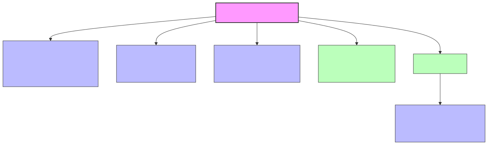

# Adding a Domain to Epistract

Epistract is a domain-agnostic knowledge graph framework. Each domain is a self-contained package that teaches the extraction engine what to look for in your documents. This guide covers two paths: the automated wizard (recommended) and manual creation for power users.

---

## Quick Start: Domain Wizard

The fastest path to a working domain. Five steps from sample documents to an interactive knowledge graph.

### Step 1: Gather Sample Documents

Collect 3-5 representative documents from your target corpus. These should cover the range of entity types and relationships you want to extract. Supported formats: PDF, DOCX, HTML, TXT, XLS, EML (75+ formats via Kreuzberg).

```
mkdir ./sample-docs/
# Copy 3-5 representative documents here
```

### Step 2: Run the Wizard

```bash
/epistract:domain --input ./sample-docs/
```

The wizard performs multi-pass LLM analysis on your sample documents:

1. **Document reading** -- extracts text from all supported formats
2. **Entity discovery** -- proposes entity types based on what appears in the documents
3. **Relation discovery** -- proposes relation types based on how entities connect
4. **Schema generation** -- produces a complete `domain.yaml` with types, descriptions, and extraction hints
5. **Package generation** -- creates `SKILL.md` extraction prompt and `epistemic.py` analysis rules

The wizard limits schemas to 15 entity types and 20 relation types to keep extraction focused. You can always add more manually after reviewing the output.

### Step 3: Review the Generated Schema

The wizard outputs a complete domain package to `domains/your-domain/`:

```
domains/your-domain/
  domain.yaml    # Entity types, relation types, aliases
  SKILL.md       # LLM extraction prompt with domain knowledge
  epistemic.py   # Domain-specific analysis rules
  references/    # Ontology references (if applicable)
```

Open `domain.yaml` and review the proposed entity and relation types. Adjust descriptions, add or remove types, and refine extraction hints as needed.

### Step 4: Test with Full Corpus

```bash
/epistract:ingest --domain your-domain --input ./full-corpus/
```

Run extraction on your full document set. Check entity and relation quality in the output. The pipeline will:
- Read all documents in the input directory
- Extract entities and relations using your domain schema
- Build a deduplicated knowledge graph with community detection
- Run epistemic analysis (conflicts, gaps, risks)

### Step 5: Explore Your Graph

```bash
/epistract:view
```

Open the interactive graph visualization in your browser. Run queries, explore communities, and export to GraphML, CSV, or SQLite.

---

## What Gets Generated



A domain package directory contains:

| File | Purpose | Required |
|------|---------|----------|
| `domain.yaml` | Entity types, relation types, aliases, system context | Yes |
| `SKILL.md` | LLM extraction prompt with domain knowledge and examples | Yes |
| `epistemic.py` | Domain-specific epistemic analysis (conflicts, gaps, risks) | Yes |
| `references/` | Ontology references, nomenclature guides | Optional |
| `workbench/` | Dashboard customization (`template.yaml`) | Optional |

The domain resolver discovers domains automatically from the `domains/` directory. You can also register aliases for convenient access (e.g., `--domain contract` resolves to `domains/contracts/`).

---

## Manual Domain Creation

For power users who want full control or need to customize beyond what the wizard generates.

### domain.yaml Reference

The schema file defines what the extraction engine looks for. Every field explained:

```yaml
# Domain metadata
name: "your-domain"          # Human-readable name, used in output
version: "1.0.0"             # Semantic version for tracking changes
description: |               # Multi-line description of the domain
  What this domain covers and what document types it handles.

# System context -- instructions for the LLM extraction agent
system_context: |
  You are analyzing [domain] documents to build a knowledge graph
  of [key concepts]. [Domain-specific disambiguation rules go here.]

# Entity types -- what to extract from documents
entity_types:
  ENTITY_NAME:               # SCREAMING_SNAKE_CASE convention
    description: "..."       # Guides LLM extraction -- be specific
    extraction_hints:        # Optional: concrete extraction guidance
      - "Look for..."
      - "Include..."
    attributes:              # Optional: structured fields on entities
      - name: "field_name"
        type: "string"

# Relation types -- how entities connect
relation_types:
  RELATION_NAME:
    description: "..."       # What this relationship means
    source_types: [...]      # Which entity types can be source
    target_types: [...]      # Which entity types can be target
    symmetric: false         # Optional: true if A-B implies B-A
    review_required: false   # Optional: flag for human review

# Aliases for domain resolution (e.g., "contract" -> "contracts")
aliases: ["alias1", "alias2"]

# Fallback relation type when no specific type matches
fallback_relation: ASSOCIATED_WITH
```

#### Drug Discovery Example (17 entity types, 30 relation types)

From `domains/drug-discovery/domain.yaml` -- a complex biomedical schema:

```yaml
name: "Drug Discovery"
version: "1.0.0"
description: |
  Domain for extracting structured knowledge graphs from drug discovery and
  pharmaceutical research documents. Covers the full pipeline from target
  identification through clinical development and regulatory approval.

system_context: |
  You are analyzing drug discovery and pharmaceutical research documents...

  NOMENCLATURE STANDARDS -- use canonical names whenever possible:
  - Drugs/compounds: prefer International Nonproprietary Names (INN)
  - Genes: use HGNC-approved symbols (e.g. "BRAF" not full name)
  - Diseases: prefer MeSH terms
  - Adverse events: prefer MedDRA Preferred Terms

  DISAMBIGUATION RULES -- choose the correct entity type:
  - GENE vs PROTEIN: Use GENE for genomic locus/mutation; PROTEIN for
    translated product/binding/inhibition
  - COMPOUND vs MECHANISM_OF_ACTION: "nivolumab" is COMPOUND;
    "PD-1 inhibition" is MECHANISM_OF_ACTION

entity_types:
  COMPOUND:
    description: "Small molecules, biologics, drug candidates, approved drugs"
    extraction_hints:
      - "Look for drug names (INN), brand names, compound codes"
      - "Include biologics such as monoclonal antibodies, ADCs, gene therapies"
      - "Capture development stage when mentioned"
  GENE:
    description: "Genes, genetic loci, alleles, and genomic variants"
    extraction_hints:
      - "Use HGNC symbols when available (e.g. 'BRCA1', 'TP53', 'KRAS')"
      - "Include specific variants and mutations"
  PROTEIN:
    description: "Proteins, enzymes, receptors, ion channels, and complexes"
    extraction_hints:
      - "Look for drug targets: kinases, GPCRs, nuclear receptors"
      - "Use PROTEIN when discussing binding or catalytic activity"
  DISEASE:
    description: "Medical conditions with established diagnostic criteria"
    extraction_hints:
      - "Prefer MeSH disease terms for canonical naming"
      - "Include disease subtypes and staging"
  # ... 13 more entity types including MECHANISM_OF_ACTION, CLINICAL_TRIAL,
  #     PATHWAY, BIOMARKER, ADVERSE_EVENT, ORGANIZATION, PUBLICATION,
  #     REGULATORY_ACTION, PHENOTYPE, METABOLITE, CELL_OR_TISSUE,
  #     PROTEIN_DOMAIN, SEQUENCE_VARIANT

relation_types:
  TARGETS:
    description: "Compound acts on a protein or gene target"
    source_types: [COMPOUND]
    target_types: [PROTEIN, GENE]
  INHIBITS:
    description: "Entity inhibits or blocks the activity of another"
    source_types: [COMPOUND, PROTEIN]
    target_types: [PROTEIN, GENE, PATHWAY]
  INDICATED_FOR:
    description: "Compound is indicated for or used to treat a disease"
    source_types: [COMPOUND]
    target_types: [DISEASE]
  CONFERS_RESISTANCE_TO:
    description: "Gene or protein confers resistance to a compound"
    source_types: [GENE, PROTEIN, PHENOTYPE]
    target_types: [COMPOUND]
    review_required: true
  # ... 26 more relation types
```

Key patterns: nomenclature standards in `system_context`, disambiguation rules, `extraction_hints` for each type, `review_required` flag for safety-critical relations.

#### Contracts Example (9 entity types, 9 relation types)

From `domains/contracts/domain.yaml` -- a simpler but effective schema:

```yaml
name: "Contract Analysis"
version: "1.0.0"
description: |
  Domain for extracting structured knowledge graphs from event contracts,
  vendor agreements, and service-level agreements. Covers obligations,
  deadlines, costs, parties, and cross-contract dependencies.

system_context: |
  You are analyzing event contracts and vendor agreements to build a
  knowledge graph of parties, obligations, deadlines, costs, and
  cross-contract dependencies.

entity_types:
  PARTY:
    description: "Organization or individual that is a signatory or referenced entity"
  CONTRACT:
    description: "A formal agreement between parties"
  OBLIGATION:
    description: "A required action, delivery, or compliance requirement"
  DEADLINE:
    description: "A date or time constraint for an obligation or deliverable"
  COST:
    description: "A monetary amount, fee, or payment term"
  VENUE:
    description: "A physical location referenced in a contract"
  SERVICE:
    description: "A service being provided under contract"
  INSURANCE:
    description: "Insurance requirement or coverage specification"
  PENALTY:
    description: "A consequence for breach or non-compliance"

relation_types:
  OBLIGATED_TO:
    description: "Party is obligated to fulfill an obligation"
  HAS_DEADLINE:
    description: "Obligation or deliverable has a deadline"
  COSTS:
    description: "Service or obligation has an associated cost"
  SIGNED_BY:
    description: "Contract is signed by a party"
  PROVIDES_SERVICE:
    description: "Party provides a service"
  HELD_AT:
    description: "Event or service is at a venue"
  REQUIRES_INSURANCE:
    description: "Contract requires insurance coverage"
  CROSS_REFERENCES:
    description: "One contract references another"
  PENALIZES:
    description: "Breach triggers a penalty"
```

Key patterns: no `extraction_hints` needed for straightforward types, descriptions are the primary guidance, cross-contract references are high-value relation types.

### SKILL.md Guide

The extraction prompt (`SKILL.md`) teaches the LLM agent how to extract entities and relations from your documents. Structure:

1. **Role definition** -- who the agent is and what it specializes in
2. **Domain context** -- what documents look like, what to extract
3. **Entity type descriptions** with examples and disambiguation rules
4. **Relation type descriptions** with evidence patterns
5. **Output format** -- DocumentExtraction JSON schema with example
6. **Confidence scoring** -- calibration guidelines (0.9-1.0 explicit, 0.7-0.89 supported, 0.5-0.69 inferred, <0.5 speculative)

**Drug discovery SKILL.md** (detailed, ~44KB): Opens with "You are an expert biomedical knowledge engineer..." and includes nomenclature standards (INN for drugs, HGNC for genes, MeSH for diseases, MedDRA for adverse events), disambiguation rules (GENE vs PROTEIN, COMPOUND vs MECHANISM_OF_ACTION), and per-type extraction examples.

**Contracts SKILL.md** (concise, ~1KB): Opens with entity and relation type tables, followed by extraction guidelines: "Every obligation must link to a responsible party and a deadline if specified."

The level of detail scales with domain complexity. Drug discovery needs extensive disambiguation rules because biomedical terminology is ambiguous. Contracts are more straightforward and need less guidance.

### epistemic.py Reference

The epistemic module implements domain-specific analysis that runs after graph construction. It must export an `analyze` function (or domain-specific entry point) that takes graph data and returns a claims layer.

**Drug discovery entry point** (`domains/drug-discovery/epistemic.py`):

```python
def analyze_biomedical_epistemic(output_dir: Path, graph_data: dict) -> dict:
    """Run full biomedical epistemic analysis on a built graph.

    Args:
        output_dir: Directory containing graph_data.json.
        graph_data: Parsed graph_data.json dict with nodes and links.

    Returns:
        Claims layer dict with keys: metadata, summary, base_domain, super_domain.
    """
```

Biomedical epistemic analysis detects:
- **Hedging language** -- patterns like "suggests", "may inhibit", "preliminary data" classify relations as hypothesized, speculative, or prophetic
- **Contradictions** -- same relation with opposing evidence across mentions (positive vs negative findings)
- **Hypothesis clusters** -- connected subgraphs of hedged relations that form proposed hypotheses
- **Document-type profiles** -- epistemic signatures by source type (paper, patent, preprint)

**Contracts entry point** (`domains/contracts/epistemic.py`):

```python
def analyze_contract_epistemic(
    output_dir: Path,
    graph_data: dict,
    master_doc_path: Path | None = None,
) -> dict:
    """Run contract cross-reference epistemic analysis.

    Args:
        output_dir: Output directory containing graph_data.json.
        graph_data: Already-loaded graph data dict with nodes and links.
        master_doc_path: Optional path to reference document for gap analysis.

    Returns:
        claims_layer dict with keys: metadata, summary, base_domain, super_domain.
    """
```

Contract epistemic analysis detects:
- **Cross-contract entities** -- parties, venues, and services appearing in 2+ contracts
- **Conflicts** -- exclusive use disputes, schedule contradictions, term contradictions, cost mismatches
- **Coverage gaps** -- planning items from a reference document not covered by any contract
- **Risk scoring** -- aggregates conflicts and gaps into CRITICAL/WARNING/INFO risk items

The contrast illustrates domain-specific epistemic patterns: biomedical analysis focuses on evidence strength and hypothesis detection, while contract analysis focuses on cross-document conflicts and obligation coverage.

### Workbench Customization (Optional)

For domains with a web dashboard, add `workbench/template.yaml` to customize the interface.

From `domains/contracts/workbench/template.yaml`:

```yaml
title: "Sample Contract Analysis Workbench"
subtitle: "8 contract categories covering 57 documents"
persona: |
  You are the Sample Contract Analyst -- a senior contract analysis
  specialist who has thoroughly reviewed all vendor contracts...
placeholder: "Ask about contracts, costs, deadlines, risks..."
loading_message: "Analyzing contracts"
starter_questions:
  - "What are the top cross-contract conflicts and risks?"
  - "Walk me through every deadline between now and event day"
entity_colors:
  PARTY: "#6366f1"
  OBLIGATION: "#f59e0b"
  DEADLINE: "#ef4444"
  COST: "#10b981"
  SERVICE: "#8b5cf6"
  VENUE: "#06b6d4"
dashboard:
  title: "Contract Portfolio & Key Financial Commitments"
  subtitle: "Contract categories and document coverage summary"
```

Fields: `title`, `subtitle`, `persona` (see below), `placeholder`, `loading_message`, `starter_questions`, `entity_colors` (hex per entity type), `dashboard` (title/subtitle for overview panel), `analysis_patterns` (cross-reference heading + "appears in" phrase for the domain).

#### The `persona` field — single source of truth

The `persona` is used in **two** places:

1. **Workbench chat system prompt** — when the user asks questions in `/epistract:dashboard`, the chat panel injects `persona` at the start of the system message (reactive — fires on user input).
2. **Epistemic narrator** — when `/epistract:epistemic` runs, `core.label_epistemic` reads the same `persona` and feeds it to an LLM along with the freshly-built `claims_layer.json` to produce `epistemic_narrative.md` (proactive — fires after the graph is built).

Upgrade `persona` once; both surfaces improve together.

A strong persona names a profession, describes expertise depth, commits to the epistemic-status vocabulary (`asserted` / `prophetic` / `hypothesized` / `contested` / `contradictions` / `negative`), and states citation + formatting expectations. See `domains/drug-discovery/workbench/template.yaml` for a reference implementation.

When you create a domain with `/epistract:domain`, the wizard asks for a persona paragraph. If you say "default," it emits an analyst-shaped template with the domain name substituted — richer than a one-liner, weaker than hand-crafted, immediately usable. Tailor it for best narrator quality.

---

## Domain Enrichment (Optional)

For domains where external APIs can add value after graph construction, add an `enrich.py` module to your domain package. The enrichment step runs *after* the graph is built, patches node attributes with API data, and writes an `_enrichment_report.json` summary. It is **opt-in via the `--enrich` flag** on `/epistract:ingest` — omitting it leaves the graph unchanged.

The `clinicaltrials` domain is the canonical reference implementation. See `domains/clinicaltrials/enrich.py` for the complete source.

### When to Use Enrichment

Use enrichment when:
- Your entity types map to stable external identifiers (NCT IDs, PubChem CIDs, ChEMBL IDs, PDB accessions, ORCID, etc.)
- The API is public and machine-queryable
- Enrichment adds computable attributes (status, molecular weight, dates, organization metadata) not extractable from documents alone
- API failures MUST NOT abort the pipeline — non-blocking is required

Do NOT use enrichment for:
- Data that belongs in the extraction prompt (enrichment runs post-build, not during extraction)
- Slow or unreliable APIs where failures would significantly degrade user experience
- Anything requiring authentication the user has not configured — enrichment must work with public credentials or not at all

### The `enrich_graph()` Contract

The enrichment module MUST export a single public function:

```python
from pathlib import Path

def enrich_graph(output_dir: Path, domain: str = "your-domain") -> dict:
    """Load graph, enrich nodes, save, write report.

    Non-blocking: API failures log counts in the return dict but never raise.
    Saves mutated graph back to output_dir/graph_data.json.
    Writes output_dir/extractions/_enrichment_report.json with per-type hit rates.
    Returns the report dict for programmatic use.
    """
```

See the clinicaltrials reference for the full pattern: `_fetch_ct_gov()` and `_fetch_pubchem()` non-blocking helpers (return `None` on 404/timeout/connection-error rather than raising), exponential backoff on 429, `requests.utils.quote` for URL safety.

### Wiring into the Ingest Pipeline

`commands/ingest.md` Step 5.5 handles `--enrich` dispatch. It is already wired for the `clinicaltrials` domain. To wire a new domain, update Step 5.5's domain-gate check:

```markdown
Skip this step unless BOTH are true:
1. The user passed `--enrich`
2. The resolved `--domain` is `clinicaltrials` OR `your-domain` (or their aliases)
```

And add a parallel invocation block pointing at `${CLAUDE_PLUGIN_ROOT}/domains/your-domain/enrich.py <output_dir>`.

### The `_enrichment_report.json` Schema

```json
{
  "domain": "your-domain",
  "trials": {"total": 10, "enriched": 8, "not_found": 1, "failed": 1, "hit_rate": 0.8},
  "compounds": {"total": 20, "enriched": 15, "not_found": 3, "failed": 2, "hit_rate": 0.75}
}
```

`/epistract:ingest` Step 7 reads this file and surfaces hit rates to the user.

---

## crosswalk.yaml Reference (Optional)

For domains that share entities with other, independently-built epistract
project graphs -- the same drug appearing in an FDA label graph and a
pharmacovigilance graph, for instance -- add a `crosswalk.yaml` to your
domain package. It follows the same optional-file convention as `enrich.py`
and `workbench/template.yaml`: probe, use if present, skip silently if
absent. `core/crosswalk.py` builds a `spine.json` mapping a canonical key
per axis to the node IDs holding that key in each graph it is pointed at:

```bash
python3 -m core.crosswalk build \
    --graph ./project-a --graph ./project-b \
    --axes crosswalks/pharma.yaml --out spine.json
```

### Why two files, not one

Canonicalisation (how a raw value becomes a canonical key) is centralised in
a single repo-level axis spec, not declared per domain. If each domain
declared its own normalizer chain, a salt-stripped key from one graph and an
unstripped key from another would never meet, and the spine would silently
join almost nothing while every domain's own tests still passed in
isolation. So the contract splits in two:

1. **Extraction** (domain knowledge) -- `<domain_dir>/crosswalk.yaml`.
   Declares, per axis, which entity types participate and which value
   sources to try, in order.
2. **Canonicalisation** (axis knowledge) -- a repo-level axis spec (e.g.
   `crosswalks/pharma.yaml`) holding exactly one normalizer chain per axis,
   applied identically to every graph regardless of domain.

`core/crosswalk.py` and `core/crosswalk_normalize.py` ship only named,
generic primitives and a chain runner -- they never contain a domain's
vocabulary (no molecule names, no spelling maps, no entity type names, no
attribute key names). All of that lives in the two config files.

### Available primitives (axis spec)

| Op | Parameters | Behaviour |
|----|-----------|-----------|
| `lowercase` | -- | Lowercases the value |
| `uppercase` | -- | Uppercases the value |
| `collapse_whitespace` | -- | Strips and collapses internal whitespace runs |
| `regex_extract` | `pattern` | First regex match, or no key if nothing matches |
| `replace_map` | `map` | Ordered substring substitutions |
| `strip_trailing_tokens` | `tokens` | Repeatedly pops the final token while it's in the set, always leaving at least one token |

Regex patterns and token sets are compiled once when the axis spec loads,
not per value. An op name not in this table is a hard error naming the
offending op -- a config typo fails at startup rather than silently
producing zero joins.

### Available source kinds (domain crosswalk.yaml)

| `from` | Behaviour |
|--------|-----------|
| `name` | The node's `name` field |
| `context` | The node's `context` field (the narrative sentence extraction writes on extracted nodes) -- a top-level field, not an attribute, so an absent or empty-string `context` contributes nothing rather than a one-element list of `""` |
| `any_attribute` | Every attribute value on the node, list-valued attributes flattened and numeric attributes coerced to text |
| `attribute` (+ `key`) | One named attribute |

Sources are tried **in declared order**, and the first source that produces
at least one non-empty canonical key wins for that node -- later sources are
not consulted. This is deliberate: union-of-all-sources would emit a brand
key alongside a generic key and split one real-world entity across two
spine keys.

### Worked example

From `domains/pharmacovigilance/crosswalk.yaml` -- a drug axis that must
cover two entity types (dropping the second silently loses molecules from
the cross-graph intersection) and deliberately excludes the brand-name
attribute as a source:

```yaml
axes:
  drug:
    entity_types: [Drug, Concomitant]
    sources:
      - from: attribute
        key: inn
      - from: attribute
        key: substance_name
      - from: name
    identifiers:
      atc:
        from: attribute
        key: atc_code
      rxcui:
        from: attribute
        key: rxcui
```

`identifiers` is optional per axis: stable external codes (registry IDs,
ATC codes, RxCUI, UNII, ...) are collected onto the canonical key verbatim
-- never run through the normalizer chain, since they're already exact --
as sorted, de-duplicated lists merged across every graph that declares
them. A graph that declares no identifiers for an axis never causes a
merge to fail.

### Declare an axis only where it genuinely applies

A domain should declare an axis only where it truly carries that
identifier. `domains/clinicaltrials/crosswalk.yaml` declares a `trial` axis
and a `drug` axis, but no `adverse_event` axis -- that graph holds zero
adverse-event-type entities, so the axis would never join anything and
would only add stats noise. Per-axis stats (`declared_by`,
`shared_by_all_graphs`, and the pairwise counts) are always scoped to the
graphs that actually declare an axis, never to every graph loaded.

---

## Cross-Domain Epistemic Rules (Optional)

`spine.json` alone is a join table. `core/cross_domain.py` turns it into an
analysis product: it reads a spine plus the graphs it was built from and
emits findings that are impossible inside any single graph, in the
established `{rule_name, type, severity, description, evidence}` shape,
nested under `super_domain.custom_findings` by rule name -- the same
channel `core/label_epistemic.py`'s single-graph `CUSTOM_RULES` hook
writes to, but as its own artifact (`cross_domain_findings.json`) rather
than a modification to that dispatcher. `core/label_epistemic.py` is never
imported or changed by this module; the two are independent by
construction.

```bash
python3 -m core.cross_domain analyze \
    --spine spine.json --rules crosswalks/pharma-rules.yaml \
    --out cross_domain_findings.json --json
```

Graphs default to the directories `spine.json` itself recorded; `--graph
NAME=DIR` (repeatable) overrides one. **The rule spec's `probe` and
`reference` fields must name graphs by the key the spine recorded for
them** -- `metadata.domain` unless the spine was built with a `NAME=`
override -- and `subject_axis`/`object_axis` must name an axis the spine
actually carries. A mismatch is caught eagerly at load time, naming both
the offending value and the valid alternatives; it is never allowed to
degrade into a silent zero-finding run.

### Two more config layers, same split as the crosswalk

Cross-domain rules add two files on top of the crosswalk's two-layer
split, following the same domain-agnostic discipline:

1. **The repo-level rules spec** (`crosswalks/pharma-rules.yaml`) --
   which graph probes, which graph is the reference, which axis pair a
   rule spans, how a miss is worded, how it is graded, and (for the
   token-coverage mode) the tokenizer parameters and stopword list.
2. **Each domain's `edges:` section** (`<domain_dir>/crosswalk.yaml`,
   alongside its `axes:` section) -- which relation types connect one
   axis to another for that graph, or, for a graph that participates only
   as a text-comparison reference, which value sources to assemble text
   from instead.

`core/cross_domain.py` and `core/cross_domain_compare.py` ship no domain
vocabulary of their own -- no entity type names, no relation type names,
no attribute key names, no clinical or molecule terms. All of it lives in
the two files above.

### Two comparison modes

| Mode | When it applies | What it computes |
|------|-----------------|-------------------|
| `spine_keys` | Both sides of the axis pair have comparably-typed entities in both graphs | Canonical-key set difference: for each subject shared by the probe and reference graphs, which of the probe's object keys the reference graph does not attach to that same subject |
| `text_tokens` | The reference side holds no comparably-typed entities to key-difference against (e.g. no `Outcome`-typed nodes at all) | Configurable token-coverage ratio: what fraction of the probe's canonical object key's tokens appear in text assembled from the reference-graph node(s) mapped to the shared subject |

A graph may declare an `edges:` entry for an axis pair whose object axis it
does not itself declare in its own `axes:` section -- that is exactly the
`text_tokens` reference-side shape (the label graph declares `text_sources`
for the trial/outcome pair without ever declaring an `outcome` axis of its
own), and eager validation accepts it.

### The three `spine_keys` subtypes, and why their test order matters

A `spine_keys` miss (a probe object key the reference graph does not
attach to the same subject) is classified into exactly one of three
subtypes, tested in this order:

1. **`granularity_variant`** -- the probe key is a substring or superstring
   of a key the reference graph already attaches to the SAME subject (e.g.
   `abdominal pain upper` vs. the reference's `abdominal pain`). Tested
   first, and graded lowest: it's a vocabulary artifact, not a signal, and
   closing it properly needs a licensed term hierarchy the project does
   not ship.
2. **`attributed_elsewhere`** -- the probe key exists somewhere in the
   reference graph, just never against this subject. Tested second, and
   graded highest: the reference corpus already knows the term, it simply
   never attaches it to this subject, which is the more clinically
   interesting question (a class-effect candidate).
3. **`absent`** -- the probe key does not appear in the reference graph at
   all.

The order is load-bearing, not incidental: a key satisfying both the
granularity test and the attributed-elsewhere test must come back as the
granularity variant. Reordering these two checks reclassifies real misses
-- a class-effect signal would be swallowed by a same-subject vocabulary
artifact, or vice versa.

### Grade vocabulary

Cross-domain findings use lowercase `high` / `medium` / `low` / `advisory`.
This differs from the single, uppercase grade level the older
single-graph example in this guide shows -- these rules need a graded
band (multiple severities that separate signal from noise within one
rule), which a single-level vocabulary cannot express. Existing consumers
already treat the grade field as free-form (the workbench slugifies it
into a tag; the contracts domain uses capitalised words), so this is not a
breaking change to any existing reader.

### The advisory contract

A rule flagged `advisory: true` in the rules spec is **skipped entirely**
unless the CLI's `--include-advisory` flag is passed -- its stats slot
records `{"status": "skipped-advisory"}` and it gets no key at all under
`custom_findings`, so a run without the flag can never be mistaken for a
zero-signal one. When it does run, every finding is force-graded
`advisory` regardless of subtype, and every finding's evidence carries the
rules spec's `caveat` string. `off_label_exposure` ships this way: its
measured noise floor (roughly 31 of 32 probe drug/indication pairs) sits
above its signal, because the two indication vocabularies overlap on
exactly one term after normalisation -- so presenting it beside the other
two rules at equal confidence would be misleading.

### A correction: which relations connect a drug to an adverse event

The pharmacovigilance graph does **not** connect a drug to an adverse
event through the patient-experience relation -- that relation runs
patient -> event and never touches a drug node. The actual drug/event
connection is the temporal-ordering relation (`OCCURRED_AFTER`) plus the
direct causal relation (`CAUSES`), verified by counting typed relation
signatures on the real graph. If you're adding a new domain whose graph
plays the probe side of a similar safety-signal rule, count your graph's
actual typed relation signatures before writing the `edges:` config --
don't assume the semantically-obvious relation name is the one that
actually reaches both endpoints.

### Rendering the crosswalk as a viewable graph

`spine.json` and `cross_domain_findings.json` are analysis artifacts, not
displayable ones. `core/crosswalk_output.py` renders both into the pair every
existing consumer already reads:

```bash
python3 -m core.crosswalk_output render \
    --spine spine.json --findings cross_domain_findings.json \
    --out ./crosswalk-output
```

`/epistract:crosswalk` runs all three steps (build → analyze → render) in one
command and can hand off to the dashboard when it finishes.

The rendered `graph_data.json` is a graph **about the joins**, not a merged
graph — which is how it sidesteps the one-domain-per-project blocker noted
below. Its nodes are one `Graph` node per source graph plus one node per
(axis, canonical key) pair, typed by axis so the workbench legend and type
filter treat axes as facets. Its links are `PRESENT_IN` (canonical key held by
a source graph — two or more of these on one key is a join) and one link per
cross-domain finding, named after the rule that raised it and carrying the
finding's severity and subtype. Member node IDs from the source graphs ride
along as attributes; they never become nodes.

The rendered `claims_layer.json` writes the findings to
`super_domain.custom_findings` verbatim (plus an `affected_entities` list of
the crosswalk node IDs each finding spans) and every key shared by two or more
graphs to `cross_references`, which the workbench chat prompt already renders.

`metadata.domain` is `crosswalk`, resolving against `domains/crosswalk/` — a
meta-domain that ships a `domain.yaml`, a `SKILL.md` reading guide and a
`workbench/template.yaml`, but no extraction prompt: nothing is ever ingested
against it. `/epistract:dashboard`, `/epistract:view` and `/epistract:export`
all accept the output directory unchanged, with no `--domain` flag.

Adding an axis to an axis spec means adding the matching entity type to
`domains/crosswalk/domain.yaml` and a legend colour to its
`workbench/template.yaml`. `tests/test_crosswalk_output.py` enforces that
every axis in `crosswalks/pharma.yaml` has both.

### Not yet built

- **Feeding spine-canonicalised endpoints into the existing temporal
  contradiction engine** (`core/epistemic_temporal.relations_contradict()`),
  which already gates purely on node-pair identity -- rewriting endpoints to
  canonical spine IDs would make it directly reusable with no engine
  changes.
- **Merging the cross-domain findings into an existing single-graph claims
  layer.** The crosswalk now writes its own claims layer (see above), which
  covers the viewing case. What remains unbuilt is folding the findings back
  into a *source* graph's `claims_layer.json`, so a pharmacovigilance
  workbench session would see what the label graph does not corroborate
  without opening the crosswalk.
- **Link-evidence text as an additional value source** -- worth roughly one
  or two more trial matches over the current node-attribute-plus-name
  sourcing.
- **A merged `graph_data.json`** -- still blocked, and still for the same
  reason: the project registry's one-domain-per-project-directory assumption
  has no answer for what domain a union graph would validate against. The
  rendered crosswalk graph is not this; it unions nothing.
- **An ontology mapping for the condition/indication axis.** The axis
  itself now exists (`indication`, joined in `crosswalks/pharma.yaml` and
  declared per-domain) -- what remains blocked is the MONDO/MeSH mapping
  that would make the rule spanning it trustworthy rather than
  vocabulary-noisy, which is exactly why `off_label_exposure` ships
  advisory-only. Corroborating an off-label finding via the
  pharmacovigilance graph's own off-label annotation attribute was
  evaluated and rejected: that attribute is present on exactly one node in
  the real graph, far too sparse to gate on.
- **MedDRA hierarchy expansion** (LLT -> PT -> HLT -> SOC) -- needs a
  licensed external resource the project does not ship. Would resolve the
  `granularity_variant` subtype properly rather than merely grading it
  down.

---

## Testing Your Domain

```bash
# Validate domain resolution
python -c "from core.domain_resolver import resolve_domain; print(resolve_domain('your-domain'))"

# Run extraction on test documents
/epistract:ingest --domain your-domain --input ./test-docs/

# Query the graph
/epistract:query --domain your-domain --type ENTITY_NAME

# Run epistemic analysis
/epistract:epistemic --domain your-domain

# Run tests
python -m pytest tests/ -k "your_domain" -v
```

---

## Tips

- **Start small** -- 5-10 entity types is plenty. You can always add more after seeing extraction results.
- **Use the wizard first** -- even if you plan to customize heavily, the wizard output gives you a working starting point and correct file structure.
- **Study both domains** -- drug-discovery shows complex extraction with disambiguation rules; contracts shows simpler but effective schemas. Pick the pattern closer to your use case.
- **Epistemic rules are the differentiator** -- every domain should define what conflicts, gaps, and risks mean in its context. This is what makes epistract a knowledge graph framework, not just an extraction tool.
- **Naming conventions matter** -- use SCREAMING_SNAKE_CASE for entity and relation types. Include `extraction_hints` for ambiguous concepts.
- **Test incrementally** -- extract from 3-5 documents first, review the graph, then scale to the full corpus.
