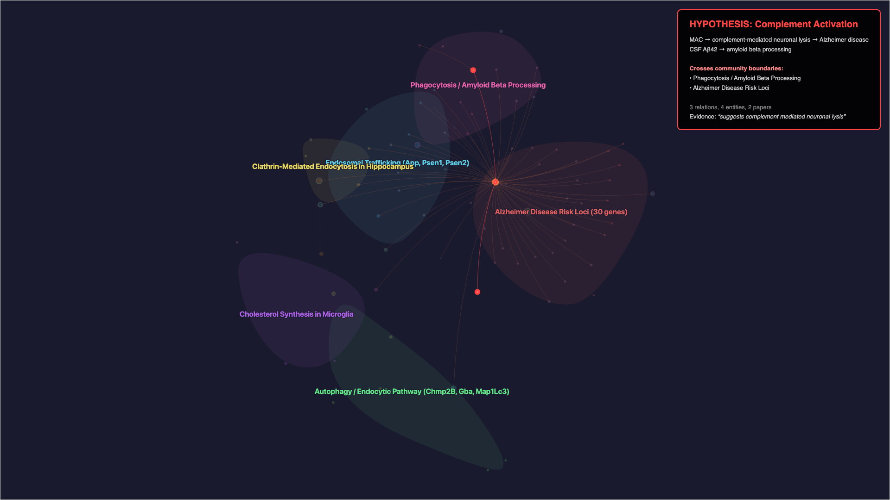
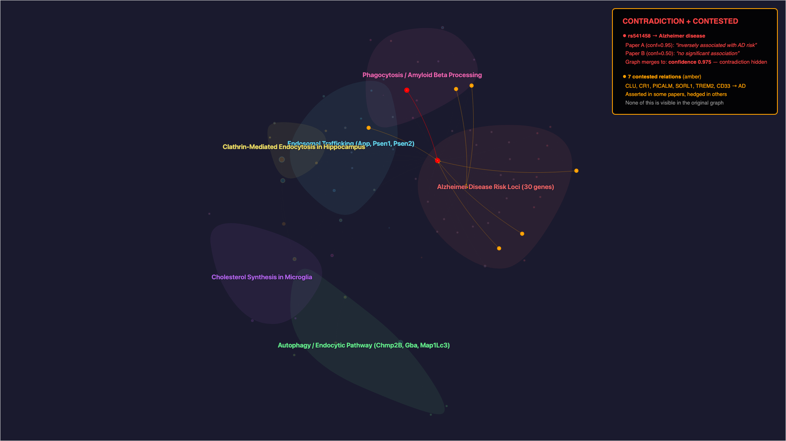
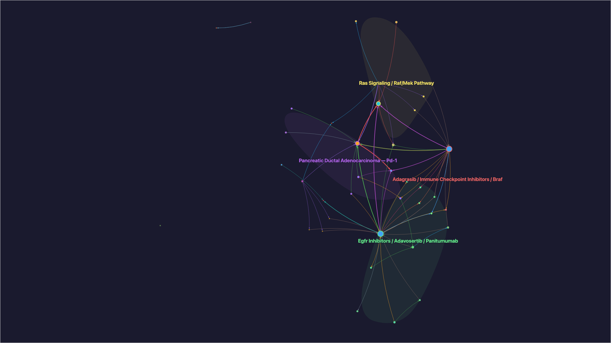
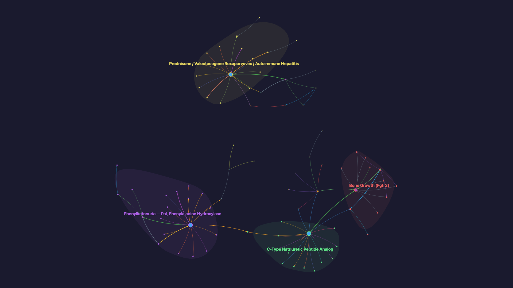
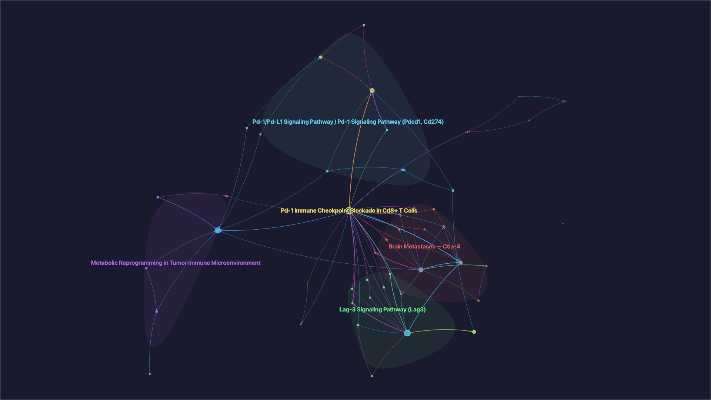
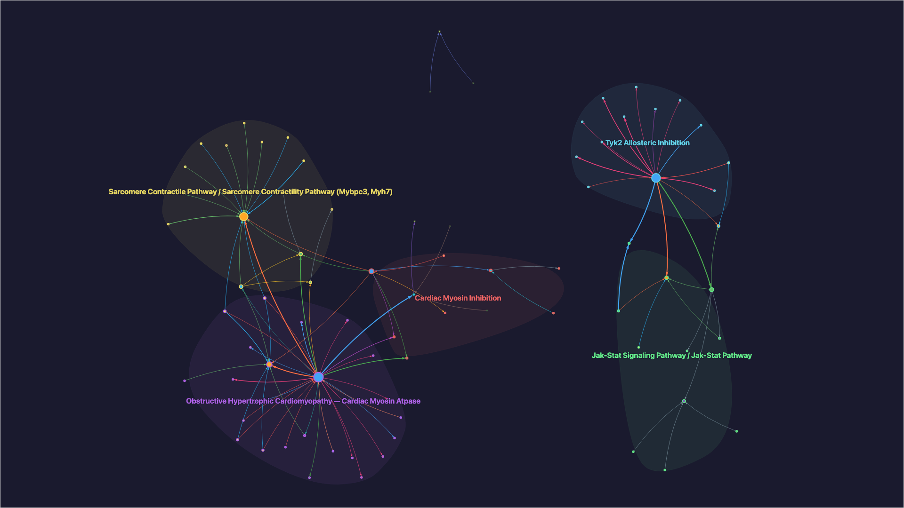
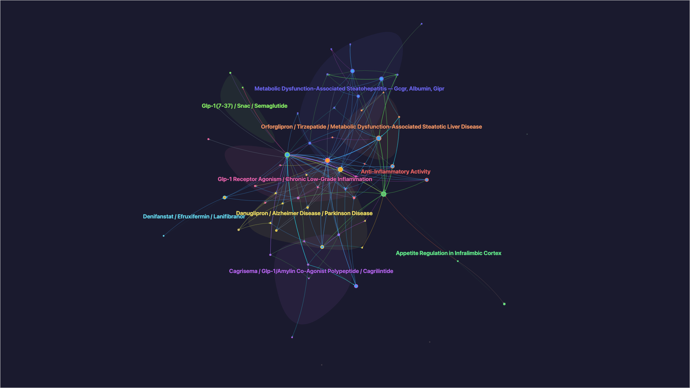

# Addendum: Super Domains in Literature-Derived Knowledge Graphs

## From Proposal to Proof-of-Concept — Decision Log

### Starting Point: A Known Weakness in Epistract

This update to epistract was triggered by an analysis into Eric Little's [LinkedIn post](https://www.linkedin.com/posts/eric-little-71b2a0b_pleased-to-announce-that-i-will-be-speaking-activity-7442581339096313856-wEFc) announcing his upcoming talk at the Knowledge Graph Conference in NYC on reasoning with knowledge graphs. His description of managing graph-level sets of inference — specifically the problem of handling epistemic facts that are only true under certain conditions, at certain times, or from certain perspectives — immediately resonated with a sore point in the epistract project.

Epistract builds drug discovery knowledge graphs from scientific literature — PubMed papers, bioRxiv preprints, patent filings, and FDA regulatory documents. I extract entities and relations using Claude Code as the LLM, assign confidence scores calibrated by evidence strength and document type, and assemble a graph. Louvain community detection clusters entities into thematic groups. Across 6 test scenarios, the system has processed corpora spanning neurogenetics, oncology, rare disease, immunotherapy, cardiovascular medicine, and competitive intelligence — producing graphs with 2,230+ relations across 600+ entities.

The extraction pipeline follows standard KG construction principles: extract triples, assign confidence, build a graph, detect communities. These are well-established patterns. But those principles have a blind spot. **The confidence score — a float between 0.0 and 1.0 — was the only mechanism for representing uncertainty.** A relation at 0.55 could mean any of these fundamentally different things:

- A **hypothesis** proposed in a review paper ("suggests a novel mechanism")
- A **prophetic example** in a patent ("the compound is expected to achieve...")
- A **negative result** from a meta-analysis ("no significant association was observed")
- A **conditional finding** that holds only in a subpopulation ("in Caucasian cohorts")

The pipeline was collapsing all of these into one number. And because the graph-building step aggregates confidence across documents, the nuance disappeared further. When I examined the built graph for Scenario 1 (PICALM/Alzheimer's), I found that two meta-analyses reporting opposite conclusions about the same genetic variant — one finding a risk allele, the other finding the same allele protective — had been **merged into a single relation at composite confidence 0.975**. The **contradiction was structurally invisible**. Not because the extraction was wrong — both papers were extracted correctly with accurate evidence quotes — but because **the graph construction principles I was following had no concept of epistemic layering**.

This revealed a **fundamental design gap**. The standard principles of triple extraction + confidence scoring + community detection are **insufficient for representing what scientific literature actually contains**. **Papers don't just state facts — they propose hypotheses, hedge conclusions, report negative findings, and contradict each other.** The graph was faithfully extracting all of this content, then flattening it into a structure that couldn't express the distinction between **established knowledge and active conjecture**.

Eric's post gave this problem a name and a framework. He describes **Super Domains** — an ontological layer above base domains for managing epistemic facts. The core insight: reification and RDF* annotate at the individual triple level, causing scalability problems when you have graph-level sets of inference. A hypothesis isn't one annotated triple; it's a cluster of 3-5 relations that together propose a mechanism and stand or fall as a unit. Super Domains handle these **graph-level inference patterns** — hypotheses, conjectures, and conditional statements — by giving them a home separate from the base domain of brute facts.

The question was immediate: could I test this against my existing graphs? Were the epistemic facts **already hiding in plain sight**, masked by confidence scores and flat community labels?

### Decision 1: Test Against Existing Graphs First

Rather than designing a theoretical framework, I chose to analyze my existing 6 test scenarios (1,400+ relations across 600+ entities) for epistemic patterns. This produced the initial analysis document ([super-domain-epistemic-analysis.md](super-domain-epistemic-analysis.md)) identifying 5 categories of epistemic facts:

| Category | Description | Example |
|---|---|---|
| A | Hypothesized mechanisms | Complement activation → neuronal lysis in AD (3-relation pattern) |
| B | Conflicting evidence | rs3851179: risk allele in one meta-analysis, protective in another |
| C | Patent vs. paper signatures | Prophetic patent claims vs. empirical paper findings |
| D | Temporal state transitions | Pre-clinical → Phase 2 → approved |
| E | Negative results | "No association was observed" |

**Key finding:** Confidence scores are a lossy proxy for epistemic status. A relation at 0.55 could be a hypothesis, a prophetic claim, a negative result, or a conditional finding — fundamentally different categories collapsed into one number.

### Decision 2: Communities Are Complementary, Not Sufficient

I evaluated whether existing Louvain community detection could serve as a Super Domain equivalent. **Conclusion: no.** Communities group entities by topological density (which nodes are heavily interconnected). Super Domains group relations by epistemic status (which claims are hypothesized vs. asserted).

Concrete example: The "Clathrin-Mediated Endocytosis in Hippocampus" community (S1) contains 5 entities all at confidence 0.95 — all brute facts (these genes exist, this pathway exists). But the relations connecting them ("PICALM dysfunction disrupts clathrin endocytosis, contributing to AD") are a **hypothesis** supported by 5 papers but not proven. The community correctly identifies the topology; **it says nothing about epistemology**.

**Decision:** Super Domains complement communities — communities provide the *where* (which part of the graph), Super Domains provide the *what kind of knowledge* (fact vs. hypothesis vs. contested).

### Decision 3: Separate Skill Invoked After Build

I considered three implementation approaches:

| Approach | When it runs | Pros | Cons |
|---|---|---|---|
| Extraction-time tagging | During document extraction | Full document context for hedging detection | Single-document scope; can't detect cross-document contradictions |
| Post-build layer | Automatically after graph build | Sees merged graph; detects cross-document patterns | Lost document context; regex-based hedging detection |
| Separate skill | User-invoked after ingest | Non-invasive; iterable; doesn't change existing pipeline | Extra step for user |

**Decision:** Separate skill (`/epistract-epistemic`) invoked after ingest. Rationale:
- Non-invasive — doesn't modify the existing extraction or build pipeline
- Iterable — I can improve the algorithm without breaking core functionality
- Cross-document — operates on the merged graph where contradictions are visible
- Complements communities — runs alongside `label_communities.py`, not instead of it

### Decision 4: Evidence-Based Classification, Not LLM-Based

The epistemic classification uses **regex pattern matching on evidence quotes** rather than sending relations back through the LLM. Rationale:
- Deterministic and reproducible
- Fast (processes 630 relations in <1 second)
- The evidence quotes already contain the hedging language — "suggests", "may", "potentially", "no association" — that signals epistemic status
- Document type (patent vs. paper) is inferred from document IDs (e.g., `patent_01`, `pmid_12345678`)

Future improvement: extraction-time tagging (Approach C from the analysis doc) would let the LLM classify with full document context. This can be added later without changing the post-build script.

---

## Proof-of-Concept: Validation Against Existing Graphs

I built `scripts/label_epistemic.py` and ran it against all 6 epistract test scenarios. **No modifications were made to the existing graphs** — the script reads the built `graph_data.json` and produces a `claims_layer.json` overlay.

### The 6 Test Scenario Graphs — Before and After Epistemic Analysis

For each scenario, the commentary compares against the original graph (linked from the scenario report) and highlights what the epistemic analysis revealed that **was invisible in the original**. The graph topology and communities are identical — the epistemic layer adds metadata, not structure.

---

#### S1: PICALM/Alzheimer's Disease — Neurogenetics (457 relations, 149 entities)

Original graph: [scenario-01-graph.png](../../tests/scenarios/screenshots/scenario-01-graph.png)

**Hypothesis highlighted** — red nodes and dashed edges show the complement activation hypothesis crossing from the Phagocytosis community into the Risk Loci community:


**Contradiction + contested highlighted** — red shows the rs541458 contradiction (opposing meta-analyses merged to confidence 0.975); amber shows 7 contested relations where genes (CLU, CR1, PICALM, SORL1, TREM2, CD33) are asserted in some papers but hedged in others:


**What the epistemic layer revealed:** The original graph shows 6 well-defined communities — visually, it looks like a coherent, settled body of knowledge. But the epistemic analysis found **1 contradiction hidden inside the Risk Loci cluster** (rs541458: associated in one meta-analysis, no association in another) and **1 multi-relation hypothesis** spanning the Phagocytosis and Endocytic clusters (complement activation → neuronal lysis → AD). The hypothesis connects two communities that appear separate in the topology — **the epistemic pattern crosses community boundaries**. 7 additional relations were flagged as "contested" — established in some papers, still hedged in others. **None of this is visible in the original graph.**

**Super Domain: 16 relations (3.5%), 1 contradiction, 1 hypothesis, 7 contested.**

---

#### S2: KRAS G12C Landscape — Oncology (307 relations, 113 entities)

Original graph: [scenario-02-graph.png](../../tests/scenarios/screenshots/scenario-02-graph.png)



**What the epistemic layer revealed:** Nothing. **Zero epistemic content.** Every single one of the 307 relations is asserted as brute fact. This is the most important validation in the entire analysis — it confirms that **the epistemic classifier isn't simply finding noise**. The KRAS G12C landscape is a mature therapeutic area: sotorasib and adagrasib are approved drugs, resistance mechanisms are well-characterized in clinical data, and the literature states these facts definitively. The graph looks the same before and after because **there is genuinely no epistemic uncertainty in this corpus**. This scenario serves as the **negative control** for the Super Domain concept.

**Super Domain: 0 relations (0%) — 100% brute facts.**

---

#### S3: Rare Disease (229 relations, 99 entities)

Original graph: [scenario-03-graph.png](../../tests/scenarios/screenshots/scenario-03-graph.png)



**What the epistemic layer revealed:** Minimal epistemic content — 3 relations (1.3%). The rare disease corpus covers well-characterized monogenic conditions (PKU/PAH, achondroplasia/FGFR3) where the biology is established. The small amount of epistemic content is concentrated in 1 contested relation where different papers express different levels of certainty about the same finding. The disconnected community structure (4 distinct disease clusters with little overlap) reflects genuine biological separation — these are independent rare diseases, not competing hypotheses about the same mechanism.

**Super Domain: 3 relations (1.3%), 1 contested.**

---

#### S4: Immuno-oncology (361 relations, 143 entities)

Original graph: [scenario-04-graph.png](../../tests/scenarios/screenshots/scenario-04-graph.png)



**What the epistemic layer revealed:** The original shows the PD-1/PD-L1 axis as a densely connected hub with satellite communities (LAG-3, Brain Metastases, Tumor Microenvironment). The epistemic analysis found **1 hypothesis** linking hedged biomarker-response relations and **1 negative result** where a predicted response was not observed. The hypothesis emerges from the connection between the PD-1 Checkpoint Blockade community and the Tumor Microenvironment cluster — papers propose that metabolic reprogramming in the TME modulates checkpoint response, but this is stated with hedging language ("suggests", "may"), not as established fact. In the original, these relations look identical to the definitively stated PD-1/PD-L1 mechanism. **The epistemic layer distinguishes the established mechanism (PD-1 blockade restores T cell function) from the emerging hypothesis (TME metabolism modulates this response).**

**Super Domain: 4 relations (1.1%), 1 hypothesis, 1 negative result.**

---

#### S5: Cardiovascular (246 relations, 102 entities)

Original graph: [scenario-05-graph.png](../../tests/scenarios/screenshots/scenario-05-graph.png)



**What the epistemic layer revealed:** The original shows 5 distinct communities — Obstructive HCM / Cardiac Myosin, Sarcomere Contractile Pathway, Cardiac Myosin Inhibition, Jak-Stat Signaling, and Tyk2 Allosteric Inhibition. The epistemic analysis detected **1 contradiction** where competing evidence exists about a cardiovascular finding. The well-separated community structure masks the fact that some cross-community relations carry different levels of certainty depending on trial stage. The contradiction is particularly noteworthy because cardiovascular medicine relies heavily on randomized trial data — **when two trials disagree, the contradiction carries clinical weight**.

**Super Domain: 3 relations (1.2%), 1 contradiction.**

---

#### S6: GLP-1 Competitive Intelligence (630 relations, 206 entities)

Original graph: [scenario-06-graph.png](../../tests/scenarios/screenshots/scenario-06-graph.png)



**What the epistemic layer revealed:** This is where the Super Domain concept proves its greatest value. The original is the largest and most complex — 630 relations across 206 entities, with overlapping communities spanning approved drugs, clinical candidates, and speculative indications. The epistemic analysis found **26 Super Domain relations (4.1%)** — the highest density of any scenario — breaking down into:

- **15 prophetic patent claims** — forward-looking statements from patent filings ("is expected to", "may be prepared by") that describe unproven compound properties. In the original, these look identical to clinically validated relations.
- **4 hypotheses** — connected clusters of hedged relations forming emerging conjectures: (1) off-label GLP-1 use for chronic pain/neuropathy/osteoarthritis, (2) novel small-molecule GLP-1R activation via allosteric mechanisms, (3) triple agonist peptide designs, (4) speculative metabolic syndrome indications.
- **7 hypothesized relations** — individual hedged claims from papers ("may offer novel analgesia", "pre-clinical studies have revealed neuroprotective effects").
- **3 contested relations** — where patent claims and paper evidence provide different levels of certainty for the same drug-target interaction.

The **patent vs. paper epistemic signature** is cleanly visible: patents contributed `{asserted: 233, prophetic: 17}` while papers contributed `{asserted: 463, hypothesized: 8}`. In the original, a Novo Nordisk patent claim about semaglutide and a Phase 3 trial result from a peer-reviewed paper sit side by side at similar confidence, **indistinguishable in the topology**. The epistemic layer separates them: one is a legal claim, the other is empirical evidence. This distinction is **critical for competitive intelligence** — knowing that a competitor's indication claim comes from a patent (prophetic) versus a completed trial (demonstrated) fundamentally changes how you interpret it.

**Super Domain: 26 relations (4.1%), 4 hypotheses, 15 prophetic, 3 contested.**

### Results Summary

| Scenario | Domain | Relations | Base Domain | Super Domain | Contradictions | Hypotheses |
|---|---|---|---|---|---|---|
| S1: PICALM/AD | Neurogenetics | 457 | 441 (96.5%) | 16 (3.5%) | 1 | 1 |
| S2: KRAS G12C | Oncology | 307 | 307 (100%) | 0 (0%) | 0 | 0 |
| S3: Rare Disease | Rare disease | 229 | 226 (98.7%) | 3 (1.3%) | 0 | 0 |
| S4: Immuno-oncology | Immunotherapy | 361 | 357 (98.9%) | 4 (1.1%) | 0 | 1 |
| S5: Cardiovascular | Cardiology | 246 | 243 (98.8%) | 3 (1.2%) | 1 | 0 |
| S6: GLP-1 CI | Metabolic/CI | 630 | 604 (95.9%) | 26 (4.1%) | 0 | 4 |
| **Total** | | **2,230** | **2,178 (97.7%)** | **52 (2.3%)** | **2** | **6** |

### Key Findings

**1. Epistemic content concentrates where you'd expect it**

- S2 (KRAS G12C): **100% asserted** — oncology landscape papers report established resistance mechanisms and approved drugs definitively. **Zero epistemic content.**
- S6 (GLP-1 CI): **4.1% Super Domain** — patent-heavy corpus with prophetic claims and off-label hypotheses. **Highest epistemic density.**
- S1 (PICALM/AD): 3.5% Super Domain — genetics papers with competing meta-analyses and mechanistic hypotheses.

This validates the concept: **the proportion of epistemic facts correlates with document type and research maturity.** Established oncology (S2) is factual; emerging metabolic research with patents (S6) is epistemic.

**2. Patent vs. paper epistemic signatures are cleanly separable**

S6 document-type profile:

```
patent: {asserted: 233, prophetic: 17}
paper:  {asserted: 463, hypothesized: 8}
```

**Patents produce prophetic claims** ("is expected to", "may be prepared by"). **Papers produce hedged hypotheses** ("suggests", "may offer"). These are **distinct epistemic categories that map to different Super Domain layers**.

**3. Contradictions are real and detectable**

S1 detected a genuine scientific contradiction:

```
rs541458 → ASSOCIATED_WITH → Alzheimer disease

Positive: [pmid_31385771] conf=0.95
  "C carriers of rs541458 were inversely associated with AD risk (OR=0.86)"

Negative: [pmid_26611835] conf=0.50
  "no significant association between PICALM rs541458 and AD"
```

Two meta-analyses, same variant, opposing conclusions. The current graph merges these into one relation at confidence 0.975 — **hiding the contradiction entirely**. The claims layer **makes it explicit and queryable**.

**4. Multi-relation hypotheses emerge from connected epistemic subgraphs**

S1 identified a 3-relation hypothesis spanning 4 entities and 2 papers:

```
Hypothesis 1: CSF amyloid beta 42 — Alzheimer disease —
              complement-mediated neuronal lysis — complement membrane attack complex

Member relations:
  - MAC → HAS_MECHANISM → complement-mediated neuronal lysis
  - complement-mediated neuronal lysis → IMPLICATED_IN → AD
  - CSF Aβ42 → PARTICIPATES_IN → amyloid beta processing

Support: pmid_21167244, pmid_21300948
Evidence: "suggests complement mediated neuronal lysis"
```

This is a **graph-level inference pattern** — exactly what Eric describes as requiring Super Domain treatment. **The individual triples are uncertain; the hypothesis is the connected pattern.**

S6 identified 4 hypotheses, including:

```
Hypothesis 4: GLP-1 receptor agonists — chronic pain — diabetic neuropathy — osteoarthritis
  3 relations, 4 entities
  Evidence: "may offer novel analgesia"
```

An emerging off-label hypothesis grouping three speculative indications under one mechanism.

**5. The "contested" status captures a novel pattern**

Relations where some mentions are asserted and others are epistemic receive "contested" status. S1 has 7 contested relations — these are the most scientifically interesting because they represent **knowledge in transition**: some sources treat the claim as established, others still hedge.

### What the POC Does NOT Capture (Known Limitations)

1. **No claim grouping from extraction context** — hypotheses are detected by connecting epistemic relations via shared entities (BFS), not by understanding the scientific narrative. A future extraction-time `claim_group` field would improve this.

2. **Hedging detection is regex-based** — catches explicit patterns ("suggests", "may", "no association") but misses subtle epistemic indicators (section placement in Discussion vs. Results, citation patterns).

3. **No temporal scoping** — development stage transitions (pre-clinical → approved) are stored in entity attributes, not detected by the current script.

4. **Contradiction detection is conservative** — only catches explicit positive/negative evidence polarity within the same relation. Doesn't detect cases like rs3851179 where both mentions are positive but report opposing allele effects.

---

## Architecture: How `/epistract-epistemic` Complements the Pipeline

```
/epistract-ingest
  ├── Step 1-3: Extract entities/relations from documents
  ├── Step 4: Validate molecular identifiers (/epistract-validate)
  ├── Step 5: Build graph (sift-kg)
  │     ├── Louvain community detection → communities.json
  │     └── Community labeling → label_communities.py
  ├── Step 6: Visualize
  └── Step 7: Report

/epistract-epistemic (NEW — run after ingest)
  ├── Reads: graph_data.json (merged cross-document graph)
  ├── Classifies: each relation's epistemic status
  ├── Detects: contradictions across mentions
  ├── Groups: connected epistemic relations into hypotheses
  ├── Profiles: document-type epistemic signatures
  ├── Writes: claims_layer.json (Super Domain overlay)
  └── Updates: graph_data.json (adds epistemic_status to links)
```

**Communities tell you WHERE in the graph to look.**
**Super Domains tell you WHAT KIND OF KNOWLEDGE you're looking at.**

They are orthogonal and complementary:

| | Communities | Super Domain |
|---|---|---|
| Groups | Entities (nodes) | Relations (claims) |
| Basis | Topological density | Epistemic status |
| Labels | Semantic ("Endocytic Pathway") | Epistemic ("Hypothesis: complement activation") |
| Cross-doc | Merges all sources | Preserves source perspectives |
| Contradictions | Invisible | Explicit |

---

*POC implementation: `scripts/label_epistemic.py` (0 external dependencies, runs on any built epistract graph)*
*Command: `/epistract-epistemic <output_dir>`*
*Analysis generated from 6 epistract knowledge graphs (2,230 relations, 600+ entities)*
