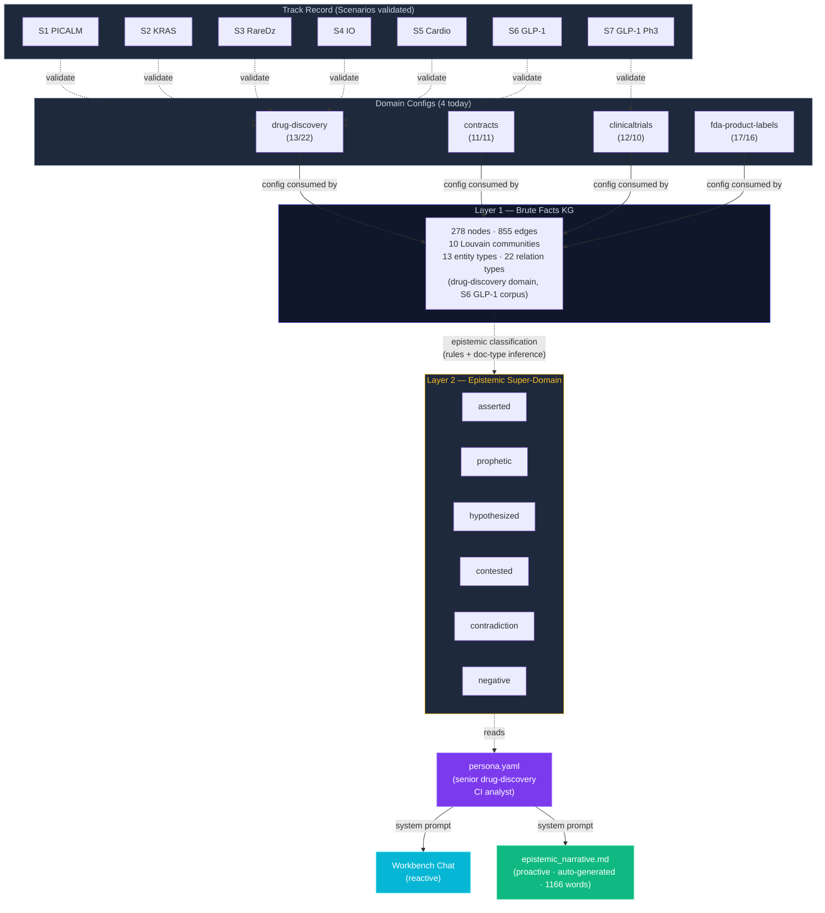

# Visual Generation Prompt — KGC 2026 Hero Image

**Purpose:** A title-card / hero visual for the 5-min demo video that captures Epistract's two-layer architecture and is legible to a Knowledge Graph Conference audience (life sciences experts, KG practitioners, ontology experts, CS graph theorists).

**Use cases:**

- Opening title card (5 seconds, t=0:00)
- Closing title card (5 seconds, t=4:55)
- Slide background if you switch to slides for QnA
- README hero image
- Show HN thumbnail (if/when posted)

---

## What the visual must communicate

This is what we actually built, framed for the audience. Don't generate vague "AI illustrations" — every element below maps to a concrete piece of the system.

1. **Two-layer architecture** — the brute-facts KG (force-directed labeled property graph with typed edges) at the bottom, the epistemic super-domain layer (per-edge status overlay) above.
2. **Per-edge epistemic status** — small badges or colored ring indicators on a subset of edges showing the categorical labels: `asserted`, `prophetic`, `hypothesized`, `contested`, `contradiction`, `negative`. Not all edges — just enough to communicate that the dimension exists.
3. **Domain-specific analyst persona** — a single document/string icon labeled `persona.yaml` with two outgoing arrows: one to a "Workbench Chat" surface (chat-bubble icon, labeled "reactive"), one to an "Epistemic Briefing" surface (markdown-document icon, labeled "proactive"). This is the single-source-of-truth pattern made visible.
4. **Four pre-built domains** — small swatches or pills along an edge labeled `drug-discovery`, `contracts`, `clinicaltrials`, `fda-product-labels`. Drug-discovery should be visually emphasized (it's the showcase corpus).
5. **Track record / scenarios validated** — a thin horizontal strip below the domain swatches showing 6 stacked thumbnails for drug-discovery (S1–S6), 1 thumbnail for clinicaltrials (S7), empty placeholders for the other two. This visualizes the maturity gradient honestly.
6. **Color palette** — dark navy or near-black background; node fills using the actual drug-discovery entity-type palette: indigo `#6366f1` (compounds), red `#ef4444` (diseases), cyan `#06b6d4` (clinical trials), purple `#8b5cf6` (mechanisms), slate `#64748b` (biomarkers). Epistemic-status badges in: green `#10b981` (asserted), amber `#f59e0b` (prophetic), yellow `#fbbf24` (hypothesized), orange `#f97316` (contested), red `#dc2626` (contradiction), gray `#6b7280` (negative).

---

## Aesthetic constraints — what NOT to generate

- **No abstract neural-network swooshes**, no glowing brains, no "AI" tropes. KG audiences hate this. They will roast you in QnA.
- **No human figures** — no analysts in lab coats, no people pointing at screens. Pure schematic.
- **No 3D perspective unless it's actually informative.** Slight isometric tilt is OK to suggest layered architecture; full 3D wireframes look dated.
- **No emoji**, no chat-app stickers, no consumer-app gradients.
- **No screenshots of the actual workbench** rendered into the visual — that's Block 3 of the demo, not the title card.

---

## Image-generation prompt (Midjourney / DALL-E / SDXL)

Paste-ready. Adjust as needed:

```
A clean technical schematic illustrating a two-layer knowledge graph framework called "Epistract." Layer 1 (lower foreground): a force-directed labeled property graph showing approximately 100 visible nodes color-coded by entity type — indigo nodes for drug compounds, red for diseases, cyan for clinical trials, purple for mechanisms of action, slate gray for biomarkers — connected by typed directional edges arranged in 5-7 visible Louvain community clusters. Layer 2 (translucent overlay above Layer 1): a subset of edges have small circular status badges in distinct colors — green for "asserted," amber for "prophetic," yellow for "hypothesized," orange for "contested," and red for "contradiction" — indicating the epistemic super-domain classification on each edge. To the upper right of the graph, a single document icon labeled "persona.yaml" emits two arrows: one arrow points to a chat-bubble icon labeled "Workbench Chat (reactive)," the other to a markdown-document icon labeled "Epistemic Briefing (proactive)." Along the bottom edge, four small horizontal pills labeled "drug-discovery," "contracts," "clinicaltrials," "fda-product-labels" — the drug-discovery pill is highlighted slightly larger or brighter than the other three. Below the domain pills, a thin row of six small graph thumbnails labeled S1 through S6 sits below "drug-discovery"; one thumbnail labeled S7 sits below "clinicaltrials"; empty placeholder squares sit below "contracts" and "fda-product-labels." Title text above the schematic in clean sans-serif: "EPISTRACT — A Two-Layer Knowledge Graph Framework." Subtitle: "v3.2.0 / github.com/usathyan/epistract." Background: dark navy (#0f172a) or near-black with subtle grid lines. Style: technical schematic, slight isometric depth shading to distinguish the two layers, vector-clean, no glow effects, no 3D wireframes, no people, no AI/brain imagery. Aspect ratio 16:9. Suitable for a Knowledge Graph Conference 2026 talk.
```

### Tips for tweaking the prompt

- If the generator over-produces "AI swirl" imagery, add: `, no glow, no neural network swirls, no abstract energy flows, no AI tropes` to the end.
- If nodes come out as solid blobs instead of looking like a graph, add: `, edges visible, graph structure clearly readable`.
- If the layer-stacking doesn't read as "layers," add: `, two distinct stacked planes visible from a slight 3/4 angle`.
- For Midjourney specifically: append `--ar 16:9 --style raw --v 6` (or whichever version is current).
- For DALL-E 3: emphasize "schematic diagram" and "no photographic realism" up front.
- For SDXL: lean on `infographic style` and `flat vector illustration` keywords; expect to iterate 5-10 times.

---

## Mermaid diagram alternative (if you'd rather skip image generation)

If you want a pure technical diagram instead of a generated image, this Mermaid block renders cleanly in any markdown viewer or via `bunx beautiful-mermaid`:



This Mermaid diagram is **factually grounded**:

- Layer-1 numbers (278/855/10) are S6 V3 actuals
- Entity / relation counts per domain are correct (13/22, 11/11, 12/10, 17/16)
- 6 scenarios for drug-discovery, 1 for clinicaltrials match `tests/scenarios/`
- The persona-dual-use arrow direction matches the actual data flow

You can render it with `bunx beautiful-mermaid` (per your CLAUDE.md preference) for SVG + ASCII output.

---

## Suggested deliverables (you decide which)

- **Title card hero (16:9)** — generated image OR Mermaid diagram rendered as SVG
- **Closing card (16:9)** — same composition, different title (`QnA →`)
- **Optional**: a "scenarios timeline" thin banner showing S1 through S7 chronologically — useful if you ever do a "where the framework has been used" slide

---

*Visual prompt prepared 2026-04-25. Iterate. The Mermaid alternative is a safe fallback if image generation produces too much "AI tropes" noise — KG audiences will respect a clean technical diagram more than a glossy generated image anyway.*
