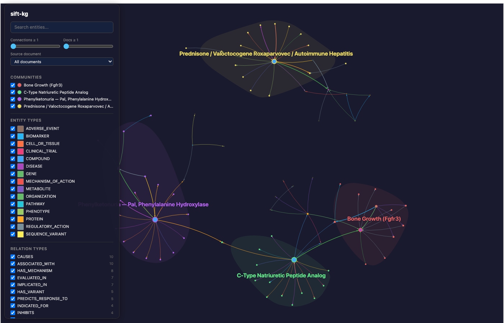
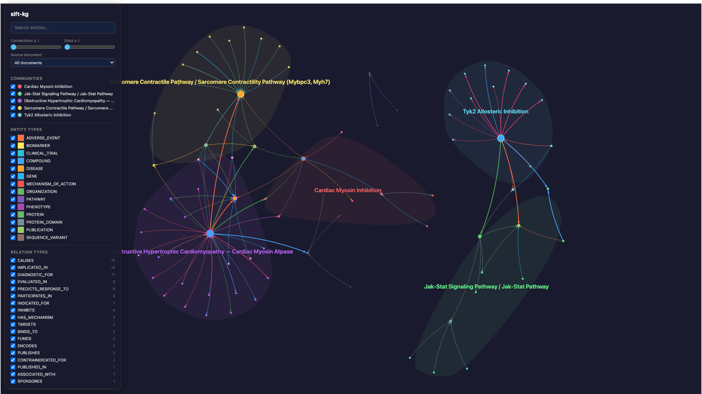
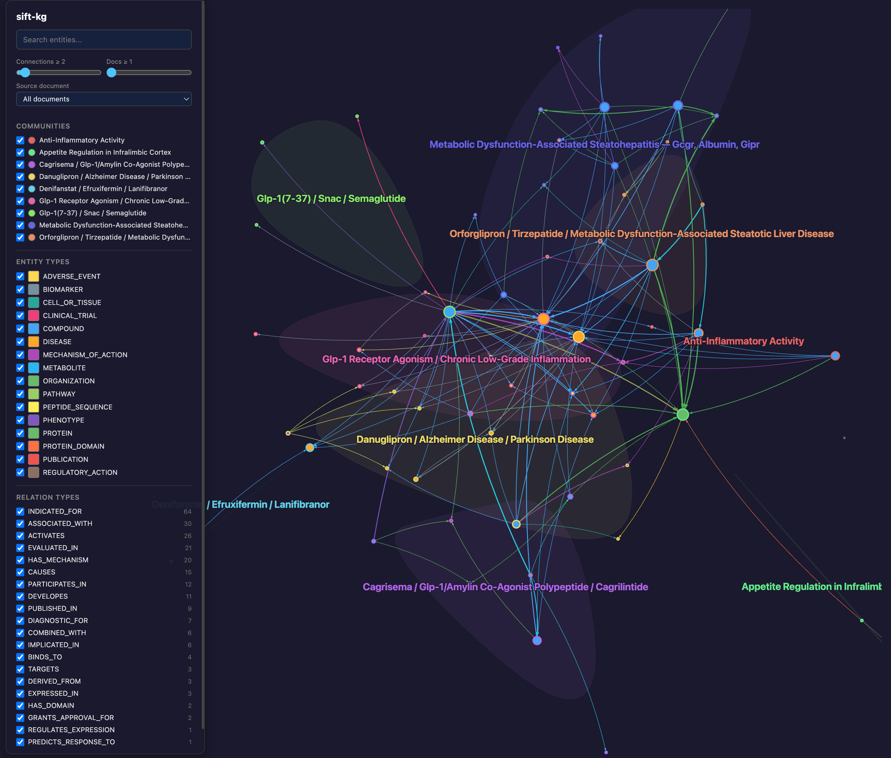

# Drug Discovery Literature Analysis

Epistract was evaluated across six drug discovery research scenarios, each backed by a curated corpus of scientific literature. These scenarios test the full pipeline — document ingestion, entity/relation extraction, molecular validation, graph construction, community detection, and epistemic analysis — across diverse therapeutic areas.

> **Note:** These are hypothetical test scenarios designed to validate the pipeline across diverse drug discovery domains. They are not attributable to any ongoing research.

## Methodology

Each scenario follows the same workflow:

1. **Corpus assembly** — PubMed abstracts (Scenarios 1-5) or multi-source documents from PubMed + Google Scholar + Google Patents via SerpAPI (Scenario 6)
2. **Extraction** — Claude reads each document with domain expertise, producing entities typed against 17 entity types and relations from 30 relation types, grounded in 40+ biomedical ontologies (HGNC, ChEBI, MeSH, UniProt, DrugBank, etc.)
3. **Molecular validation** — RDKit validates SMILES strings and computes canonical forms, InChI, InChIKey, and Lipinski properties. Biopython validates DNA/RNA/protein sequences with computed properties
4. **Graph construction** — sift-kg builds a deduplicated knowledge graph with SemHash fuzzy matching, Unicode normalization, and entity resolution
5. **Community detection** — Louvain community detection with automatic semantic labeling based on entity composition
6. **Epistemic analysis** — Classification of claims as asserted, hypothesized, or prophetic based on confidence and hedging language

## Domain Schema

The drug discovery domain uses 17 entity types and 30 relation types:

| Category | Entity Types |
|----------|-------------|
| Drug & Chemistry | COMPOUND, METABOLITE |
| Molecular Biology | GENE, PROTEIN, PROTEIN_DOMAIN, SEQUENCE_VARIANT, CELL_OR_TISSUE |
| Disease & Phenotype | DISEASE, PHENOTYPE, ADVERSE_EVENT |
| Clinical | CLINICAL_TRIAL, BIOMARKER, REGULATORY_ACTION |
| Pathways & Mechanisms | PATHWAY, MECHANISM_OF_ACTION |
| Context | ORGANIZATION, PUBLICATION |

All entity names follow standard nomenclature: INN for drugs, HGNC for genes, MeSH for diseases, MedDRA for adverse events.

## Scenario Results

| # | Scenario | Focus | Documents | Nodes | Links | Communities |
|---|----------|-------|-----------|-------|-------|-------------|
| 1 | PICALM / Alzheimer's | Genetic target validation | 15 | 149 | 457 | 6 |
| 2 | KRAS G12C Landscape | Competitive intelligence | 16 | 108 | 307 | 4 |
| 3 | Rare Disease Therapeutics | Due diligence | 15 | 94 | 229 | 4 |
| 4 | Immuno-Oncology Combinations | Checkpoint combinations | 16 | 132 | 361 | 5 |
| 5 | Cardiovascular & Inflammation | Cardiology + inflammation | 15 | 94 | 246 | 5 |
| 6 | GLP-1 Competitive Intelligence | Multi-source CI | 34 | 206 | 630 | 9 |

**Totals:** 111 documents, 783 nodes, 2,230 links, 33 communities.

### Scenario 1: PICALM / Alzheimer's Disease

*149 nodes, 457 links, 6 auto-labeled communities.*

| Community | Members | Theme |
|-----------|---------|-------|
| Alzheimer Disease Risk Loci (30 genes) | 49 | GWAS genes converging on LOAD |
| Endosomal Trafficking (APP, PSEN1, PSEN2) | 18 | Core amyloid/tau pathology cascade |
| Phagocytosis / Amyloid Beta Processing | 15 | PICALM variants, TREM2, CD33 |
| Autophagy / Endocytic Pathway | 17 | Cross-disease autophagy links (AD, PD) |
| Clathrin-Mediated Endocytosis in Hippocampus | 10 | Tissue-specific CME biology |
| Cholesterol Synthesis in Microglia | 8 | 2025 Nature: rs10792832 causal mechanism |

### Scenario 2: KRAS G12C Inhibitor Landscape

*108 nodes, 307 links, 4 auto-labeled communities.*

| Community | Members | Theme |
|-----------|---------|-------|
| EGFR Inhibitors / Adavosertib / Panitumumab | 25 | Combination strategies and CRC responses |
| Adagrasib / Immune Checkpoint Inhibitors / BRAF | 20 | Adagrasib clinical profile and bypass resistance |
| RAS Signaling / RAF/MEK Pathway | 17 | Mechanistic biology and emerging targets |
| Pancreatic Ductal Adenocarcinoma / PD-1 | 10 | Disease indications and next-gen RAS-ON inhibitors |

### Scenario 3: Rare Disease Therapeutics

*94 nodes, 229 links, 4 auto-labeled communities.*

| Community | Members | Theme |
|-----------|---------|-------|
| PKU Enzyme Replacement / Gene Therapy Safety | 28 | Pegvaliase, sapropterin, PAH gene therapy |
| CNP Analog / Bone Biology | 24 | Vosoritide, achondroplasia, FGFR3/NPR-B pathway |
| Arimoclomol / HSP Co-induction | 22 | Niemann-Pick C, HSF1/HSP70, miglustat |
| ERT Immunogenicity / Clinical Trials | 20 | Enzyme replacement therapy, anti-drug antibodies |

### Scenario 4: Immuno-Oncology Combinations

*132 nodes, 361 links, 5 auto-labeled communities.*

| Community | Members | Theme |
|-----------|---------|-------|
| PD-1 Immune Checkpoint Blockade in CD8+ T Cells | 31 | Core nivolumab biology, biomarkers (PD-L1, TMB, MSI-H) |
| Brain Metastases -- CTLA-4 | 16 | Ipilimumab combinations, CheckMate trials, melanoma |
| LAG-3 Signaling Pathway (LAG3) | 18 | Relatlimab, RELATIVITY trials, dual checkpoint blockade |
| PD-1/PD-L1 Signaling Pathway (PDCD1, CD274) | 15 | 13 approved anti-PD-(L)1 agents, combination strategies |
| Metabolic Reprogramming in Tumor Immune Microenvironment | 15 | HCC immunotherapy, cabozantinib/VEGF, spatial transcriptomics |

### Scenario 5: Cardiovascular & Inflammation

*94 nodes, 246 links, 5 auto-labeled communities.*

| Community | Members | Theme |
|-----------|---------|-------|
| Obstructive HCM -- Cardiac Myosin ATPase | 24 | Mavacamten trials, LVOT gradient, NT-proBNP |
| Sarcomere Contractile Pathway (MYBPC3, MYH7) | 15 | Aficamten, R403Q mutation, sarcomere biology |
| TYK2 Allosteric Inhibition | 14 | Deucravacitinib, POETYK trials, psoriasis |
| JAK-STAT Signaling Pathway | 11 | IL-12/IL-23, type I interferons, cytokine signaling |
| Cardiac Myosin Inhibition | 8 | Shared mechanism hub, FDA approval, REMS |

### Scenario 6: GLP-1 Competitive Intelligence

*206 nodes, 630 links, 9 auto-labeled communities. 34 documents (24 PubMed + 10 patents from 5 companies).*

| Community | Members | Theme |
|-----------|---------|-------|
| MASH -- GCGR, Albumin, GIPR | 26 | Survodutide, retatrutide, hepatic lipid oxidation |
| GLP-1(7-37) / SNAC / Semaglutide | 24 | Oral delivery technology, SNAC absorption enhancer |
| Appetite Regulation in Infralimbic Cortex | 21 | GLP-1 in addiction, GABA modulation, CNS expression |
| Danuglipron / Alzheimer / Parkinson | 19 | Oral small molecules, neurodegeneration |
| Orforglipron / Tirzepatide / MASLD | 18 | Next-gen compounds, ACHIEVE/SURMOUNT trials |
| CagriSema / Amylin Co-Agonist / Cagrilintide | 17 | Combination therapy, REDEFINE trials |
| GLP-1 Receptor Agonism / Inflammation | 14 | Core mechanism, cardiovascular protection |
| Anti-Inflammatory Activity | 9 | CV risk reduction mechanisms |
| Denifanstat / Efruxifermin / Lanifibranor | 9 | Non-GLP-1 MASH competitor drugs |

**What makes Scenario 6 notable:**
- **Multi-source corpus** — first scenario using PubMed + Google Scholar + Google Patents (via SerpAPI)
- **Patent extraction** — peptide sequences, CAS numbers (tirzepatide: 2023788-19-2), InChIKeys, chemical formulas from 10 patents across 5 companies
- **Largest graph** — 206 nodes, 630 links (vs 94-149 nodes for Scenarios 1-5)

## Molecular Validation

When RDKit and Biopython are installed, epistract automatically validates molecular identifiers found in source text:

- **SMILES** — canonical form, InChI, InChIKey, molecular formula, MW, LogP, Lipinski Ro5
- **DNA/RNA sequences** — GC content, complement, reverse complement, translation
- **Protein sequences** — molecular weight, isoelectric point, instability index, GRAVY
- **Pattern detection** — NCT numbers, CAS numbers, patent numbers, InChIKeys

LLMs cannot reliably reproduce character-exact molecular notation. Epistract uses a hybrid approach: Claude identifies identifiers in context, regex extracts exact strings from source text, and RDKit/Biopython validates with computed properties. The knowledge graph contains verified molecular structures, not LLM approximations.

## Epistemic Analysis

Relations are classified by epistemic status:
- **Asserted** — high confidence, no hedging language, direct evidence
- **Hypothesized** — text contains "may", "might", "could", hedging indicators
- **Prophetic** — patent-sourced claims about future applications

This enables filtering by evidence strength and source document type.

## Full Scenario Details

Each scenario has a dedicated page with corpus provenance, acceptance criteria, and detailed results:

- [Scenario 1: PICALM / Alzheimer's](../../tests/scenarios/scenario-01-picalm-alzheimers.md)
- [Scenario 2: KRAS G12C Landscape](../../tests/scenarios/scenario-02-kras-g12c-landscape.md)
- [Scenario 3: Rare Disease Therapeutics](../../tests/scenarios/scenario-03-rare-disease.md)
- [Scenario 4: Immuno-Oncology Combinations](../../tests/scenarios/scenario-04-immunooncology.md)
- [Scenario 5: Cardiovascular & Inflammation](../../tests/scenarios/scenario-05-cardiovascular.md)
- [Scenario 6: GLP-1 Competitive Intelligence](../../tests/scenarios/scenario-06-glp1-landscape.md)
