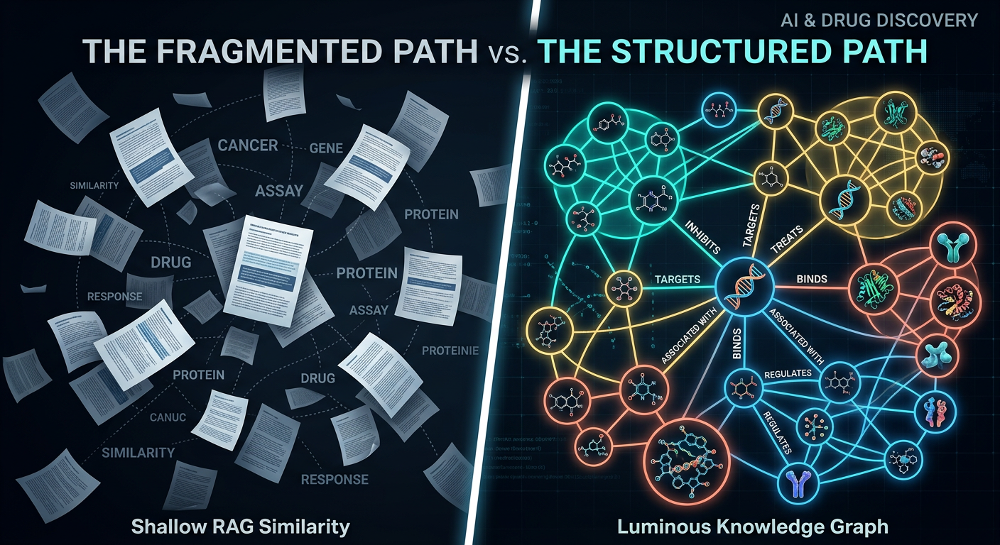
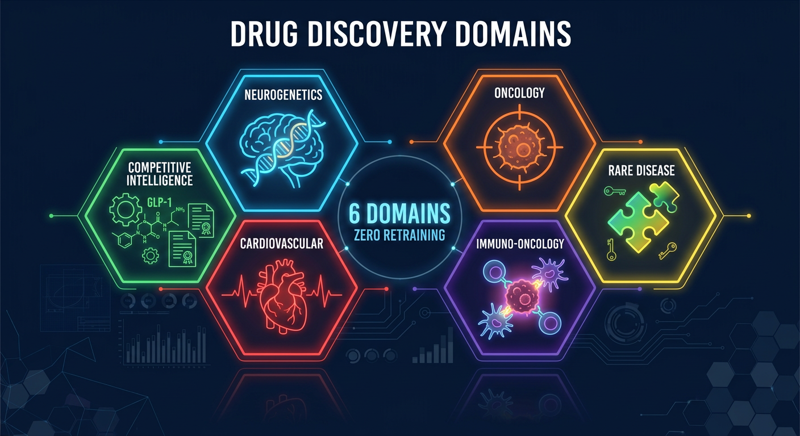
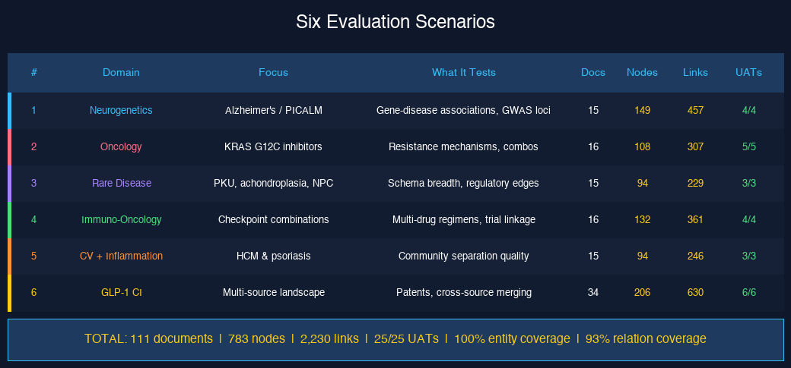
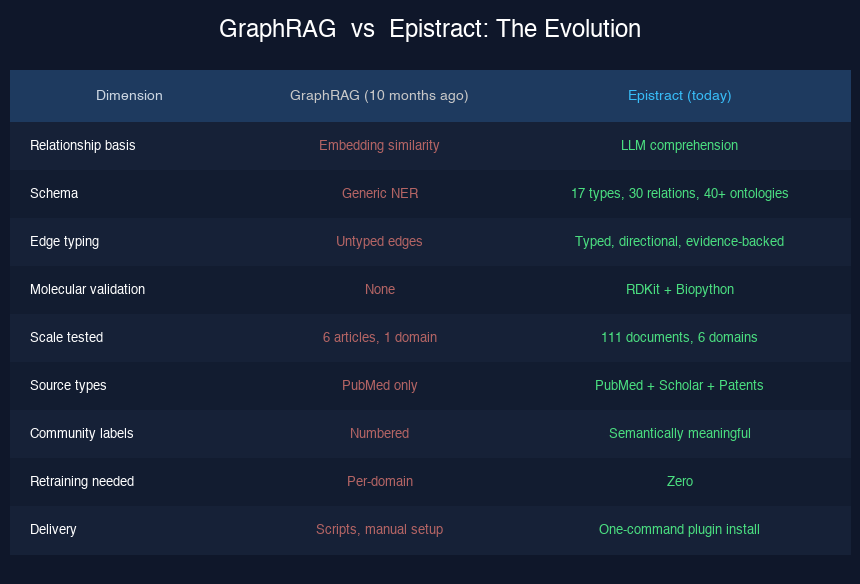

# Beyond RAG: When Your Knowledge Graph Actually Understands the Science

*A follow-up to [Latent Knowledge Graphs](https://medium.com/@8thcross/latent-knowledge-graphs-66dbb479ed52) — what happened when we replaced similarity with comprehension.*


*Left: what RAG gives you — scattered documents connected by embedding proximity. Right: what comprehension-based extraction produces — a structured knowledge graph with typed, directional, evidence-backed relationships.*

---

Ten months ago, I built a latent knowledge graph from six drug discovery articles using Microsoft's GraphRAG. It extracted 3,224 entities and 2,242 relationships. The experiment proved something important: LLMs can extract structured knowledge from scientific literature without task-specific training.

But it also revealed a critical limitation that kept nagging me.

**GraphRAG couldn't tell me whether nivolumab *causes* colitis or *treats* it.**

That edge between two nodes? It was a similarity score — a cosine distance. Not a scientific assertion. Not something a drug safety reviewer could act on. Not something you'd put in front of a regulatory submission.

For drug discovery, where the difference between "inhibits" and "activates" determines whether a compound is a therapeutic candidate or a safety risk, this isn't a nuance. It's the whole game.

---

## The Epistemological Gap

Here's the core problem with similarity-based knowledge graphs for science:

- **GraphRAG asks:** *What entities appear near each other in the text?*
- **Epistract asks:** *What does the text say about how these entities relate?*

The first captures co-occurrence. The second captures meaning. The distinction between these two things determines whether your knowledge graph can support hypothesis generation, drug repurposing, and regulatory evidence assembly — or whether it remains a pretty visualization.

I call this the **comprehension gap**. And closing it required a fundamentally different architecture.

---

## What We Built: Epistract

[Epistract](https://github.com/usathyan/epistract) is an open-source Claude Code plugin that replaces similarity-based assembly with comprehension-based extraction. Here's what that means in practice:

**Instead of embedding chunks and measuring distances**, Epistract dispatches parallel LLM agents that *read entire scientific documents* with domain understanding. Each agent produces structured JSON conforming to a biomedical schema — 17 entity types, 30 relation types, grounded in 40+ established ontologies (Gene Ontology, ChEBI, MeSH, MedDRA, UniProt, HGNC, and more).

**Every extracted relationship carries:**
- A **typed, directional edge** — `sotorasib → INHIBITS → KRAS G12C`, not an unnamed similarity link
- A **confidence score** calibrated for scientific literature
- The **exact source passage** from which it was extracted
- **Ontology grounding** — so "imatinib" and "Gleevec" resolve to the same entity

**Every molecular identifier gets validated:**
- SMILES strings → RDKit validates and computes InChI, InChIKey, molecular weight, Lipinski Ro5
- Amino acid sequences → Biopython validates and computes isoelectric point, stability
- CAS numbers, NCT trial IDs, patent numbers → regex extraction and format validation

A SMILES string in an Epistract graph is a verified molecular structure, not an LLM approximation. A single character transposition produces a different molecule — so we don't trust the LLM to reproduce it. We trust it to *find* it, then validate deterministically.

---

## Six Domains. Zero Retraining. 783 Nodes. 2,230 Links.


*Each scenario exercises a different facet of the biomedical schema — from gene-centric neurogenetics to multi-source competitive intelligence. All 25 user acceptance tests passed.*

We validated Epistract across six drug discovery domains. No retraining. No fine-tuning. No domain-specific annotation campaigns. The same schema, the same pipeline, the same plugin — pointed at different corpora.

### The Scenarios


*111 documents across 6 therapeutic domains. Zero retraining between domains. All 25 user acceptance tests passing.*

### What the Numbers Mean

**100% entity type coverage** — all 17 entity types were exercised across the six domains.

**93% relation type coverage** — 28 of 30 relation types appeared. The two missing ones (PHOSPHORYLATES, METABOLIZED_BY) are biochemical details rarely discussed at the abstract level.

**33 auto-labeled communities** — not "Community 0" and "Community 1," but labels like:
- *"Alzheimer Disease Risk Loci (30 genes)"*
- *"TYK2 Allosteric Inhibition"*
- *"GLP-1(7-37) / SNAC / Semaglutide"* (oral delivery technology cluster)
- *"Denifanstat / Efruxifermin / Lanifibranor"* (non-GLP-1 MASH competitors)

These labels are generated by a heuristic engine that reads community membership — not by an LLM summarizing at runtime. They communicate biological meaning at a glance.

---

## The GLP-1 Scenario: How a Human Researcher Actually Works

Scenario 6 deserves special attention because it mirrors how a competitive intelligence analyst actually operates.

**The corpus:** 24 PubMed abstracts + 10 patent documents from 5 companies (Novo Nordisk, Eli Lilly, Pfizer, Hanmi Pharmaceutical, Zealand Pharma), assembled via PubMed E-utilities, Google Scholar, and Google Patents through SerpAPI.

**What we extracted from patents that you can't get from papers:**
- Peptide sequences (validated amino acid strings)
- CAS registry numbers (tirzepatide: 2023788-19-2)
- InChIKeys and chemical formulas
- Company-to-compound relationships (who's developing what)

**The graph self-organized into commercially meaningful clusters:**
- MASH therapeutics (survodutide, retatrutide)
- Oral delivery technology (SNAC + semaglutide)
- Next-gen competitors (orforglipron, tirzepatide)
- Combination therapy (CagriSema)
- Emerging CNS indications (GLP-1 in addiction, GABA modulation)
- Non-GLP-1 MASH competitor drugs

**This is the part that usually takes weeks** — reading patents, cross-referencing with published data, building a mental map of who's developing what. Epistract doesn't replace that judgment. But it turns 34 documents into a queryable, structured starting point — with every edge traceable back to the source passage.

---

## The Co-Scientist Workspace


*The human drives scientific strategy. The AI drives implementation velocity. Neither could produce the result alone.*

Here's what most articles about AI in drug discovery get wrong: they frame it as "AI does the science." That's not what happened here.

Epistract was built through **intensive, interactive human-AI collaboration** using Claude Code as both the development environment and the runtime platform. The entire system — plugin architecture, domain schema, six test scenarios, extraction pipeline, documentation, and the academic paper — was constructed in collaborative sessions where:

- **The human** drove scientific strategy, corpus curation, acceptance criteria, branding, and quality judgment
- **The AI** drove implementation, parallelization, schema enforcement, defensive error handling, and documentation

The feedback loop operated at the granularity of individual function calls and schema decisions — not at the granularity of complete artifacts. This is not prompt-and-wait. This is pair programming with a tireless partner who can dispatch parallel extraction agents, validate molecular structures, and write documentation simultaneously.

### What This Looks Like in Practice

A scientist installs Epistract with a single command:

```
/plugin install epistract@epistract
```

Points it at a folder of documents:

```
/epistract-ingest ./my-papers/
```

And gets back: a validated knowledge graph with typed relations, community labels, molecular validation, and an interactive visualization in the browser. From papers to structured knowledge in minutes, not months.

**That's the paradigm shift for IT leadership to understand.** The bottleneck in computational drug discovery has never been compute or data. It's been the translation from unstructured literature to structured knowledge — and that translation has historically required expensive, brittle, per-domain NLP models that break when you switch therapeutic areas.

---

## GraphRAG vs. Epistract: The Evolution

For the executives who want the comparison:


*The trajectory is clear: from co-occurrence to comprehension, from prototype to production-ready tool.*

---

## What This Means for Pharma and Biotech Leadership

**1. Knowledge graph construction is no longer a 6-month NLP project.**
A single scientist with domain expertise and Epistract can build a validated knowledge graph across multiple therapeutic areas in a day. No annotation campaigns. No model training. No ML engineering team.

**2. The "bring your own papers" model changes the economics.**
Scientists with institutional access to Lancet, JAMA, and NEJM can supplement the corpus. The pipeline doesn't care about the source — it cares about the content. This means your existing journal subscriptions become inputs to structured knowledge.

**3. Competitive intelligence becomes structured, not narrative.**
Scenario 6 demonstrates that patent filings can be ingested alongside academic papers, producing graphs that self-organize into competitive landscape views. The difference between a 40-page CI report and a queryable knowledge graph is the difference between reading and reasoning.

**4. The co-scientist model is a force multiplier.**
This isn't about replacing scientists. It's about giving them a partner that can read 111 documents in parallel, validate every molecular structure, and produce a traceable knowledge graph — while the scientist focuses on what matters: which questions to ask, which corpora to curate, and whether the answers make scientific sense.

**5. It's open source. Today.**
[Epistract](https://github.com/usathyan/epistract) is MIT-licensed. Install it in one command. All six test scenarios, extraction outputs, and graph evidence are committed to the public repository. Full reproducibility.

---

## Try It

```bash
# Install (inside any Claude Code session)
/plugin marketplace add usathyan/epistract
/plugin install epistract@epistract

# Verify
/epistract-setup

# Run on your own papers
/epistract-ingest ./your-papers/
```

The full technical paper — *"Beyond RAG: Domain-Specific Agentic Architecture for Biomedical Knowledge Graph Construction"* — is available in the [repository](https://github.com/usathyan/epistract/blob/main/paper/main.pdf).

---

*All code written with Claude Code. All graphs built with [sift-kg](https://github.com/juanceresa/sift-kg). All molecular validation by RDKit and Biopython. All scientific judgment by a human.*

*Previously: [Latent Knowledge Graphs](https://medium.com/@8thcross/latent-knowledge-graphs-66dbb479ed52)*

---

**Umesh Bhatt** builds at the intersection of AI and life sciences. Follow for more on agentic architectures, knowledge graphs, and the future of computational drug discovery.
