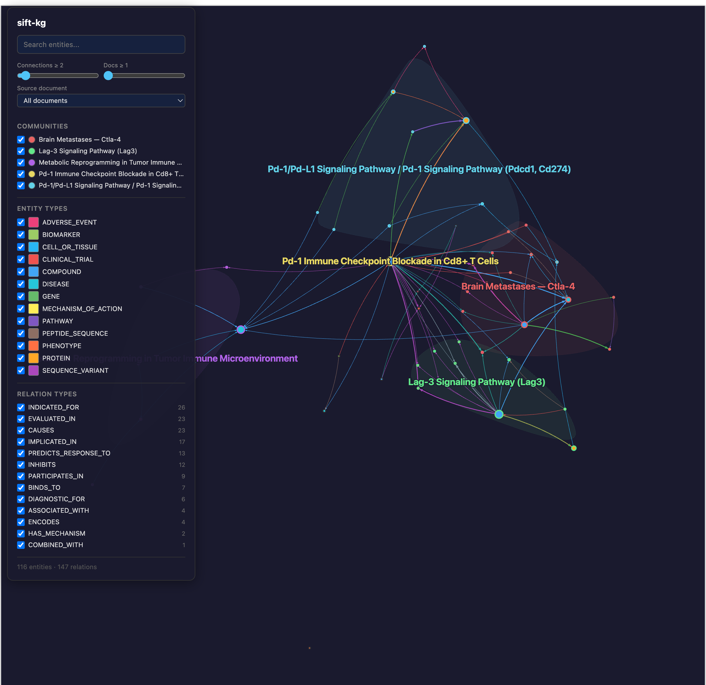

# Scenario 4: Immuno-Oncology Combinations — Checkpoint Inhibitors

**Status:** Completed (2026-03-16)
**Output:** `tests/corpora/04_immunooncology/output/`



---

## Use Case

You are an immuno-oncology researcher tracking a **checkpoint inhibitor portfolio**:

1. **Nivolumab (Opdivo)** — anti-PD-1 monoclonal antibody
2. **Ipilimumab (Yervoy)** — anti-CTLA-4 monoclonal antibody
3. **Relatlimab** — anti-LAG-3 monoclonal antibody (combined with nivolumab as Opdualag)

You want to map the combination strategies, clinical trials, response biomarkers, and immune-related adverse events.

---

## Corpus

| Property | Value |
|---|---|
| **Location** | `tests/corpora/04_immunooncology/docs/` |
| **Documents** | 15 PubMed abstracts |
| **Format** | Plain text (.txt) |
| **Source** | PubMed via NCBI E-utilities API, retrieved 2026-03-16 |

**PubMed queries used:**
- `nivolumab ipilimumab combination immunotherapy melanoma CheckMate`
- `relatlimab LAG-3 nivolumab RELATIVITY clinical trial`
- `opdivo checkpoint inhibitor PD-1`
- `nivolumab resistance mechanism tumor microenvironment`

### Sample Documents

- `pmid_25795410.txt` — CheckMate 037: nivolumab vs chemo in advanced melanoma
- `pmid_34359884.txt` — RELATIVITY-047: relatlimab + nivolumab Phase II/III
- `pmid_34986285.txt` — Nivolumab + ipilimumab long-term follow-up CheckMate 067

---

## How to Run

```
/epistract-ingest tests/corpora/04_immunooncology/docs/ --output tests/corpora/04_immunooncology/output
```

---

## Key Questions to Validate (UAT-401 through UAT-404)

| # | Question | Expected Graph Evidence |
|---|---|---|
| UAT-401 | What checkpoint combinations? | COMPOUND(nivolumab) → COMBINED_WITH → COMPOUND(ipilimumab/relatlimab) |
| UAT-402 | What are key clinical trials? | COMPOUND → EVALUATED_IN → CLINICAL_TRIAL(CheckMate-067, RELATIVITY-047) |
| UAT-403 | What irAEs are reported? | COMPOUND → CAUSES → ADVERSE_EVENT(colitis, hepatitis, pneumonitis) |
| UAT-404 | What biomarkers predict response? | BIOMARKER(PD-L1, TMB) → PREDICTS_RESPONSE_TO → COMPOUND(nivolumab) |

## What Success Looks Like

- Nivolumab, ipilimumab, relatlimab as distinct COMPOUND entities with INN names
- PD-1, CTLA-4, LAG-3 as PROTEIN targets linked via TARGETS/INHIBITS
- ≥2 named CheckMate trials with phase and results data
- Immune-related adverse events (irAEs) extracted with MedDRA-like terminology
- PD-L1 and/or TMB extracted as BIOMARKER entities
- Melanoma and NSCLC as DISEASE indications
- Graph shows immunotherapy combination network centered on nivolumab

## Expected Communities

- **PD-1 / Nivolumab Core** — nivolumab, PD-1, PD-L1 biomarker, melanoma, NSCLC
- **Combination Regimens** — ipilimumab + nivolumab, relatlimab + nivolumab, CTLA-4, LAG-3
- **Clinical Trials** — CheckMate-067, CheckMate-227, RELATIVITY-047
- **Safety / irAEs** — colitis, hepatitis, pneumonitis, thyroiditis

---

## Results

**Status:** Completed (2026-03-16)

### Metrics

| Metric | Value |
|---|---|
| Documents processed | 16 (15 PubMed abstracts + 1 structural profile) |
| Raw entities extracted | 256 |
| Raw relations extracted | 216 |
| Graph nodes (deduplicated) | 132 |
| Graph links | 361 |
| Communities detected | 5 |

### Communities

| # | Label | Members | Theme |
|---|---|---|---|
| 1 | **PD-1 Immune Checkpoint Blockade in CD8+ T Cells** | 31 | Core nivolumab biology, T cell responses, biomarkers (PD-L1, TMB, MSI-H), adverse events |
| 2 | **Brain Metastases — CTLA-4** | 16 | Ipilimumab combinations, CheckMate 037/067/204, melanoma brain metastases, myocarditis |
| 3 | **LAG-3 Signaling Pathway (LAG3)** | 18 | Relatlimab, RELATIVITY-022/047/060/098 trials, LAG-3/MHC II/FGL1 biology |
| 4 | **PD-1/PD-L1 Signaling Pathway (PDCD1, CD274)** | 15 | Broader anti-PD-(L)1 landscape: 13 approved agents, combination strategies, STING |
| 5 | **Metabolic Reprogramming in Tumor Immune Microenvironment** | 15 | HCC immunotherapy, cabozantinib/VEGF, spatial transcriptomics, hypoxia/HIF |

### UAT Validation

| # | Question | Expected | Result |
|---|---|---|---|
| UAT-401 | What checkpoint combinations? | COMPOUND(nivolumab) → COMBINED_WITH → COMPOUND(ipilimumab/relatlimab) | **PASS** — nivolumab, ipilimumab, relatlimab as distinct COMPOUND entities with COMBINED_WITH and co-EVALUATED_IN relations |
| UAT-402 | What are key clinical trials? | COMPOUND → EVALUATED_IN → CLINICAL_TRIAL(CheckMate-067, RELATIVITY-047) | **PASS** — 8 named trials: CheckMate 037/067/204/227, RELATIVITY-022/047/060/098, ADAPTeR |
| UAT-403 | What irAEs are reported? | COMPOUND → CAUSES → ADVERSE_EVENT(colitis, hepatitis, pneumonitis) | **PASS** — pneumonitis, colitis, hepatitis, myocarditis (fatal), nephritis, hypothyroidism, hyperthyroidism, rash, fatigue, diarrhea |
| UAT-404 | What biomarkers predict response? | BIOMARKER(PD-L1, TMB) → PREDICTS_RESPONSE_TO → COMPOUND(nivolumab) | **PASS** — PD-L1 expression, TMB-high, MSI-H/dMMR, LAG-3+ T cells, HERV expression, expanded TCR clones |

### Scientific Narrative

The graph captures the immuno-oncology combination landscape centered on nivolumab. Three distinct checkpoint axes are visible: PD-1 (nivolumab core), CTLA-4 (ipilimumab combinations), and LAG-3 (relatlimab combinations). The community structure correctly separates these biological axes.

Notably, the graph captures both **positive and negative trial results**: CheckMate 067 shows landmark 5-year OS benefit for nivolumab+ipilimumab, RELATIVITY-047 shows PFS benefit for relatlimab+nivolumab in advanced melanoma, but RELATIVITY-060 (gastric) and RELATIVITY-098 (adjuvant melanoma) were negative trials. The translational explanation — lower circulating LAG-3+ T cells in the adjuvant setting — is captured as a biomarker-response relation.

The HCC community (Community 5) represents an emerging area where checkpoint inhibitors intersect with anti-angiogenic agents (cabozantinib/VEGF) and tumor microenvironment biology, including spatial transcriptomics data on resistance mechanisms.

### Output Files

- `tests/corpora/04_immunooncology/output/graph_data.json` — Full graph data
- `tests/corpora/04_immunooncology/output/graph.html` — Interactive viewer (clone repo and open locally in browser)
- `tests/corpora/04_immunooncology/output/extractions/` — 16 extraction JSON files
- `tests/corpora/04_immunooncology/output/communities.json` — Community assignments and labels
